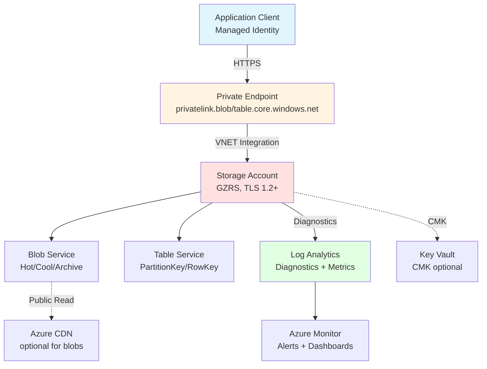

# Azure Storage Implementation Guidelines - AI Agent Reference Guide

> **Last Updated**: 2025-10-06
> **Original Source**: Internal standards document
> **Optimization Version**: 1.0
> **Audience**: Senior engineers & tech leads

## What This Is

Comprehensive implementation guidelines and best practices for Azure Blob Storage and Azure Table Storage. Covers provisioning, security, data access patterns, performance optimization, and operational excellence using .NET 8, Azure CLI, and Bicep. All code examples are production-ready and runnable.

This guide enforces security-by-default principles including Managed Identity authentication, least privilege RBAC, network isolation via private endpoints, and comprehensive observability.

## File Structure Guide

This research has been organized into the following structure:

### 01-quick-start/
**Purpose**: Get implementing fast (< 30 minutes to working code)
- `provisioning.md` - Azure CLI and Bicep for storage account creation
- `authentication-setup.md` - DefaultAzureCredential and RBAC configuration
- `local-development.md` - Azurite emulator setup and connection strings

### 02-core-concepts/
**Purpose**: Understand foundational architecture
- `storage-accounts.md` - Redundancy options (LRS/ZRS/GRS/GZRS), hierarchical namespace, account types
- `security-model.md` - RBAC vs SAS vs Account Keys trade-offs
- `networking-architecture.md` - Private endpoints, VNET service endpoints, DNS configuration

### 03-blob-storage/
**Purpose**: Implement Blob Storage features
- `blob-fundamentals.md` - Block/Append/Page blobs, tiering (Hot/Cool/Archive), versioning
- `blob-implementation.md` - Upload/download patterns, streaming, chunking, metadata
- `blob-concurrency.md` - ETags, If-Match/If-None-Match, optimistic concurrency
- `blob-lifecycle-management.md` - Lifecycle policies, archival, retention

### 04-table-storage/
**Purpose**: Implement Table Storage features
- `table-fundamentals.md` - PartitionKey/RowKey design, schema-less modeling
- `table-implementation.md` - CRUD operations, batch transactions, query patterns
- `table-patterns.md` - Secondary indexes, hot partition avoidance, composite keys
- `table-vs-cosmos.md` - When to use Table Storage vs Cosmos DB Table API

### 05-security/
**Purpose**: Implement security controls
- `identity-authentication.md` - Managed Identity, DefaultAzureCredential chain, RBAC roles
- `sas-patterns.md` - User delegation SAS, stored access policies, IP scoping
- `encryption.md` - Customer-managed keys (CMK), double encryption, immutability policies
- `network-security.md` - Firewall rules, private endpoints, CORS configuration

### 06-operations/
**Purpose**: Production operations and optimization
- `observability.md` - Diagnostics settings, KQL queries, Azure Monitor alerts
- `performance-optimization.md` - Throughput targets, parallelism, CDN integration
- `data-access-layer.md` - C# client patterns, DI registration, retry policies
- `governance.md` - Naming conventions, tagging, lifecycle policies, cost controls

### 07-deployment/
**Purpose**: CI/CD and testing
- `cicd-patterns.md` - GitHub Actions, OIDC authentication, environment promotion
- `testing-strategy.md` - Azurite contract tests, performance testing

### 08-reference/
**Purpose**: Quick lookup and copy-paste
- `code-examples.md` - Complete runnable C# examples
- `bicep-templates.md` - Infrastructure as Code templates
- `checklists.md` - Security, performance, resilience, operations
- `references.md` - Citations and primary sources

## Agent Workflow Paths

### For Quick Implementation (< 30 min)
1. Read `01-quick-start/provisioning.md`
2. Follow `01-quick-start/authentication-setup.md`
3. Reference `08-reference/code-examples.md` for your use case
4. Test locally with `01-quick-start/local-development.md`

### For Blob Storage Implementation
1. Review `02-core-concepts/storage-accounts.md`
2. Work through `03-blob-storage/` in order (fundamentals → implementation → concurrency → lifecycle)
3. Implement security from `05-security/identity-authentication.md` and `05-security/network-security.md`
4. Add observability per `06-operations/observability.md`
5. Verify against `08-reference/checklists.md`

### For Table Storage Implementation
1. Review `02-core-concepts/storage-accounts.md`
2. Study `04-table-storage/table-fundamentals.md` (partition design is critical)
3. Implement following `04-table-storage/table-implementation.md`
4. Review patterns in `04-table-storage/table-patterns.md` to avoid hot partitions
5. Add security from `05-security/identity-authentication.md`
6. Verify against `08-reference/checklists.md`

### For Security Hardening
1. Start with `02-core-concepts/security-model.md`
2. Implement `05-security/identity-authentication.md` (Managed Identity)
3. Configure `05-security/network-security.md` (private endpoints)
4. Add `05-security/encryption.md` if CMK/immutability required
5. Use `05-security/sas-patterns.md` only when SAS unavoidable
6. Verify against `08-reference/checklists.md` (Security section)

### For Production Optimization
1. Start with `06-operations/performance-optimization.md`
2. Review `06-operations/data-access-layer.md` for client patterns
3. Check `03-blob-storage/blob-implementation.md` or `04-table-storage/table-patterns.md` for service-specific optimizations
4. Add `06-operations/observability.md` for monitoring
5. Implement cost controls from `06-operations/governance.md`

## Quick Lookup Index

**I need to...**
- Create a storage account → `01-quick-start/provisioning.md`
- Set up authentication → `01-quick-start/authentication-setup.md`
- Upload/download blobs → `03-blob-storage/blob-implementation.md`
- Design table partition keys → `04-table-storage/table-fundamentals.md`
- Generate SAS tokens → `05-security/sas-patterns.md`
- Configure private endpoints → `05-security/network-security.md`
- Set up monitoring → `06-operations/observability.md`
- Optimize performance → `06-operations/performance-optimization.md`
- Run local tests → `01-quick-start/local-development.md`
- Set up CI/CD → `07-deployment/cicd-patterns.md`
- Copy-paste code → `08-reference/code-examples.md`

## Critical Reading

**Must-read files** (minimum for production implementation):
- [ ] `01-quick-start/authentication-setup.md` (Managed Identity is non-negotiable)
- [ ] `02-core-concepts/security-model.md` (understand RBAC vs SAS trade-offs)
- [ ] `05-security/network-security.md` (private endpoints for production)
- [ ] `06-operations/observability.md` (diagnostics settings required)
- [ ] `08-reference/checklists.md` (verify before production deployment)

**Service-specific critical files**:
- **Blob Storage**: `03-blob-storage/blob-fundamentals.md`, `03-blob-storage/blob-concurrency.md`
- **Table Storage**: `04-table-storage/table-fundamentals.md`, `04-table-storage/table-patterns.md`

## Decision Matrices

### When to Use Blob Storage vs Table Storage

| Use Case | Recommended Service | Rationale |
|----------|-------------------|-----------|
| Unstructured files (images, videos, documents) | Blob Storage | Native support for large objects, streaming, CDN integration |
| Structured key-value data (< 1MB per entity) | Table Storage | Low cost, sub-15ms latency, NoSQL flexibility |
| Analytics workloads (large datasets) | Blob Storage + ADLS Gen2 | Hierarchical namespace, Spark/Hadoop integration |
| Global distribution with multi-region writes | Cosmos DB Table API | Table Storage has limited geo-replication |
| Logs, audit trails (append-only) | Blob Storage (Append blobs) | Immutable append semantics |

See `04-table-storage/table-vs-cosmos.md` for detailed comparison.

### Redundancy Selection

| Scenario | Recommended SKU | Notes |
|----------|----------------|-------|
| Dev/Test | Standard_LRS | Lowest cost, 3 copies in one zone |
| Production (zone-redundant) | Standard_ZRS | 3 copies across availability zones |
| Production (geo-redundant) | Standard_GZRS | Zone + geo redundancy, RA-GZRS for read access |
| Archive/Compliance | Standard_GRS or GZRS | Lifecycle policies to Archive tier |

See `02-core-concepts/storage-accounts.md` for RA-* variants and trade-offs.

### Hierarchical Namespace (ADLS Gen2)

| Enable HNS If... | Keep HNS Disabled If... |
|-----------------|------------------------|
| Analytics workloads (Databricks, Synapse) | Simple blob storage use cases |
| Directory-level operations required | Cost sensitivity (HNS has premium) |
| ACL-based security needed | Using RBAC at container level is sufficient |

**Cannot enable HNS after account creation** - plan ahead. See `02-core-concepts/storage-accounts.md`.

## Principles & Non-Goals

### Principles
1. **Security by Default**: Managed Identity only; deny public network access; private endpoints
2. **Least Privilege**: RBAC over account keys; user delegation SAS over account SAS
3. **Immutability Options**: Soft delete + versioning for recoverability; WORM for compliance
4. **Cost Awareness**: Lifecycle policies; monitor hot partition costs; archive cold data
5. **Testability**: Azurite for local dev; abstractions for DI; contract tests
6. **Observability**: Diagnostics to Log Analytics; request ID propagation; alerts on throttling

### Non-Goals
- This guide does NOT cover Azure Files, Queue Storage, or Data Lake Storage Gen1
- Multi-cloud patterns (AWS S3, GCP Cloud Storage) are out of scope
- Deprecated features (Classic storage accounts, Account Key as primary auth) are not covered

## Complexity Overview

| Component | Complexity | Time Est. | Priority |
|-----------|------------|-----------|----------|
| Basic provisioning (CLI/Bicep) | Low | 15 min | Critical |
| Managed Identity + RBAC | Low-Medium | 30 min | Critical |
| Blob upload/download | Low | 20 min | Critical |
| Table CRUD operations | Low-Medium | 30 min | Critical |
| Private endpoints + DNS | Medium | 1 hour | Critical (prod) |
| Lifecycle policies | Medium | 45 min | High |
| Performance optimization | Medium-High | 2 hours | Medium |
| CMK encryption | High | 2 hours | Optional |
| Immutability policies | High | 1 hour | Optional (compliance) |

## Reference Architecture Overview

See `02-core-concepts/networking-architecture.md` for detailed network topology.

## Navigation

- **Start Here**: `01-quick-start/provisioning.md`
- **For Blob Storage**: `03-blob-storage/blob-fundamentals.md`
- **For Table Storage**: `04-table-storage/table-fundamentals.md`
- **Security Checklist**: `08-reference/checklists.md`
