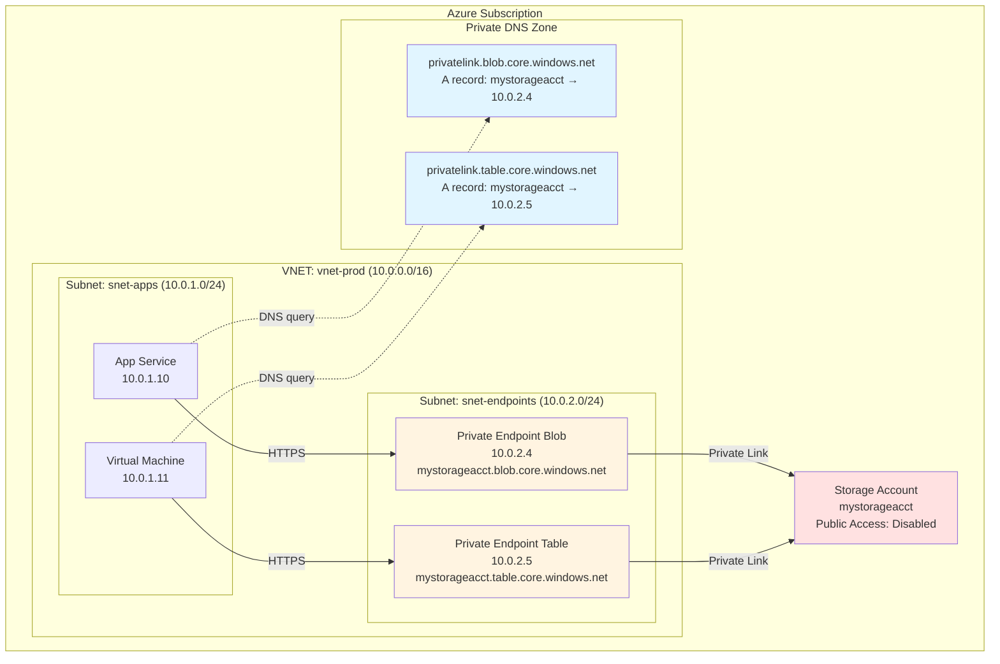
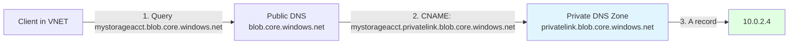
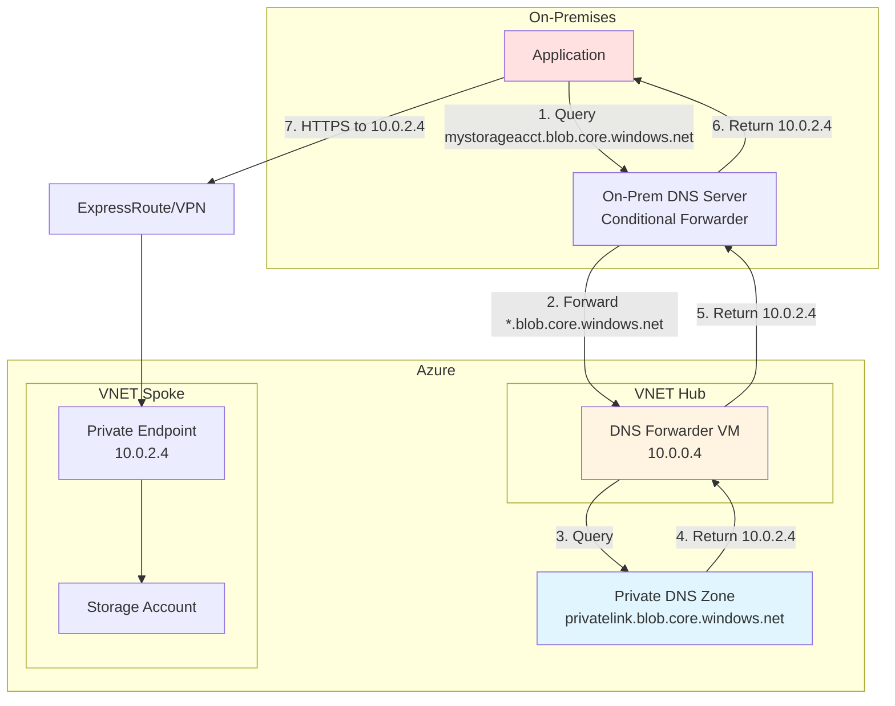
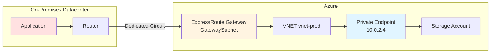

# Storage Networking Architecture

> **File Purpose**: Comprehensive guide to network security patterns including private endpoints, service endpoints, firewall rules, and DNS configuration
> **Prerequisites**: Understanding of Azure VNets, subnets, and DNS concepts
> **Agent Use Case**: Reference when designing network isolation, configuring private endpoints, or troubleshooting connectivity issues

## Quick Context

Azure Storage accounts support three network access patterns: public internet (discouraged), service endpoints (moderate security), and private endpoints (recommended for production). **Default to private endpoints with deny-public-network-access for all production workloads.**

**Key principle**: Network security is defense-in-depth. Combine network isolation (private endpoints), identity-based access (RBAC), and data protection (encryption, soft delete).

## Network Access Patterns Overview

### Comparison Table

| Feature | Public Access | Service Endpoints | Private Endpoints |
|---------|--------------|-------------------|-------------------|
| **Access method** | Internet | VNET-optimized routing | Private IP in VNET |
| **DNS resolution** | Public IP | Public IP | Private IP (privatelink zone) |
| **Traffic route** | Public internet | Azure backbone | Azure backbone |
| **IP allowlist** | Required | Not required (VNET-based) | Not required (VNET-based) |
| **Cross-region** | Yes | Yes | Yes (with VNET peering) |
| **On-premises** | Yes | Via ExpressRoute/VPN | Via ExpressRoute/VPN |
| **Cost** | Free | Free | $0.01/hour per endpoint (~$7.30/month) |
| **Security posture** | Weakest | Moderate | Strongest |
| **Zero-trust ready** | No | Partial | Yes |
| **Setup complexity** | Low | Low | Medium (DNS configuration) |

### Decision Matrix

| Use Case | Recommended Pattern | Justification |
|----------|---------------------|---------------|
| Production application | Private Endpoint | No internet exposure, private IP addressing |
| Dev/test environment | Service Endpoint or Public + Firewall | Balance cost and security |
| CDN origin storage | Public Access (read-only SAS) | CDN PoPs require public access |
| Hybrid on-premises + Azure | Private Endpoint | Seamless connectivity via ExpressRoute/VPN |
| Multi-region application | Private Endpoint (per region) | Low latency, private routing |
| Third-party integration (temporary) | Firewall IP allowlist | Time-boxed, IP-restricted access |
| Analytics (Databricks, Synapse) | Private Endpoint or Service Endpoint | Depends on network topology |

## Private Endpoints (Recommended)

### Architecture Overview

Private endpoints create a private IP address in your VNET subnet that maps to the storage account. Traffic never leaves the Azure backbone.



### Setup: Azure CLI

**Step 1: Disable public network access**

```bash
# Variables
STORAGE_ACCOUNT="mystorageacct"
RG_STORAGE="rg-storage"
LOCATION="westus3"

# Deny all public access
az storage account update \
  --name $STORAGE_ACCOUNT \
  --resource-group $RG_STORAGE \
  --default-action Deny \
  --public-network-access Disabled
```

**Step 2: Create VNET and subnet**

```bash
# VNET
az network vnet create \
  --name vnet-prod \
  --resource-group rg-network \
  --location $LOCATION \
  --address-prefix 10.0.0.0/16

# Subnet for private endpoints
az network vnet subnet create \
  --name snet-endpoints \
  --vnet-name vnet-prod \
  --resource-group rg-network \
  --address-prefix 10.0.2.0/24 \
  --disable-private-endpoint-network-policies true  # Required for private endpoints
```

**Step 3: Create private endpoint for Blob service**

```bash
# Get storage account resource ID
STORAGE_ID=$(az storage account show \
  --name $STORAGE_ACCOUNT \
  --resource-group $RG_STORAGE \
  --query id -o tsv)

# Create private endpoint
az network private-endpoint create \
  --name pe-${STORAGE_ACCOUNT}-blob \
  --resource-group rg-network \
  --vnet-name vnet-prod \
  --subnet snet-endpoints \
  --private-connection-resource-id $STORAGE_ID \
  --group-id blob \
  --connection-name ${STORAGE_ACCOUNT}-blob-connection
```

**Step 4: Create private endpoint for Table service**

```bash
az network private-endpoint create \
  --name pe-${STORAGE_ACCOUNT}-table \
  --resource-group rg-network \
  --vnet-name vnet-prod \
  --subnet snet-endpoints \
  --private-connection-resource-id $STORAGE_ID \
  --group-id table \
  --connection-name ${STORAGE_ACCOUNT}-table-connection
```

**Supported subresources** (group-id):
- `blob` - Blob service
- `table` - Table service
- `queue` - Queue service
- `file` - File service
- `dfs` - Data Lake Storage Gen2 (ADLS Gen2)

**Step 5: Configure DNS (Private DNS Zone)**

```bash
# Create private DNS zone for Blob
az network private-dns zone create \
  --name privatelink.blob.core.windows.net \
  --resource-group rg-network

# Link DNS zone to VNET
az network private-dns link vnet create \
  --name vnet-prod-link \
  --resource-group rg-network \
  --zone-name privatelink.blob.core.windows.net \
  --virtual-network vnet-prod \
  --registration-enabled false

# Create DNS zone group (auto-registers A record)
az network private-endpoint dns-zone-group create \
  --name blob-dns-zone-group \
  --resource-group rg-network \
  --endpoint-name pe-${STORAGE_ACCOUNT}-blob \
  --private-dns-zone privatelink.blob.core.windows.net \
  --zone-name blob
```

**Repeat for Table service**:

```bash
# Create private DNS zone for Table
az network private-dns zone create \
  --name privatelink.table.core.windows.net \
  --resource-group rg-network

# Link DNS zone to VNET
az network private-dns link vnet create \
  --name vnet-prod-link \
  --resource-group rg-network \
  --zone-name privatelink.table.core.windows.net \
  --virtual-network vnet-prod \
  --registration-enabled false

# Create DNS zone group
az network private-endpoint dns-zone-group create \
  --name table-dns-zone-group \
  --resource-group rg-network \
  --endpoint-name pe-${STORAGE_ACCOUNT}-table \
  --private-dns-zone privatelink.table.core.windows.net \
  --zone-name table
```

**Step 6: Verify DNS resolution**

```bash
# From VM in VNET, run:
nslookup mystorageacct.blob.core.windows.net
# Should resolve to 10.0.2.x (private IP)

nslookup mystorageacct.table.core.windows.net
# Should resolve to 10.0.2.x (private IP)
```

### Setup: Bicep

**Complete Bicep template** (VNET, private endpoints, DNS):

```bicep
param location string = resourceGroup().location
param storageAccountName string
param vnetName string = 'vnet-prod'
param subnetName string = 'snet-endpoints'

// Existing storage account
resource storageAccount 'Microsoft.Storage/storageAccounts@2023-05-01' existing = {
  name: storageAccountName
}

// Virtual Network
resource vnet 'Microsoft.Network/virtualNetworks@2023-05-01' = {
  name: vnetName
  location: location
  properties: {
    addressSpace: {
      addressPrefixes: ['10.0.0.0/16']
    }
    subnets: [
      {
        name: 'snet-apps'
        properties: {
          addressPrefix: '10.0.1.0/24'
        }
      }
      {
        name: subnetName
        properties: {
          addressPrefix: '10.0.2.0/24'
          privateEndpointNetworkPolicies: 'Disabled'  // Required
        }
      }
    ]
  }
}

// Subnet reference
resource subnet 'Microsoft.Network/virtualNetworks/subnets@2023-05-01' existing = {
  parent: vnet
  name: subnetName
}

// Private Endpoint - Blob
resource privateEndpointBlob 'Microsoft.Network/privateEndpoints@2023-05-01' = {
  name: 'pe-${storageAccountName}-blob'
  location: location
  properties: {
    subnet: {
      id: subnet.id
    }
    privateLinkServiceConnections: [
      {
        name: '${storageAccountName}-blob-connection'
        properties: {
          privateLinkServiceId: storageAccount.id
          groupIds: ['blob']
        }
      }
    ]
  }
}

// Private Endpoint - Table
resource privateEndpointTable 'Microsoft.Network/privateEndpoints@2023-05-01' = {
  name: 'pe-${storageAccountName}-table'
  location: location
  properties: {
    subnet: {
      id: subnet.id
    }
    privateLinkServiceConnections: [
      {
        name: '${storageAccountName}-table-connection'
        properties: {
          privateLinkServiceId: storageAccount.id
          groupIds: ['table']
        }
      }
    ]
  }
}

// Private DNS Zone - Blob
resource privateDnsZoneBlob 'Microsoft.Network/privateDnsZones@2020-06-01' = {
  name: 'privatelink.blob.core.windows.net'
  location: 'global'
}

// Private DNS Zone - Table
resource privateDnsZoneTable 'Microsoft.Network/privateDnsZones@2020-06-01' = {
  name: 'privatelink.table.core.windows.net'
  location: 'global'
}

// Link DNS Zone to VNET - Blob
resource dnsZoneLinkBlob 'Microsoft.Network/privateDnsZones/virtualNetworkLinks@2020-06-01' = {
  parent: privateDnsZoneBlob
  name: '${vnetName}-link'
  location: 'global'
  properties: {
    virtualNetwork: {
      id: vnet.id
    }
    registrationEnabled: false
  }
}

// Link DNS Zone to VNET - Table
resource dnsZoneLinkTable 'Microsoft.Network/privateDnsZones/virtualNetworkLinks@2020-06-01' = {
  parent: privateDnsZoneTable
  name: '${vnetName}-link'
  location: 'global'
  properties: {
    virtualNetwork: {
      id: vnet.id
    }
    registrationEnabled: false
  }
}

// DNS Zone Group - Blob (auto-registers A record)
resource dnsZoneGroupBlob 'Microsoft.Network/privateEndpoints/privateDnsZoneGroups@2023-05-01' = {
  parent: privateEndpointBlob
  name: 'blob-dns-zone-group'
  properties: {
    privateDnsZoneConfigs: [
      {
        name: 'blob-config'
        properties: {
          privateDnsZoneId: privateDnsZoneBlob.id
        }
      }
    ]
  }
}

// DNS Zone Group - Table
resource dnsZoneGroupTable 'Microsoft.Network/privateEndpoints/privateDnsZoneGroups@2023-05-01' = {
  parent: privateEndpointTable
  name: 'table-dns-zone-group'
  properties: {
    privateDnsZoneConfigs: [
      {
        name: 'table-config'
        properties: {
          privateDnsZoneId: privateDnsZoneTable.id
        }
      }
    ]
  }
}

// Outputs
output blobPrivateEndpointIp string = privateEndpointBlob.properties.customDnsConfigs[0].ipAddresses[0]
output tablePrivateEndpointIp string = privateEndpointTable.properties.customDnsConfigs[0].ipAddresses[0]
```

### DNS Configuration Deep-Dive

**How DNS resolution works with private endpoints**:

1. **Without private endpoint**:
   - `mystorageacct.blob.core.windows.net` → Public IP (e.g., 52.239.x.x)

2. **With private endpoint + Private DNS Zone**:
   - `mystorageacct.blob.core.windows.net` → CNAME → `mystorageacct.privatelink.blob.core.windows.net` → A record → Private IP (10.0.2.4)

**DNS flow**:



**Verify DNS configuration**:

```bash
# From VM in VNET
dig mystorageacct.blob.core.windows.net

# Expected output:
# mystorageacct.blob.core.windows.net. 60 IN CNAME mystorageacct.privatelink.blob.core.windows.net.
# mystorageacct.privatelink.blob.core.windows.net. 60 IN A 10.0.2.4
```

**Manual DNS record creation** (if not using DNS Zone Group):

```bash
# Get private endpoint IP
PE_IP=$(az network private-endpoint show \
  --name pe-mystorageacct-blob \
  --resource-group rg-network \
  --query "customDnsConfigs[0].ipAddresses[0]" -o tsv)

# Create A record in private DNS zone
az network private-dns record-set a add-record \
  --resource-group rg-network \
  --zone-name privatelink.blob.core.windows.net \
  --record-set-name mystorageacct \
  --ipv4-address $PE_IP
```

### Hybrid Connectivity (On-Premises)

**Scenario**: Access storage from on-premises network via ExpressRoute or VPN.

**DNS forwarder required** (on-premises DNS cannot resolve Azure Private DNS zones).

**Architecture**:



**Setup DNS forwarder VM**:

```bash
# 1. Create Ubuntu VM in Azure VNET (hub)
az vm create \
  --name dns-forwarder \
  --resource-group rg-network \
  --image Ubuntu2204 \
  --vnet-name vnet-hub \
  --subnet snet-infra \
  --private-ip-address 10.0.0.4 \
  --size Standard_B2s

# 2. SSH to VM and install BIND9
sudo apt-get update
sudo apt-get install -y bind9

# 3. Configure BIND to forward to Azure DNS (168.63.129.16)
sudo tee -a /etc/bind/named.conf.options > /dev/null <<EOF
forwarders {
    168.63.129.16;
};
forward only;
EOF

# 4. Restart BIND
sudo systemctl restart bind9

# 5. Configure on-premises DNS server
# Add conditional forwarder:
#   Zone: blob.core.windows.net
#   Forwarders: 10.0.0.4 (DNS forwarder VM in Azure)
```

**Alternative**: Use Azure Private DNS Resolver (managed service, no VM required).

```bash
# Create Private DNS Resolver
az dns-resolver create \
  --name dns-resolver-prod \
  --resource-group rg-network \
  --location $LOCATION \
  --virtual-network /subscriptions/{sub}/resourceGroups/rg-network/providers/Microsoft.Network/virtualNetworks/vnet-hub

# Create inbound endpoint (for on-premises queries)
az dns-resolver inbound-endpoint create \
  --name inbound-endpoint \
  --dns-resolver-name dns-resolver-prod \
  --resource-group rg-network \
  --location $LOCATION \
  --ip-configurations "[{subnet:{id:/subscriptions/{sub}/resourceGroups/rg-network/providers/Microsoft.Network/virtualNetworks/vnet-hub/subnets/snet-dns},privateIpAddress:10.0.0.4}]"

# Configure on-premises DNS to forward to 10.0.0.4
```

See Azure Private DNS Resolver documentation for detailed setup.

### Application Code (No Changes Required)

**C# example** (same code works with public or private endpoints):

```csharp
using Azure.Identity;
using Azure.Storage.Blobs;

// URI uses public FQDN (DNS resolves to private IP if in VNET)
var blobServiceClient = new BlobServiceClient(
    new Uri("https://mystorageacct.blob.core.windows.net"),
    new DefaultAzureCredential());

// No code changes needed when switching to private endpoint
var containerClient = blobServiceClient.GetBlobContainerClient("mycontainer");
await containerClient.CreateIfNotExistsAsync();
```

**How it works**:
1. Application queries `mystorageacct.blob.core.windows.net`
2. VNET-linked Private DNS Zone returns private IP (10.0.2.4)
3. Traffic routed to private endpoint in VNET
4. Private Link routes to storage account

**No code changes required** when migrating from public to private endpoints.

## VNET Service Endpoints

### What Are Service Endpoints?

Service endpoints optimize routing from VNET to Azure Storage via Azure backbone (not internet). **Traffic still uses public IP** but routes through Azure's internal network.

**Use case**: Lower cost alternative to private endpoints when private IP addressing not required.

**Limitations**:
- Traffic still exits VNET (source IP = VNET public IP)
- No hybrid connectivity (cannot access from on-premises)
- Storage firewall must allow VNET/subnet

### Setup: Azure CLI

```bash
# 1. Enable service endpoint on subnet
az network vnet subnet update \
  --vnet-name vnet-prod \
  --name snet-apps \
  --resource-group rg-network \
  --service-endpoints Microsoft.Storage

# 2. Add VNET rule to storage account firewall
az storage account network-rule add \
  --account-name mystorageacct \
  --resource-group rg-storage \
  --vnet-name vnet-prod \
  --subnet snet-apps
```

### Setup: Bicep

```bicep
// Subnet with service endpoint
resource subnet 'Microsoft.Network/virtualNetworks/subnets@2023-05-01' = {
  name: 'snet-apps'
  parent: vnet
  properties: {
    addressPrefix: '10.0.1.0/24'
    serviceEndpoints: [
      {
        service: 'Microsoft.Storage'
        locations: [location]
      }
    ]
  }
}

// Storage account with VNET rule
resource storageAccount 'Microsoft.Storage/storageAccounts@2023-05-01' = {
  name: storageAccountName
  location: location
  kind: 'StorageV2'
  sku: { name: 'Standard_GZRS' }
  properties: {
    networkAcls: {
      defaultAction: 'Deny'
      bypass: 'AzureServices'
      virtualNetworkRules: [
        {
          id: subnet.id
          action: 'Allow'
        }
      ]
    }
  }
}
```

### Service Endpoints vs Private Endpoints

| Feature | Service Endpoints | Private Endpoints |
|---------|------------------|-------------------|
| **Private IP in VNET** | No (public IP) | Yes (10.x.x.x) |
| **Hybrid connectivity** | No | Yes (via ExpressRoute/VPN) |
| **DNS changes** | No | Yes (Private DNS Zone) |
| **Cost** | Free | ~$7.30/month per endpoint |
| **NSG support** | Yes | Yes |
| **Routing** | Azure backbone | Azure backbone |
| **Security posture** | Moderate | Strong |

**Recommendation**: Use private endpoints for production. Service endpoints acceptable for dev/test.

## Firewall Rules and IP Restrictions

### IP Allowlist

**Use case**: Grant access from known public IPs (e.g., third-party SaaS, CI/CD agents).

```bash
# Allow specific IP address
az storage account network-rule add \
  --account-name mystorageacct \
  --resource-group rg-storage \
  --ip-address 203.0.113.42

# Allow IP range (CIDR)
az storage account network-rule add \
  --account-name mystorageacct \
  --resource-group rg-storage \
  --ip-address 203.0.113.0/24
```

**Bicep**:

```bicep
resource storageAccount 'Microsoft.Storage/storageAccounts@2023-05-01' = {
  name: storageAccountName
  location: location
  kind: 'StorageV2'
  sku: { name: 'Standard_GZRS' }
  properties: {
    networkAcls: {
      defaultAction: 'Deny'
      bypass: 'AzureServices'
      ipRules: [
        {
          value: '203.0.113.42'  // Single IP
          action: 'Allow'
        }
        {
          value: '203.0.113.0/24'  // IP range
          action: 'Allow'
        }
      ]
    }
  }
}
```

**Important**: Use public IP of client (not private IP). Check your IP:

```bash
curl ifconfig.me
```

### Bypass Azure Services

**Allow Azure trusted services** (Azure Monitor, Azure Backup, etc.) even when default action is Deny:

```bash
az storage account update \
  --name mystorageacct \
  --resource-group rg-storage \
  --bypass AzureServices
```

**Trusted services include**:
- Azure Monitor (diagnostics)
- Azure Backup
- Azure Site Recovery
- Azure Log Analytics
- Azure Event Grid
- Azure Data Factory (with managed identity)

**Security note**: Only services with RBAC or SAS can access. Bypass does not grant automatic access.

### Resource Instance Rules

**Grant access to specific Azure resource instances** (e.g., specific App Service):

```bash
# Get App Service resource ID
APP_ID=$(az webapp show \
  --name myapp \
  --resource-group rg-apps \
  --query id -o tsv)

# Add resource instance rule
az storage account network-rule add \
  --account-name mystorageacct \
  --resource-group rg-storage \
  --resource-id $APP_ID
```

**Bicep**:

```bicep
resource storageAccount 'Microsoft.Storage/storageAccounts@2023-05-01' = {
  name: storageAccountName
  properties: {
    networkAcls: {
      defaultAction: 'Deny'
      bypass: 'AzureServices'
      resourceAccessRules: [
        {
          tenantId: tenant().tenantId
          resourceId: appService.id
        }
      ]
    }
  }
}
```

**Use case**: Allow specific App Service to access storage without IP allowlist or VNET integration.

### View Current Firewall Rules

```bash
az storage account show \
  --name mystorageacct \
  --resource-group rg-storage \
  --query "networkRuleSet.{defaultAction:defaultAction, bypass:bypass, ipRules:ipRules, vnetRules:virtualNetworkRules}"
```

## Network Security Best Practices

### 1. Deny Public Network Access

```bash
# Production: disable all public access
az storage account update \
  --name mystorageacct \
  --resource-group rg-storage \
  --public-network-access Disabled

# Only private endpoints can access
```

**Trade-offs**:
- ✅ Maximum security (zero internet exposure)
- ✅ Compliant with zero-trust
- ❌ Requires private endpoint setup
- ❌ Cannot use Azure Portal storage browser (use Azure Storage Explorer with private endpoint)

### 2. Enable HTTPS Only

```bash
az storage account update \
  --name mystorageacct \
  --resource-group rg-storage \
  --https-only true
```

**Blocks HTTP traffic**. TLS 1.2+ required (configure via `--min-tls-version TLS1_2`).

### 3. Use Private Endpoints for Production

```bash
# Create private endpoint (see earlier section)
az network private-endpoint create \
  --name pe-mystorageacct-blob \
  --resource-group rg-network \
  --vnet-name vnet-prod \
  --subnet snet-endpoints \
  --private-connection-resource-id $STORAGE_ID \
  --group-id blob \
  --connection-name mystorageacct-blob
```

**Cost**: ~$7.30/month per endpoint (per service). E.g., blob + table = $14.60/month.

**Justified by**:
- Private IP addressing
- No internet exposure
- Hybrid connectivity (ExpressRoute/VPN)
- Compliance requirements

### 4. Minimize IP Allowlist

**Use IP allowlist only for**:
- Known third-party IPs (SaaS vendors)
- Temporary access (remove after use)
- CI/CD agents (GitHub Actions, Azure DevOps)

**Avoid**:
- Broad IP ranges (e.g., 0.0.0.0/0)
- Dynamic IPs (home internet)

**Better**: Use VNET integration or private endpoints.

### 5. Audit Network Rules Quarterly

```bash
# List all IP rules
az storage account network-rule list \
  --account-name mystorageacct \
  --resource-group rg-storage \
  --query "ipRules[].{IP:value, Action:action}"

# Review and remove obsolete rules
az storage account network-rule remove \
  --account-name mystorageacct \
  --resource-group rg-storage \
  --ip-address 203.0.113.42
```

### 6. Enable Diagnostic Logs

**Monitor network access patterns**:

```bash
az monitor diagnostic-settings create \
  --name storage-network-logs \
  --resource /subscriptions/{sub}/resourceGroups/rg-storage/providers/Microsoft.Storage/storageAccounts/mystorageacct \
  --logs '[{"category":"StorageRead","enabled":true},{"category":"StorageWrite","enabled":true}]' \
  --workspace /subscriptions/{sub}/resourceGroups/rg-monitoring/providers/Microsoft.OperationalInsights/workspaces/myworkspace
```

**Query network errors** (KQL):

```kql
StorageBlobLogs
| where TimeGenerated > ago(24h)
| where StatusCode in (403, 404)  // Access denied, not found
| summarize count() by CallerIpAddress, OperationName, StatusCode
| order by count_ desc
```

See `06-operations/observability.md` for detailed monitoring.

## Hybrid Connectivity Patterns

### Pattern 1: ExpressRoute + Private Endpoint

**Best for**: Enterprise on-premises connectivity (dedicated circuit).

**Architecture**:



**Setup**:

```bash
# 1. Create ExpressRoute Gateway in Azure
az network vnet-gateway create \
  --name er-gateway \
  --resource-group rg-network \
  --vnet vnet-prod \
  --gateway-type ExpressRoute \
  --sku Standard \
  --location $LOCATION

# 2. Create private endpoint (see earlier section)

# 3. Configure DNS forwarder (see earlier section)

# 4. Update on-premises routes to point to ExpressRoute
#    (Configure via on-premises router)
```

**Traffic flow**:
1. On-premises app queries DNS → resolves to 10.0.2.4 (via DNS forwarder)
2. Traffic routed to ExpressRoute Gateway
3. Gateway routes to VNET → private endpoint → storage account

### Pattern 2: VPN Gateway + Private Endpoint

**Best for**: Cost-effective hybrid connectivity (internet-based VPN).

```bash
# 1. Create VPN Gateway
az network vnet-gateway create \
  --name vpn-gateway \
  --resource-group rg-network \
  --vnet vnet-prod \
  --gateway-type Vpn \
  --vpn-type RouteBased \
  --sku VpnGw1 \
  --location $LOCATION

# 2. Create local network gateway (on-premises)
az network local-gateway create \
  --name lng-onprem \
  --resource-group rg-network \
  --gateway-ip-address 203.0.113.42 \  # On-prem public IP
  --local-address-prefixes 192.168.0.0/16  # On-prem CIDR

# 3. Create connection
az network vpn-connection create \
  --name vpn-connection-onprem \
  --resource-group rg-network \
  --vnet-gateway1 vpn-gateway \
  --local-gateway2 lng-onprem \
  --shared-key "YourSharedKey"
```

**Traffic flow**: Same as ExpressRoute, but over internet (encrypted via IPSec).

### Pattern 3: Point-to-Site VPN (Individual Developers)

**Best for**: Remote developers accessing storage via private endpoint.

```bash
# 1. Create VPN Gateway (if not exists)

# 2. Configure point-to-site
az network vnet-gateway update \
  --name vpn-gateway \
  --resource-group rg-network \
  --address-prefixes 172.16.0.0/24 \  # VPN client IP pool
  --vpn-client-protocols OpenVPN IkeV2 \
  --root-cert-name MyRootCert \
  --root-cert-data "$(cat rootcert.cer)"

# 3. Download VPN client
az network vnet-gateway vpn-client generate \
  --name vpn-gateway \
  --resource-group rg-network \
  --processor-architecture Amd64
```

**Developer workflow**:
1. Connect to P2S VPN (assigned 172.16.0.x IP)
2. DNS resolves `mystorageacct.blob.core.windows.net` to private IP
3. Access storage via private endpoint

## Troubleshooting Network Connectivity

### Issue: Connection Timeout

**Symptoms**: Application cannot connect to storage account.

**Diagnosis**:

```bash
# 1. Check network ACL default action
az storage account show \
  --name mystorageacct \
  --resource-group rg-storage \
  --query "networkRuleSet.defaultAction"

# If "Deny", verify IP/VNET rules or private endpoint

# 2. Test DNS resolution (from VM in VNET)
nslookup mystorageacct.blob.core.windows.net

# Should return private IP (10.x.x.x) if private endpoint configured

# 3. Test connectivity
curl -I https://mystorageacct.blob.core.windows.net

# If timeout, check NSG rules on subnet
az network nsg rule list \
  --nsg-name nsg-snet-apps \
  --resource-group rg-network \
  --query "[].{Name:name, Priority:priority, DestinationPort:destinationPortRange, Access:access}"
```

**Solutions**:
- Add IP to firewall allowlist
- Configure VNET service endpoint or private endpoint
- Check NSG allows outbound HTTPS (port 443)
- Verify private DNS zone linked to VNET

### Issue: DNS Resolves to Public IP (Expected Private)

**Symptoms**: `nslookup` returns public IP instead of private IP.

**Diagnosis**:

```bash
# 1. Check Private DNS Zone exists
az network private-dns zone list \
  --resource-group rg-network \
  --query "[?name=='privatelink.blob.core.windows.net']"

# 2. Check VNET link
az network private-dns link vnet list \
  --zone-name privatelink.blob.core.windows.net \
  --resource-group rg-network

# 3. Check DNS zone group (auto-registration)
az network private-endpoint dns-zone-group list \
  --endpoint-name pe-mystorageacct-blob \
  --resource-group rg-network
```

**Solutions**:
- Link Private DNS Zone to VNET
- Create DNS zone group for private endpoint (auto-registers A record)
- Manually create A record if DNS zone group missing

### Issue: Access Denied (403)

**Symptoms**: Network connectivity works, but requests return 403 Forbidden.

**Diagnosis**:

```bash
# 1. Check RBAC role assignments
az role assignment list \
  --assignee $PRINCIPAL_ID \
  --scope /subscriptions/{sub}/resourceGroups/rg-storage/providers/Microsoft.Storage/storageAccounts/mystorageacct

# 2. Check if shared key access disabled
az storage account show \
  --name mystorageacct \
  --resource-group rg-storage \
  --query "allowSharedKeyAccess"

# If false, must use Azure AD authentication (RBAC or user delegation SAS)

# 3. Check diagnostic logs
az monitor diagnostic-settings list \
  --resource /subscriptions/{sub}/resourceGroups/rg-storage/providers/Microsoft.Storage/storageAccounts/mystorageacct
```

**Solutions**:
- Assign appropriate RBAC role (Storage Blob Data Contributor)
- Use DefaultAzureCredential in application code
- If using SAS, verify not expired and permissions correct

See `02-core-concepts/security-model.md` for authentication troubleshooting.

## Security Checklist

Before production deployment:

- [ ] Default action set to Deny (`--default-action Deny`)
- [ ] Public network access disabled (`--public-network-access Disabled`) or minimal IP allowlist
- [ ] Private endpoints created for each service (blob, table, etc.)
- [ ] Private DNS Zones created and linked to VNETs
- [ ] DNS zone groups configured (auto-registration)
- [ ] HTTPS-only enabled (`--https-only true`)
- [ ] TLS 1.2+ enforced (`--min-tls-version TLS1_2`)
- [ ] Bypass set to AzureServices only
- [ ] IP allowlist minimized (only known IPs)
- [ ] VNET service endpoints or private endpoints for Azure services
- [ ] NSG rules allow outbound HTTPS (port 443)
- [ ] Diagnostic logs enabled and sent to Log Analytics
- [ ] Hybrid DNS forwarder configured (if on-premises access required)
- [ ] Network rules audited quarterly

## Navigation

- **Previous**: `security-model.md`
- **Next**: `03-blob-storage/blob-fundamentals.md`
- **Up**: `00-overview.md`

## See Also

- `01-quick-start/provisioning.md` - Basic network configuration
- `02-core-concepts/security-model.md` - Authentication and authorization
- `05-security/network-security.md` - Advanced firewall patterns
- `06-operations/observability.md` - Network monitoring and alerts

## References

[1] "Azure Storage private endpoints" - Microsoft Learn - 2024-09 - https://learn.microsoft.com/azure/storage/common/storage-private-endpoints
[2] "Use private endpoints for Azure Storage" - Microsoft Learn - 2024-08 - https://learn.microsoft.com/azure/storage/common/storage-network-security
[3] "Configure Azure Storage firewalls and virtual networks" - Microsoft Learn - 2024-09 - https://learn.microsoft.com/azure/storage/common/storage-network-security
[4] "Virtual Network service endpoints" - Microsoft Learn - 2024-07 - https://learn.microsoft.com/azure/virtual-network/virtual-network-service-endpoints-overview
[5] "Azure Private Link DNS configuration" - Microsoft Learn - 2024-08 - https://learn.microsoft.com/azure/private-link/private-endpoint-dns
