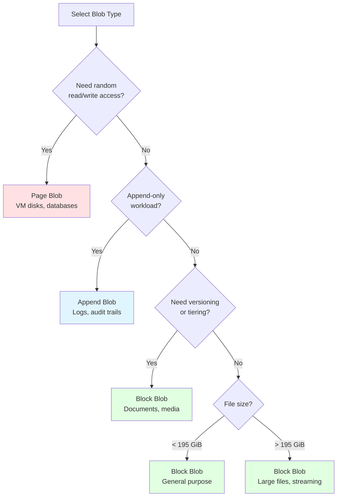
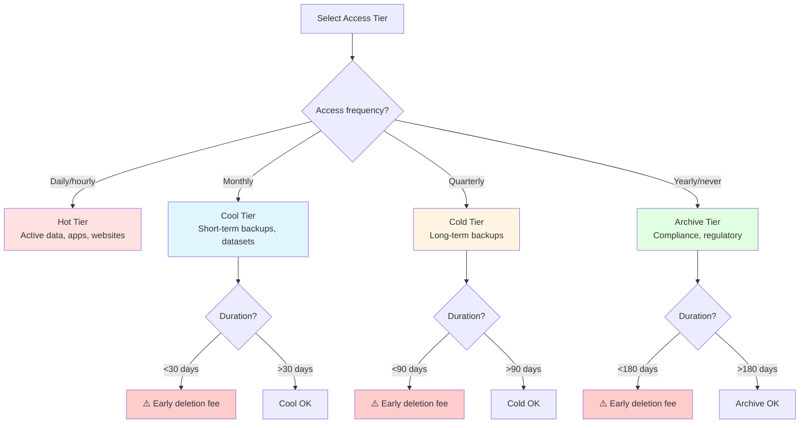

# Blob Storage Fundamentals

> **File Purpose**: Comprehensive guide to blob types, access tiers, versioning, and performance characteristics
> **Prerequisites**: `01-quick-start/provisioning.md`, `02-core-concepts/storage-accounts.md`
> **Agent Use Case**: Reference when choosing blob types and access tiers for specific workloads

## Quick Context

Azure Blob Storage supports three blob types (Block, Append, Page) optimized for different scenarios, and four access tiers (Hot, Cool, Cold, Archive) for cost optimization. Understanding the trade-offs between blob types and tiers is critical for performance and cost efficiency.

**Key principle**: Choose blob type based on access pattern (random vs sequential vs append-only), choose tier based on access frequency and latency requirements.

## Blob Types Overview

| Blob Type | Optimized For | Max Size | Use Cases | Modification Pattern |
|-----------|--------------|----------|-----------|---------------------|
| **Block Blob** | General-purpose | 190.7 TiB | Documents, images, videos, backups | Upload blocks, commit list |
| **Append Blob** | Append operations | 195 GiB | Logs, audit trails, streaming data | Append blocks only |
| **Page Blob** | Random I/O | 8 TiB | VM disks, database files | Random read/write 512-byte pages |

### Decision Matrix: Which Blob Type?



## Block Blobs

### Overview

Block blobs are optimized for **streaming** and **uploading large files efficiently**. Files are uploaded in blocks (up to 4,000 MiB each) and committed as a single blob.

**Best for**:
- Documents (PDF, Word, Excel)
- Images and videos
- Backups and archives
- General-purpose file storage

### Architecture

```
Block Blob Upload Flow:
┌─────────────────┐
│  Client         │
│  (Your App)     │
└────────┬────────┘
         │
         │ 1. Upload Block 1 (uncommitted)
         ├──────────────────────────┐
         │ 2. Upload Block 2         │
         ├──────────────────────────┤
         │ 3. Upload Block N         │
         ├──────────────────────────┤
         │ 4. Commit Block List      │
         ▼                           ▼
┌─────────────────────────────────────┐
│  Azure Blob Storage                 │
│  ┌─────────────────────────────┐   │
│  │ Uncommitted Blocks (temp)   │   │
│  └─────────────────────────────┘   │
│              │                      │
│              ▼ (on commit)          │
│  ┌─────────────────────────────┐   │
│  │ Committed Blob              │   │
│  │ Block1 + Block2 + ... BlockN│   │
│  └─────────────────────────────┘   │
└─────────────────────────────────────┘
```

**Key characteristics**:
- Each block: 1 byte to 4,000 MiB
- Max blocks per blob: 50,000
- Max blob size: 190.7 TiB (50,000 × 4,000 MiB)
- Uncommitted blocks expire after 7 days if not committed

### C# Implementation

#### Simple Upload (Files < 256 MB)

```csharp
using Azure.Storage.Blobs;
using Azure.Storage.Blobs.Models;
using Azure.Identity;

var blobServiceClient = new BlobServiceClient(
    new Uri("https://storacct.blob.core.windows.net"),
    new DefaultAzureCredential()
);

var containerClient = blobServiceClient.GetBlobContainerClient("documents");
var blobClient = containerClient.GetBlockBlobClient("reports/q4-2025.pdf");

// Upload with metadata and access tier
var uploadOptions = new BlobUploadOptions
{
    HttpHeaders = new BlobHttpHeaders
    {
        ContentType = "application/pdf",
        CacheControl = "public, max-age=86400"
    },
    Metadata = new Dictionary<string, string>
    {
        ["department"] = "finance",
        ["fiscal-year"] = "2025",
        ["quarter"] = "Q4"
    },
    AccessTier = AccessTier.Hot
};

await blobClient.UploadAsync("./q4-report.pdf", uploadOptions);
```

#### Chunked Upload (Files > 256 MB)

```csharp
// Optimized for large files with parallel upload
var uploadOptions = new BlobUploadOptions
{
    TransferOptions = new StorageTransferOptions
    {
        // 16 MB chunks, 8 parallel uploads
        InitialTransferSize = 16 * 1024 * 1024,
        MaximumTransferSize = 16 * 1024 * 1024,
        MaximumConcurrency = 8
    },
    HttpHeaders = new BlobHttpHeaders
    {
        ContentType = "video/mp4"
    },
    AccessTier = AccessTier.Cool,  // Less frequently accessed
    ProgressHandler = new Progress<long>(bytes =>
        Console.WriteLine($"Uploaded: {bytes / (1024.0 * 1024.0):F2} MB"))
};

using var fileStream = File.OpenRead("./large-video.mp4");
await blobClient.UploadAsync(fileStream, uploadOptions);
```

**Performance tuning**:
- **Small files (<4 MB)**: Single upload, no chunking
- **Medium files (4-256 MB)**: 8 MB chunks, 4 concurrent uploads
- **Large files (256 MB-1 GB)**: 16 MB chunks, 8 concurrent uploads
- **Huge files (>1 GB)**: 32-100 MB chunks, 8-16 concurrent uploads

**Why it works**: Parallel uploads maximize throughput; chunk size balances request overhead vs memory usage.

### When to Use Block Blobs

✅ **Use Block Blobs when**:
- Uploading files that don't require random access
- Storing documents, images, videos, backups
- Need versioning or soft delete
- Need lifecycle management (auto-tiering to Cool/Archive)
- Streaming large files with chunking

❌ **Don't use Block Blobs when**:
- Need random read/write access (use Page Blobs)
- Append-only workload (use Append Blobs)

## Append Blobs

### Overview

Append blobs are optimized for **append operations** where data is added to the end of the blob. Ideal for logging and audit scenarios.

**Best for**:
- Application logs
- Audit trails
- Event streams
- Telemetry data

### Architecture

```
Append Blob Pattern:
┌─────────────────┐
│  Client         │
│  (Logger)       │
└────────┬────────┘
         │
         │ Append Block 1
         ├──────────────────────────┐
         │ Append Block 2            │
         ├──────────────────────────┤
         │ Append Block 3            │
         ▼                           ▼
┌─────────────────────────────────────┐
│  Append Blob                        │
│  ┌─────────────────────────────┐   │
│  │ Block 1                     │   │
│  ├─────────────────────────────┤   │
│  │ Block 2                     │   │
│  ├─────────────────────────────┤   │
│  │ Block 3  ← New appends here │   │
│  └─────────────────────────────┘   │
└─────────────────────────────────────┘
```

**Key characteristics**:
- Each append block: 1 byte to 100 MiB
- Max append blocks: 50,000
- Max blob size: 195 GiB
- Append operations are atomic
- No modification of existing blocks (append-only)

### C# Implementation

#### Create and Append to Log

```csharp
using Azure.Storage.Blobs.Specialized;

var containerClient = blobServiceClient.GetBlobContainerClient("logs");
var appendBlobClient = containerClient.GetAppendBlobClient("app-logs/2025/10/app.log");

// Create append blob if not exists
await appendBlobClient.CreateIfNotExistsAsync();

// Append log entries
var logEntry1 = $"[{DateTime.UtcNow:o}] INFO: Application started\n";
using var stream1 = new MemoryStream(Encoding.UTF8.GetBytes(logEntry1));
await appendBlobClient.AppendBlockAsync(stream1);

var logEntry2 = $"[{DateTime.UtcNow:o}] ERROR: Database connection failed\n";
using var stream2 = new MemoryStream(Encoding.UTF8.GetBytes(logEntry2));
await appendBlobClient.AppendBlockAsync(stream2);

// Read entire log
var downloadResult = await appendBlobClient.DownloadContentAsync();
var logContent = downloadResult.Value.Content.ToString();
Console.WriteLine(logContent);
```

#### Concurrent Append with Conditional Operations

```csharp
// Ensure append only if blob size is less than 100 MB
var maxBlobSize = 100 * 1024 * 1024; // 100 MB

var conditions = new AppendBlobRequestConditions
{
    IfMaxSizeLessThanOrEqual = maxBlobSize
};

try
{
    var logEntry = $"[{DateTime.UtcNow:o}] INFO: Processing request\n";
    using var stream = new MemoryStream(Encoding.UTF8.GetBytes(logEntry));

    await appendBlobClient.AppendBlockAsync(stream, conditions: conditions);
}
catch (Azure.RequestFailedException ex) when (ex.Status == 412)
{
    // Blob exceeded max size, rotate to new log file
    var newBlobName = $"app-logs/2025/10/app-{DateTime.UtcNow:yyyyMMdd-HHmmss}.log";
    appendBlobClient = containerClient.GetAppendBlobClient(newBlobName);
    await appendBlobClient.CreateAsync();
}
```

#### Log Rotation Pattern

```csharp
public class AppendBlobLogger
{
    private readonly BlobContainerClient _containerClient;
    private readonly long _maxBlobSize = 100 * 1024 * 1024; // 100 MB
    private AppendBlobClient _currentBlobClient;

    public AppendBlobLogger(BlobServiceClient serviceClient, string containerName)
    {
        _containerClient = serviceClient.GetBlobContainerClient(containerName);
        _currentBlobClient = GetOrCreateLogBlob();
    }

    private AppendBlobClient GetOrCreateLogBlob()
    {
        var blobName = $"logs/{DateTime.UtcNow:yyyy/MM/dd}/app.log";
        var client = _containerClient.GetAppendBlobClient(blobName);
        client.CreateIfNotExists();
        return client;
    }

    public async Task LogAsync(string message)
    {
        var logEntry = $"[{DateTime.UtcNow:o}] {message}\n";
        using var stream = new MemoryStream(Encoding.UTF8.GetBytes(logEntry));

        var conditions = new AppendBlobRequestConditions
        {
            IfMaxSizeLessThanOrEqual = _maxBlobSize
        };

        try
        {
            await _currentBlobClient.AppendBlockAsync(stream, conditions: conditions);
        }
        catch (Azure.RequestFailedException ex) when (ex.Status == 412)
        {
            // Rotate to new blob
            _currentBlobClient = GetOrCreateLogBlob();
            stream.Position = 0;
            await _currentBlobClient.AppendBlockAsync(stream);
        }
    }
}

// Usage
var logger = new AppendBlobLogger(blobServiceClient, "application-logs");
await logger.LogAsync("INFO: User logged in");
await logger.LogAsync("ERROR: Payment processing failed");
```

### When to Use Append Blobs

✅ **Use Append Blobs when**:
- Writing logs or audit trails
- Append-only workloads (no updates to existing data)
- Need atomic append operations
- Implementing log rotation based on size

❌ **Don't use Append Blobs when**:
- Need to modify existing blocks
- Random access required
- File size exceeds 195 GiB

## Page Blobs

### Overview

Page blobs are optimized for **random read/write operations** at 512-byte page granularity. Primarily used as backing storage for Azure Virtual Machine disks.

**Best for**:
- Azure VM disks (OS and data disks)
- Database files requiring random I/O
- Applications needing random access patterns

### Architecture

```
Page Blob Structure:
┌─────────────────────────────────────┐
│  Page Blob (8 TiB max)              │
│  ┌─────────────────────────────┐   │
│  │ Page 0   (512 bytes)        │   │
│  ├─────────────────────────────┤   │
│  │ Page 1   (512 bytes)        │   │
│  ├─────────────────────────────┤   │
│  │ Page 2   (512 bytes)        │   │
│  ├─────────────────────────────┤   │
│  │ ...                         │   │
│  ├─────────────────────────────┤   │
│  │ Page N   (512 bytes)        │   │
│  └─────────────────────────────┘   │
│                                     │
│  Write to Page 5 → Updates only     │
│  that 512-byte region               │
└─────────────────────────────────────┘
```

**Key characteristics**:
- Page size: 512 bytes (fixed)
- Max blob size: 8 TiB
- Random read/write at page granularity
- Sparse allocation (pay only for written pages)
- Supports snapshots for point-in-time backups

### C# Implementation

#### Create and Write to Page Blob

```csharp
using Azure.Storage.Blobs.Specialized;

var containerClient = blobServiceClient.GetBlobContainerClient("vm-disks");
var pageBlobClient = containerClient.GetPageBlobClient("disk1.vhd");

// Create page blob (8 GiB virtual disk)
var blobSize = 8L * 1024 * 1024 * 1024; // 8 GiB
await pageBlobClient.CreateAsync(blobSize);

// Write to specific page (offset must be 512-byte aligned)
var pageData = new byte[512];
Array.Fill<byte>(pageData, 0xFF); // Fill with data

var offset = 0; // Must be multiple of 512
using var stream = new MemoryStream(pageData);
await pageBlobClient.UploadPagesAsync(stream, offset);

// Write to different page (random access)
var offset2 = 1024; // Second page
using var stream2 = new MemoryStream(pageData);
await pageBlobClient.UploadPagesAsync(stream2, offset2);
```

#### Read from Page Blob

```csharp
// Read specific page range
var offset = 0;
var length = 512;

var downloadResult = await pageBlobClient.DownloadAsync(new Azure.HttpRange(offset, length));
using var reader = new StreamReader(downloadResult.Value.Content);
var pageContent = await reader.ReadToEndAsync();
```

#### Get Page Ranges (Sparse Blob Analysis)

```csharp
// Get list of valid (written) page ranges
var pageRanges = await pageBlobClient.GetPageRangesAsync();

foreach (var range in pageRanges.Value.PageRanges)
{
    Console.WriteLine($"Written pages: {range.Start} to {range.End} (size: {range.End - range.Start + 1} bytes)");
}

// Get clear (unwritten) page ranges
foreach (var clearRange in pageRanges.Value.ClearRanges)
{
    Console.WriteLine($"Unwritten pages: {clearRange.Start} to {clearRange.End}");
}
```

#### Incremental Snapshot (Differential Backup)

```csharp
// Take snapshot
var snapshotResponse = await pageBlobClient.CreateSnapshotAsync();
var snapshotBlob = pageBlobClient.WithSnapshot(snapshotResponse.Value.Snapshot);

Console.WriteLine($"Snapshot created: {snapshotResponse.Value.Snapshot}");

// Get page ranges diff (changes since snapshot)
var previousSnapshot = snapshotResponse.Value.Snapshot;
var diff = await pageBlobClient.GetManagedDiskPageRangesDiffAsync(
    range: default,
    previousSnapshotUri: snapshotBlob.Uri
);

foreach (var range in diff.Value.PageRanges)
{
    Console.WriteLine($"Changed pages since snapshot: {range.Start} to {range.End}");
}
```

### When to Use Page Blobs

✅ **Use Page Blobs when**:
- Azure VM disks (managed by Azure automatically)
- Database files needing random I/O
- Applications requiring sparse file allocation
- Need incremental snapshots for differential backups

❌ **Don't use Page Blobs when**:
- Sequential access is sufficient (use Block Blobs)
- Append-only workload (use Append Blobs)
- Don't need 512-byte page granularity

**Note**: For most scenarios, Block Blobs are the correct choice. Page Blobs are primarily for Azure-managed VM disks.

## Access Tiers

### Overview

Access tiers optimize cost based on data access frequency. Lower tiers have cheaper storage but higher access costs and latency.

| Tier | Storage Cost | Access Cost | Latency | Min Storage Duration | Use Case |
|------|-------------|-------------|---------|---------------------|----------|
| **Hot** | Highest | Lowest | <10ms | None | Frequently accessed data |
| **Cool** | Lower | Higher | <10ms | 30 days | Infrequently accessed (monthly) |
| **Cold** | Lower | Higher | <10ms | 90 days | Rarely accessed (quarterly) |
| **Archive** | Lowest | Highest | Hours | 180 days | Long-term retention (yearly) |

**Cost comparison** (approximate, varies by region):
- Hot: $0.0184/GB/month storage, $0.004/10K reads
- Cool: $0.0100/GB/month storage, $0.010/10K reads
- Cold: $0.0045/GB/month storage, $0.030/10K reads
- Archive: $0.0020/GB/month storage, $0.050/10K reads + rehydration cost

### Tier Selection Matrix



### C# Implementation

#### Set Tier on Upload

```csharp
var uploadOptions = new BlobUploadOptions
{
    AccessTier = AccessTier.Cool,  // Set tier at upload time
    HttpHeaders = new BlobHttpHeaders
    {
        ContentType = "application/pdf"
    }
};

await blobClient.UploadAsync("./backup.pdf", uploadOptions);
```

#### Change Tier (Rehydration)

```csharp
// Move to Cool tier (immediate)
await blobClient.SetAccessTierAsync(AccessTier.Cool);

// Move to Archive tier (immediate)
await blobClient.SetAccessTierAsync(AccessTier.Archive);

// Rehydrate from Archive to Hot (takes hours)
await blobClient.SetAccessTierAsync(
    AccessTier.Hot,
    rehydratePriority: RehydratePriority.High  // High or Standard
);

// Check rehydration status
var properties = await blobClient.GetPropertiesAsync();
Console.WriteLine($"Archive status: {properties.Value.ArchiveStatus}");
// Possible values:
// - null (not archived)
// - "rehydrate-pending-to-hot"
// - "rehydrate-pending-to-cool"
```

### Archive Tier Rehydration

#### Rehydration Priorities

| Priority | SLA | Cost | Use Case |
|----------|-----|------|----------|
| **Standard** | < 15 hours | Lower | Planned restores, batch processing |
| **High** | < 1 hour | Higher (10x standard) | Urgent access, disaster recovery |

#### Rehydration Patterns

**Pattern 1: In-place rehydration** (changes tier of existing blob)

```csharp
// Move from Archive to Hot (overwrites Archive tier)
await blobClient.SetAccessTierAsync(AccessTier.Hot, rehydratePriority: RehydratePriority.Standard);

// Poll until rehydrated
while (true)
{
    var props = await blobClient.GetPropertiesAsync();
    if (props.Value.ArchiveStatus == null)
    {
        Console.WriteLine("Rehydration complete");
        break;
    }
    Console.WriteLine($"Status: {props.Value.ArchiveStatus}");
    await Task.Delay(TimeSpan.FromMinutes(5));
}
```

**Pattern 2: Copy to different tier** (preserves Archive blob)

```csharp
// Copy archived blob to Hot tier (source remains in Archive)
var archiveBlobClient = containerClient.GetBlobClient("data-archive.bin");
var hotBlobClient = containerClient.GetBlobClient("data-hot.bin");

var copyOptions = new BlobCopyFromUriOptions
{
    AccessTier = AccessTier.Hot,
    RehydratePriority = RehydratePriority.High
};

var copyOperation = await hotBlobClient.StartCopyFromUriAsync(archiveBlobClient.Uri, copyOptions);
await copyOperation.WaitForCompletionAsync();

Console.WriteLine($"Copy complete, source remains in Archive");
```

**Why use copy pattern**: Preserves archived blob for compliance; allows multiple consumers to access hot copy.

### Lifecycle Management (Auto-Tiering)

#### Automated Tier Transitions

```json
{
  "rules": [
    {
      "enabled": true,
      "name": "move-to-cool-after-30-days",
      "type": "Lifecycle",
      "definition": {
        "actions": {
          "baseBlob": {
            "tierToCool": {
              "daysAfterModificationGreaterThan": 30
            },
            "tierToArchive": {
              "daysAfterModificationGreaterThan": 90
            },
            "delete": {
              "daysAfterModificationGreaterThan": 365
            }
          }
        },
        "filters": {
          "blobTypes": ["blockBlob"],
          "prefixMatch": ["backups/"]
        }
      }
    },
    {
      "enabled": true,
      "name": "delete-old-logs",
      "type": "Lifecycle",
      "definition": {
        "actions": {
          "baseBlob": {
            "delete": {
              "daysAfterModificationGreaterThan": 7
            }
          }
        },
        "filters": {
          "blobTypes": ["appendBlob"],
          "prefixMatch": ["logs/"]
        }
      }
    }
  ]
}
```

**Apply via Azure CLI**:

```bash
# Save policy to file
cat > lifecycle-policy.json <<EOF
{
  "rules": [...]
}
EOF

# Apply to storage account
az storage account management-policy create \
  --account-name mystorageaccount \
  --policy @lifecycle-policy.json \
  --resource-group myresourcegroup
```

**When lifecycle runs**:
- Evaluated once per day
- Transitions occur within 24 hours of meeting conditions
- Delete operations are permanent (enable soft delete for protection)

See `03-blob-storage/blob-lifecycle-management.md` for comprehensive lifecycle policies.

## Blob Versioning and Snapshots

### Versioning vs Snapshots

| Feature | Versioning | Snapshots |
|---------|-----------|-----------|
| **Automatic** | Yes (on every write) | No (manual) |
| **Cost** | Pay per version stored | Pay per snapshot |
| **Retention** | Lifecycle policy | Lifecycle policy or manual delete |
| **Point-in-time** | Automatic on every change | Manual at specific times |
| **Restore** | Restore specific version | Restore from snapshot |

### Enable Versioning

```bash
# Enable at storage account level
az storage account blob-service-properties update \
  --account-name mystorageaccount \
  --enable-versioning true
```

### C# Implementation

#### Work with Blob Versions

```csharp
// Upload creates version 1
await blobClient.UploadAsync(new BinaryData("Content v1"), overwrite: true);

// Update creates version 2 (v1 still exists)
await blobClient.UploadAsync(new BinaryData("Content v2"), overwrite: true);

// List all versions
await foreach (var blobItem in containerClient.GetBlobsAsync(states: BlobStates.Version))
{
    Console.WriteLine($"Version: {blobItem.VersionId}, IsLatest: {blobItem.IsLatestVersion}");
}

// Download specific version
var versionId = "2025-10-06T12:34:56.789Z";
var versionedBlob = blobClient.WithVersion(versionId);
var content = await versionedBlob.DownloadContentAsync();
Console.WriteLine(content.Value.Content.ToString());

// Restore previous version (creates new version with old content)
var previousVersionBlob = blobClient.WithVersion(versionId);
var downloadResult = await previousVersionBlob.DownloadContentAsync();
await blobClient.UploadAsync(downloadResult.Value.Content, overwrite: true);
```

#### Work with Snapshots

```csharp
// Create snapshot (manual point-in-time backup)
var snapshotResponse = await blobClient.CreateSnapshotAsync();
var snapshotId = snapshotResponse.Value.Snapshot;
Console.WriteLine($"Snapshot created: {snapshotId}");

// List snapshots
await foreach (var blobItem in containerClient.GetBlobsAsync(states: BlobStates.Snapshots))
{
    Console.WriteLine($"Snapshot: {blobItem.Snapshot}");
}

// Download from snapshot
var snapshotBlob = blobClient.WithSnapshot(snapshotId);
var snapshotContent = await snapshotBlob.DownloadContentAsync();

// Delete snapshot
await snapshotBlob.DeleteAsync();
```

**Versioning vs Snapshots decision**:
- **Use Versioning**: Automatic protection against accidental overwrites/deletes
- **Use Snapshots**: Manual backups before risky operations (e.g., before bulk update)

## Performance Characteristics

### Throughput Targets

| Blob Type | Max Throughput (per blob) | Max Request Rate | Optimal Chunk Size |
|-----------|---------------------------|------------------|-------------------|
| Block Blob | 60 GiB/s (egress)<br/>60 GiB/s (ingress) | 2,000 req/s per blob | 8-16 MB |
| Append Blob | 60 MiB/s (append) | 100 appends/s per blob | 4 MB |
| Page Blob | 60 MiB/s per page blob | 500 IOPS (Standard)<br/>20,000 IOPS (Premium) | 512 bytes (page) |

**Storage account limits**:
- Max ingress: 25 GiB/s (GZRS), 50 GiB/s (LRS)
- Max egress: 50 GiB/s (GZRS), 100 GiB/s (LRS)
- Max request rate: 20,000 req/s per account

### Latency by Tier

| Operation | Hot | Cool | Cold | Archive |
|-----------|-----|------|------|---------|
| **Read (first byte)** | <10ms | <10ms | <10ms | Hours (rehydration) |
| **Write** | <10ms | <10ms | <10ms | N/A (must rehydrate) |
| **List** | <100ms | <100ms | <100ms | <100ms |
| **Metadata** | <10ms | <10ms | <10ms | <10ms (no rehydration) |

**Archive rehydration time**:
- Standard priority: <15 hours (99% complete within 10 hours)
- High priority: <1 hour for blobs <10 GB

### Performance Optimization Checklist

- [ ] Use parallel uploads (4-16 concurrent) for large files
- [ ] Set chunk size to 8-16 MB for optimal throughput
- [ ] Enable CDN for frequently accessed blobs (Hot tier)
- [ ] Use lifecycle policies to auto-tier cold data
- [ ] Batch operations for multiple small files
- [ ] Use blob index tags for fast querying (vs listing + filtering)
- [ ] Configure retry policies (SDK defaults are good)
- [ ] Monitor throttling (429 errors) and scale partitions

See `06-operations/performance-optimization.md` for detailed tuning.

## Real-World Use Cases

### Use Case 1: Media Streaming Platform

**Requirements**: Store 10 TB of videos, 60% accessed weekly, 40% accessed monthly

**Solution**:
- **Blob Type**: Block Blob (streaming support)
- **Tier Strategy**:
  - Upload to Hot tier
  - Lifecycle policy: Move to Cool after 7 days of no access
  - Lifecycle policy: Move to Archive after 90 days
- **Performance**: 16 MB chunks, 8 concurrent uploads
- **CDN**: Enable Azure CDN for Hot tier blobs

**Code**:
```csharp
var uploadOptions = new BlobUploadOptions
{
    AccessTier = AccessTier.Hot,
    TransferOptions = new StorageTransferOptions
    {
        InitialTransferSize = 16 * 1024 * 1024,
        MaximumConcurrency = 8
    },
    HttpHeaders = new BlobHttpHeaders
    {
        ContentType = "video/mp4",
        CacheControl = "public, max-age=31536000"
    },
    Metadata = new Dictionary<string, string>
    {
        ["contentType"] = "movie",
        ["releaseDate"] = "2025-10-06"
    }
};

await blobClient.UploadAsync("./movie.mp4", uploadOptions);
```

### Use Case 2: Application Logging

**Requirements**: Append logs continuously, retain for 7 days, archive for compliance

**Solution**:
- **Blob Type**: Append Blob (append-only)
- **Tier Strategy**: Cool tier (infrequent reads)
- **Rotation**: New blob every 100 MB or daily
- **Lifecycle**: Delete after 7 days (Hot), archive compliance logs

**Code**:
```csharp
var appendBlobClient = containerClient.GetAppendBlobClient($"logs/{DateTime.UtcNow:yyyy/MM/dd}/app.log");
await appendBlobClient.CreateIfNotExistsAsync(new AppendBlobCreateOptions
{
    HttpHeaders = new BlobHttpHeaders { ContentType = "text/plain" }
});

var logEntry = $"[{DateTime.UtcNow:o}] INFO: Request processed\n";
using var stream = new MemoryStream(Encoding.UTF8.GetBytes(logEntry));

var conditions = new AppendBlobRequestConditions
{
    IfMaxSizeLessThanOrEqual = 100 * 1024 * 1024 // Rotate at 100 MB
};

await appendBlobClient.AppendBlockAsync(stream, conditions: conditions);
```

### Use Case 3: VM Disk Storage

**Requirements**: 1 TB disk for database, random I/O, daily snapshots

**Solution**:
- **Blob Type**: Page Blob (random access)
- **Tier**: Premium (high IOPS)
- **Snapshots**: Daily incremental snapshots
- **Backup**: Copy snapshots to Archive tier monthly

**Code**:
```csharp
var pageBlobClient = containerClient.GetPageBlobClient("vm-disks/database-disk.vhd");
await pageBlobClient.CreateAsync(1L * 1024 * 1024 * 1024 * 1024); // 1 TB

// Daily snapshot
var snapshotResponse = await pageBlobClient.CreateSnapshotAsync(
    metadata: new Dictionary<string, string>
    {
        ["backupDate"] = DateTime.UtcNow.ToString("o"),
        ["backupType"] = "daily"
    }
);

// Get incremental changes since last snapshot
var diff = await pageBlobClient.GetManagedDiskPageRangesDiffAsync(
    previousSnapshotUri: lastSnapshotUri
);
```

## References

**Microsoft Learn Documentation**:
- [Blob Storage Overview](https://learn.microsoft.com/azure/storage/blobs/storage-blobs-overview)
- [Block Blobs](https://learn.microsoft.com/azure/storage/blobs/storage-blobs-introduction)
- [Append Blobs](https://learn.microsoft.com/azure/storage/blobs/storage-blob-append)
- [Page Blobs](https://learn.microsoft.com/azure/storage/blobs/storage-blob-pageblob-overview)
- [Access Tiers](https://learn.microsoft.com/azure/storage/blobs/access-tiers-overview)
- [Blob Versioning](https://learn.microsoft.com/azure/storage/blobs/versioning-overview)
- [Archive Rehydration](https://learn.microsoft.com/azure/storage/blobs/archive-rehydrate-overview)
- [Performance Targets](https://learn.microsoft.com/azure/storage/blobs/scalability-targets)

## Navigation

- **Previous**: `02-core-concepts/storage-accounts.md`
- **Next**: `blob-implementation.md`
- **Up**: `00-overview.md`

## See Also

- `03-blob-storage/blob-implementation.md` - Upload/download patterns
- `03-blob-storage/blob-lifecycle-management.md` - Automated tiering
- `06-operations/performance-optimization.md` - Throughput tuning
- `08-reference/code-examples.md` - Complete examples
