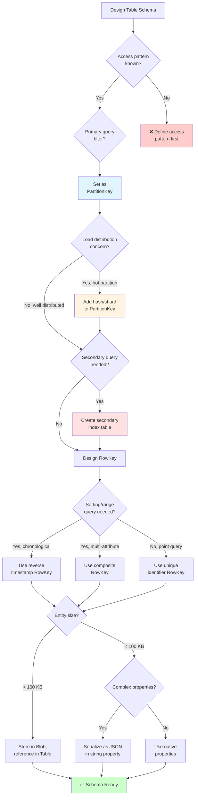

# Table Storage Fundamentals

> **File Purpose**: Comprehensive guide to PartitionKey/RowKey design, schema-less modeling, and performance optimization
> **Prerequisites**: `01-quick-start/provisioning.md`, `02-core-concepts/storage-accounts.md`
> **Agent Use Case**: Reference when designing table schema and partition strategies

## Quick Context

Azure Table Storage is a NoSQL key-value store where **PartitionKey and RowKey design is critical** to performance and scalability. Poor partition design causes hot partitions, throttling, and high latency. This guide covers partition design principles, query patterns, and anti-patterns to avoid.

**Key principle**: Design PartitionKey for distribution (avoid hot partitions); design RowKey for query patterns (enable range scans). All queries should filter by PartitionKey.

## Table Storage Architecture

### Core Concepts

```
Table Structure:
┌─────────────────────────────────────────────────────────┐
│  Table: Users                                           │
│  ┌─────────────┬──────────┬───────────┬────────────┐   │
│  │ PartitionKey│  RowKey  │ Property1 │ Property2  │   │
│  │   (Index)   │ (Index)  │           │            │   │
│  ├─────────────┼──────────┼───────────┼────────────┤   │
│  │ tenant-A    │ user-001 │ alice@... │ Alice      │   │
│  │ tenant-A    │ user-002 │ bob@...   │ Bob        │   │
│  │ tenant-B    │ user-001 │ carol@... │ Carol      │   │
│  │ tenant-B    │ user-002 │ david@... │ David      │   │
│  └─────────────┴──────────┴───────────┴────────────┘   │
│                                                          │
│  Partition 1: tenant-A (all rows with this PK)          │
│  Partition 2: tenant-B (all rows with this PK)          │
└─────────────────────────────────────────────────────────┘
```

**Key components**:
- **PartitionKey**: Logical grouping, determines physical storage partition
- **RowKey**: Unique identifier within partition, enables range queries
- **Properties**: Schema-less attributes (up to 252 per entity, max 1 MB total)
- **System Properties**: Timestamp (auto-updated), ETag (concurrency control)

### Indexing

**Only PartitionKey and RowKey are indexed**:
- **Point query** (PK + RK): O(1) lookup, <10ms
- **Range scan** (PK + RK range): O(log n), <50ms
- **Partition scan** (PK only): O(n) within partition, <100ms
- **Table scan** (no PK): O(n) full table, avoid in production

**No secondary indexes**: Filter on non-PK/RK properties requires partition/table scan.

## PartitionKey Design Principles

### Rule 1: Distribution for Scalability

**Goal**: Distribute load evenly across partitions to avoid throttling.

#### ❌ Anti-pattern: Single Partition (Hot Partition)

```csharp
// BAD: All entities in one partition
public record OrderEntity(string PartitionKey, string RowKey) : ITableEntity
{
    public OrderEntity(string orderId)
        : this("all-orders", orderId) { } // All entities → same partition

    public decimal Amount { get; init; }
    public string Status { get; init; }
    public ETag ETag { get; set; }
    public DateTimeOffset? Timestamp { get; set; }
}

// Result: 2,000 req/s limit for ENTIRE table (single partition)
```

**Why it fails**:
- Partition limit: 2,000 req/s
- High load causes throttling (HTTP 429)
- No horizontal scaling

#### ✅ Best Practice: Distributed Partitions

```csharp
// GOOD: Distribute by tenant or date
public record OrderEntity(string PartitionKey, string RowKey) : ITableEntity
{
    // Option 1: Partition by tenant (multi-tenant SaaS)
    public static OrderEntity CreateForTenant(string tenantId, string orderId, decimal amount)
    {
        return new OrderEntity($"tenant-{tenantId}", orderId)
        {
            Amount = amount,
            Status = "pending"
        };
    }

    // Option 2: Partition by date (time-series data)
    public static OrderEntity CreateForDate(DateTime orderDate, string orderId, decimal amount)
    {
        return new OrderEntity(orderDate.ToString("yyyy-MM-dd"), orderId)
        {
            Amount = amount,
            Status = "pending"
        };
    }

    public decimal Amount { get; init; }
    public string Status { get; init; }
    public ETag ETag { get; set; }
    public DateTimeOffset? Timestamp { get; set; }
}

// Result: Load distributed across multiple partitions
```

### Rule 2: Align with Query Patterns

**Goal**: Most queries should filter by PartitionKey for optimal performance.

#### Query Pattern Analysis

| Access Pattern | PartitionKey Design | Example |
|----------------|-------------------|---------|
| **Get all orders for tenant** | `tenant-{tenantId}` | Multi-tenant SaaS |
| **Get orders for specific date** | `{yyyy-MM-dd}` | Daily reporting |
| **Get user's orders** | `user-{userId}` | E-commerce order history |
| **Get IoT data by device** | `device-{deviceId}` | IoT telemetry |

**Design principle**: PartitionKey = primary query filter.

#### Example: Multi-Tenant SaaS

```csharp
// Tenant-based partitioning
public record CustomerEntity(string PartitionKey, string RowKey) : ITableEntity
{
    public CustomerEntity(string tenantId, string customerId)
        : this($"tenant-{tenantId}", $"customer-{customerId}") { }

    public string Email { get; init; }
    public string Name { get; init; }
    public bool IsActive { get; init; }
    public ETag ETag { get; set; }
    public DateTimeOffset? Timestamp { get; set; }
}

// Fast query: Get all customers for tenant
var filter = TableClient.CreateQueryFilter($"PartitionKey eq {"tenant-acme"}");
await foreach (var customer in tableClient.QueryAsync<CustomerEntity>(filter))
{
    Console.WriteLine($"{customer.RowKey}: {customer.Name}");
}
// Performance: Single partition scan, <100ms
```

### Rule 3: Balance Partition Size

**Limits per partition**:
- Max size: Unlimited (but distribute for performance)
- Max throughput: 2,000 req/s (20,000 for entire account)
- Target: <10 GB per partition, <500 req/s per partition

#### Partition Size Strategies

**Strategy 1: Time-based partitioning** (for time-series data)

```csharp
// Daily partitions for IoT telemetry
public record TelemetryEntity(string PartitionKey, string RowKey) : ITableEntity
{
    public TelemetryEntity(DateTime timestamp, string deviceId, string readingId)
        : this($"{timestamp:yyyy-MM-dd}", $"{deviceId}-{readingId}") { }

    public double Temperature { get; init; }
    public double Humidity { get; init; }
    public ETag ETag { get; set; }
    public DateTimeOffset? Timestamp { get; set; }
}

// Automatic partition rotation (new partition each day)
var reading = new TelemetryEntity(DateTime.UtcNow, "device-001", Guid.NewGuid().ToString())
{
    Temperature = 22.5,
    Humidity = 65.0
};
await tableClient.AddEntityAsync(reading);

// Query today's readings
var today = DateTime.UtcNow.ToString("yyyy-MM-dd");
var filter = TableClient.CreateQueryFilter($"PartitionKey eq {today}");
```

**Strategy 2: Hash-based partitioning** (for even distribution)

```csharp
// Distribute users across 100 partitions
public record UserEntity(string PartitionKey, string RowKey) : ITableEntity
{
    public UserEntity(string userId, string email)
        : this($"partition-{GetPartitionNumber(userId)}", userId)
    {
        Email = email;
    }

    private static int GetPartitionNumber(string userId)
    {
        // Hash to 0-99 range
        return Math.Abs(userId.GetHashCode()) % 100;
    }

    public string Email { get; init; }
    public ETag ETag { get; set; }
    public DateTimeOffset? Timestamp { get; set; }
}

// Trade-off: Good distribution, but queries need to scan multiple partitions
```

## RowKey Design Patterns

### Rule 1: Uniqueness within Partition

**Composite key**: PartitionKey + RowKey must be unique.

```csharp
// Ensure RowKey is unique within partition
public record ProductEntity(string PartitionKey, string RowKey) : ITableEntity
{
    // Category as PK, ProductId as RK
    public ProductEntity(string category, string productId)
        : this($"category-{category}", $"product-{productId}") { }

    public string Name { get; init; }
    public decimal Price { get; init; }
    public ETag ETag { get; set; }
    public DateTimeOffset? Timestamp { get; set; }
}

// Uniqueness guaranteed: category-electronics + product-12345
// Allows duplicate product IDs across categories
```

### Rule 2: Sorting and Range Queries

**RowKey is sorted lexicographically** within partition. Design for range scans.

#### Pattern 1: Timestamp-based RowKey (Chronological Order)

```csharp
// Events sorted by timestamp (newest first with reverse timestamp)
public record EventEntity(string PartitionKey, string RowKey) : ITableEntity
{
    public EventEntity(string userId, DateTime eventTime, string eventId)
        : this($"user-{userId}", $"{GetReverseTimestamp(eventTime)}-{eventId}") { }

    private static string GetReverseTimestamp(DateTime dt)
    {
        // Reverse timestamp: newer events have smaller RowKey (appear first)
        return $"{DateTime.MaxValue.Ticks - dt.Ticks:D19}";
    }

    public string EventType { get; init; }
    public string Data { get; init; }
    public ETag ETag { get; set; }
    public DateTimeOffset? Timestamp { get; set; }
}

// Query latest 100 events for user (range scan)
var filter = TableClient.CreateQueryFilter($"PartitionKey eq {"user-alice"}");
var latestEvents = tableClient.QueryAsync<EventEntity>(filter: filter, maxPerPage: 100);
await foreach (var evt in latestEvents)
{
    Console.WriteLine($"{evt.EventType} at {evt.Timestamp}");
}
```

**Why reverse timestamp**:
- Normal timestamp: Oldest events first (rarely needed)
- Reverse timestamp: Newest events first (common query pattern)

#### Pattern 2: Composite RowKey (Multi-level Sorting)

```csharp
// Orders sorted by status, then date
public record OrderEntity(string PartitionKey, string RowKey) : ITableEntity
{
    public OrderEntity(string tenantId, string status, DateTime orderDate, string orderId)
        : this($"tenant-{tenantId}", $"{status}-{orderDate:yyyy-MM-dd-HHmmss}-{orderId}") { }

    public decimal Amount { get; init; }
    public string Status { get; init; }
    public ETag ETag { get; set; }
    public DateTimeOffset? Timestamp { get; set; }
}

// Query pending orders (sorted by date)
var filter = TableClient.CreateQueryFilter(
    $"PartitionKey eq {"tenant-acme"} and RowKey ge {"pending-"} and RowKey lt {"pending-~"}"
);
// Result: pending-2025-10-01-..., pending-2025-10-02-..., etc.
```

#### Pattern 3: Padded Numeric RowKey

```csharp
// Invoices sorted by invoice number
public record InvoiceEntity(string PartitionKey, string RowKey) : ITableEntity
{
    public InvoiceEntity(string customerId, int invoiceNumber)
        : this($"customer-{customerId}", $"invoice-{invoiceNumber:D10}") { } // Zero-pad to 10 digits

    public decimal Amount { get; init; }
    public ETag ETag { get; set; }
    public DateTimeOffset? Timestamp { get; set; }
}

// Lexicographic sort works correctly with padding:
// invoice-0000000001
// invoice-0000000002
// invoice-0000000010 (not invoice-10)
```

### Rule 3: Support Point Queries

**Point query** (PK + RK) is fastest (O(1), <10ms).

```csharp
// Design for direct lookups
public record SessionEntity(string PartitionKey, string RowKey) : ITableEntity
{
    public SessionEntity(string userId, string sessionId)
        : this($"user-{userId}", $"session-{sessionId}") { }

    public DateTime LoginTime { get; init; }
    public string IpAddress { get; init; }
    public ETag ETag { get; set; }
    public DateTimeOffset? Timestamp { get; set; }
}

// Point query: Get specific session (fastest)
var session = await tableClient.GetEntityAsync<SessionEntity>("user-alice", "session-12345");
// Performance: <10ms
```

## Schema-Less Modeling Strategies

### Flexible Properties

**No fixed schema**: Entities in same table can have different properties.

```csharp
// Polymorphic entities (different types in same table)
public record EventEntity(string PartitionKey, string RowKey) : ITableEntity
{
    public string EventType { get; init; } // Discriminator

    // Login event properties
    public string? IpAddress { get; init; }

    // Purchase event properties
    public decimal? Amount { get; init; }
    public string? ProductId { get; init; }

    // Common properties
    public DateTime EventTime { get; init; }
    public ETag ETag { get; set; }
    public DateTimeOffset? Timestamp { get; set; }
}

// Add login event
await tableClient.AddEntityAsync(new EventEntity("user-alice", Guid.NewGuid().ToString())
{
    EventType = "login",
    EventTime = DateTime.UtcNow,
    IpAddress = "192.168.1.1"
});

// Add purchase event
await tableClient.AddEntityAsync(new EventEntity("user-alice", Guid.NewGuid().ToString())
{
    EventType = "purchase",
    EventTime = DateTime.UtcNow,
    Amount = 99.99m,
    ProductId = "prod-123"
});

// Query with type filtering
var filter = TableClient.CreateQueryFilter(
    $"PartitionKey eq {"user-alice"} and EventType eq {"purchase"}"
);
```

### Property Constraints

| Constraint | Limit | Notes |
|------------|-------|-------|
| **Max properties** | 252 (excluding PK, RK, Timestamp) | Use JSON for complex objects |
| **Max entity size** | 1 MB total | Including all properties |
| **Property types** | String, Int32, Int64, Double, Boolean, DateTime, Guid, Binary | Limited types |
| **String max** | 64 KB (32K chars) | Use Blob storage for larger |

#### Pattern: JSON for Complex Objects

```csharp
using System.Text.Json;

public record ProductEntity(string PartitionKey, string RowKey) : ITableEntity
{
    public string Name { get; init; }

    // Complex object serialized as JSON
    public string? SpecificationsJson { get; init; }

    // Deserialize when needed
    public ProductSpecifications? GetSpecifications()
    {
        return string.IsNullOrEmpty(SpecificationsJson)
            ? null
            : JsonSerializer.Deserialize<ProductSpecifications>(SpecificationsJson);
    }

    public ETag ETag { get; set; }
    public DateTimeOffset? Timestamp { get; set; }
}

public record ProductSpecifications(
    string Color,
    string[] Sizes,
    Dictionary<string, string> Attributes
);

// Usage
var product = new ProductEntity("category-electronics", "product-12345")
{
    Name = "Laptop",
    SpecificationsJson = JsonSerializer.Serialize(new ProductSpecifications(
        Color: "Silver",
        Sizes: new[] { "13-inch", "15-inch" },
        Attributes: new Dictionary<string, string>
        {
            ["processor"] = "Intel i7",
            ["ram"] = "16GB"
        }
    ))
};

await tableClient.AddEntityAsync(product);
```

### Entity Group Transactions (EGT)

**Atomic operations** within single partition (max 100 entities).

```csharp
// Batch update within partition (all succeed or all fail)
var batch = new List<TableTransactionAction>
{
    new(TableTransactionActionType.Add, new OrderEntity("tenant-acme", "order-001")
    {
        Amount = 100.00m,
        Status = "pending"
    }),
    new(TableTransactionActionType.Add, new OrderEntity("tenant-acme", "order-002")
    {
        Amount = 200.00m,
        Status = "pending"
    }),
    new(TableTransactionActionType.UpdateReplace, new OrderEntity("tenant-acme", "order-000")
    {
        Status = "completed"
    })
};

// Atomic transaction (all or nothing)
await tableClient.SubmitTransactionAsync(batch);
```

**Constraints**:
- All entities must have same PartitionKey
- Max 100 operations per batch
- Max 4 MB batch size

## Query Performance Analysis

### Query Types Performance

| Query Type | Example | Performance | When to Use |
|------------|---------|-------------|-------------|
| **Point Query** | `PK eq X and RK eq Y` | <10ms, O(1) | Get specific entity |
| **Range Scan** | `PK eq X and RK ge Y and RK lt Z` | <50ms, O(log n) | Get range of entities |
| **Partition Scan** | `PK eq X` | <100ms, O(n) | Get all entities in partition |
| **Table Scan** | `PropertyA eq X` | >1s, O(n) | Avoid in production |

### Performance Comparison

```csharp
using System.Diagnostics;

// 1. Point Query (fastest)
var sw = Stopwatch.StartNew();
var entity = await tableClient.GetEntityAsync<UserEntity>("tenant-acme", "user-0001");
sw.Stop();
Console.WriteLine($"Point query: {sw.ElapsedMilliseconds}ms"); // ~5-10ms

// 2. Range Scan (fast)
sw.Restart();
var filter = TableClient.CreateQueryFilter(
    $"PartitionKey eq {"tenant-acme"} and RowKey ge {"user-0001"} and RowKey lt {"user-1000"}"
);
var count = 0;
await foreach (var user in tableClient.QueryAsync<UserEntity>(filter))
{
    count++;
}
sw.Stop();
Console.WriteLine($"Range scan ({count} entities): {sw.ElapsedMilliseconds}ms"); // ~20-50ms

// 3. Partition Scan (moderate)
sw.Restart();
var pkFilter = TableClient.CreateQueryFilter($"PartitionKey eq {"tenant-acme"}");
count = 0;
await foreach (var user in tableClient.QueryAsync<UserEntity>(pkFilter))
{
    count++;
}
sw.Stop();
Console.WriteLine($"Partition scan ({count} entities): {sw.ElapsedMilliseconds}ms"); // ~50-200ms

// 4. Table Scan (slow - AVOID)
sw.Restart();
var tableFilter = TableClient.CreateQueryFilter($"Email eq {"alice@example.com"}");
count = 0;
await foreach (var user in tableClient.QueryAsync<UserEntity>(tableFilter))
{
    count++;
}
sw.Stop();
Console.WriteLine($"Table scan ({count} entities): {sw.ElapsedMilliseconds}ms"); // >1000ms
```

### Optimization Strategies

#### Strategy 1: Always Filter by PartitionKey

```csharp
// ❌ BAD: Table scan (no PartitionKey filter)
var badFilter = TableClient.CreateQueryFilter($"Email eq {"alice@example.com"}");
// Scans entire table

// ✅ GOOD: Partition scan (with PartitionKey)
var goodFilter = TableClient.CreateQueryFilter(
    $"PartitionKey eq {"tenant-acme"} and Email eq {"alice@example.com"}"
);
// Scans single partition (much faster)
```

#### Strategy 2: Use Projection (Select)

```csharp
// Reduce bandwidth by selecting only needed properties
var filter = TableClient.CreateQueryFilter($"PartitionKey eq {"tenant-acme"}");
var select = new[] { "Email", "Name" }; // Fetch only Email and Name

await foreach (var user in tableClient.QueryAsync<UserEntity>(filter: filter, select: select))
{
    Console.WriteLine($"{user.Email}"); // Other properties will be null/default
}

// Bandwidth savings: ~50-70% for entities with many properties
```

#### Strategy 3: Pagination for Large Result Sets

```csharp
// Stream results in pages (avoid loading all into memory)
var filter = TableClient.CreateQueryFilter($"PartitionKey eq {"tenant-acme"}");
var pageSize = 1000;

await foreach (var page in tableClient.QueryAsync<UserEntity>(filter, maxPerPage: pageSize).AsPages())
{
    Console.WriteLine($"Processing page with {page.Values.Count} entities");

    foreach (var user in page.Values)
    {
        // Process user
    }

    // Save continuation token for next request
    var continuationToken = page.ContinuationToken;
}
```

## Key Design Patterns

### Pattern 1: Monotonic RowKey (Time-Series)

**Use case**: Store time-series data, query recent entries first

```csharp
// Reverse timestamp: Recent entries first
public record MetricEntity(string PartitionKey, string RowKey) : ITableEntity
{
    public MetricEntity(string metricName, DateTime timestamp)
        : this($"metric-{metricName}", GetReverseTimestamp(timestamp)) { }

    private static string GetReverseTimestamp(DateTime dt)
    {
        return $"{DateTime.MaxValue.Ticks - dt.Ticks:D19}";
    }

    public double Value { get; init; }
    public ETag ETag { get; set; }
    public DateTimeOffset? Timestamp { get; set; }
}

// Query latest 100 metrics
var filter = TableClient.CreateQueryFilter($"PartitionKey eq {"metric-cpu"}");
var latest = tableClient.QueryAsync<MetricEntity>(filter, maxPerPage: 100);
// Result: Newest metrics first
```

### Pattern 2: Composite Key (Multi-Attribute Query)

**Use case**: Query by multiple attributes

```csharp
// PK: Region, RK: Status-Priority-TicketId
public record TicketEntity(string PartitionKey, string RowKey) : ITableEntity
{
    public TicketEntity(string region, string status, int priority, string ticketId)
        : this($"region-{region}", $"{status}-{priority:D3}-{ticketId}") { }

    public string Description { get; init; }
    public ETag ETag { get; set; }
    public DateTimeOffset? Timestamp { get; set; }
}

// Query: High-priority open tickets in US region
var filter = TableClient.CreateQueryFilter(
    $"PartitionKey eq {"region-us"} and RowKey ge {"open-001"} and RowKey lt {"open-002"}"
);
// Result: open-001-ticket123, open-001-ticket456 (priority 1, high)
```

### Pattern 3: Reverse Index (Secondary Index)

**Use case**: Query by non-PK/RK property (e.g., email)

```csharp
// Primary table: Users (PK: tenant, RK: userId)
public record UserEntity(string PartitionKey, string RowKey) : ITableEntity
{
    public string Email { get; init; }
    public string Name { get; init; }
    public ETag ETag { get; set; }
    public DateTimeOffset? Timestamp { get; set; }
}

// Secondary index table: UsersByEmail (PK: email, RK: userId)
public record UserEmailIndex(string PartitionKey, string RowKey) : ITableEntity
{
    public UserEmailIndex(string email, string userId)
        : this(email, userId) { }

    public string TenantId { get; init; }
    public ETag ETag { get; set; }
    public DateTimeOffset? Timestamp { get; set; }
}

// Insert into both tables (in batch if same partition)
var user = new UserEntity("tenant-acme", "user-0001")
{
    Email = "alice@example.com",
    Name = "Alice"
};
await tableClient.AddEntityAsync(user);

var index = new UserEmailIndex("alice@example.com", "user-0001")
{
    TenantId = "tenant-acme"
};
await indexTableClient.AddEntityAsync(index);

// Query by email (fast lookup via index)
var emailIndex = await indexTableClient.GetEntityAsync<UserEmailIndex>("alice@example.com", "user-0001");
var userId = emailIndex.Value.RowKey;
var tenantId = emailIndex.Value.TenantId;

// Fetch full user from primary table
var fullUser = await tableClient.GetEntityAsync<UserEntity>(tenantId, userId);
```

**Trade-offs**:
- **Pros**: Fast queries on non-indexed properties
- **Cons**: Double storage, need to maintain consistency

See `04-table-storage/table-patterns.md` for advanced secondary index strategies.

## Scalability Targets and Limits

### Account-Level Limits

| Metric | Limit | Notes |
|--------|-------|-------|
| **Max request rate** | 20,000 req/s | Per storage account |
| **Max ingress** | 25 Gbps (GZRS), 50 Gbps (LRS) | Per account |
| **Max egress** | 50 Gbps (GZRS), 100 Gbps (LRS) | Per account |
| **Max tables** | Unlimited | Limited by account storage |

### Partition-Level Limits

| Metric | Limit | Notes |
|--------|-------|-------|
| **Max throughput** | 2,000 req/s | Per partition |
| **Max entity size** | 1 MB | Including all properties |
| **Max properties** | 252 | Excluding PK, RK, Timestamp |
| **Max batch size** | 100 entities or 4 MB | Entity Group Transaction |

### Performance Targets

| Operation | Target Latency | Notes |
|-----------|---------------|-------|
| **Point query** | <10ms | PK + RK query |
| **Range scan** | <50ms | PK + RK range |
| **Partition scan** | <200ms | PK filter only |
| **Insert/Update** | <15ms | Single entity |
| **Batch transaction** | <100ms | Up to 100 entities |

## Common Anti-Patterns to Avoid

### Anti-Pattern 1: Hot Partition

**Problem**: All traffic to single partition

```csharp
// ❌ BAD: Single partition for all users
public record UserEntity(string PartitionKey, string RowKey) : ITableEntity
{
    public UserEntity(string userId)
        : this("all-users", userId) { } // All users in one partition!

    // ...
}

// Result: 2,000 req/s limit, throttling at scale
```

**Solution**: Distribute by tenant, region, or hash

```csharp
// ✅ GOOD: Distribute by tenant
public UserEntity(string tenantId, string userId)
    : this($"tenant-{tenantId}", userId) { }

// ✅ GOOD: Hash-based distribution
public UserEntity(string userId)
    : this($"partition-{Math.Abs(userId.GetHashCode()) % 100}", userId) { }
```

### Anti-Pattern 2: Table Scan Queries

**Problem**: No PartitionKey filter

```csharp
// ❌ BAD: Full table scan
var filter = TableClient.CreateQueryFilter($"Email eq {"alice@example.com"}");
// Scans all partitions, slow and expensive
```

**Solution**: Filter by PartitionKey or use secondary index

```csharp
// ✅ GOOD: Partition filter + property filter
var filter = TableClient.CreateQueryFilter(
    $"PartitionKey eq {"tenant-acme"} and Email eq {"alice@example.com"}"
);

// ✅ BETTER: Secondary index table
// See "Pattern 3: Reverse Index" above
```

### Anti-Pattern 3: Large Entities (>100 KB)

**Problem**: Exceeds optimal size, impacts throughput

```csharp
// ❌ BAD: Store large binary in entity
public record DocumentEntity(string PartitionKey, string RowKey) : ITableEntity
{
    public byte[]? FileContent { get; init; } // Could be 500 KB!
    // ...
}
```

**Solution**: Store in Blob Storage, reference in Table

```csharp
// ✅ GOOD: Blob reference in table
public record DocumentEntity(string PartitionKey, string RowKey) : ITableEntity
{
    public string BlobUrl { get; init; } // Reference to Blob Storage
    public long FileSize { get; init; }
    public string ContentType { get; init; }
    // ...
}

// Store file in Blob, metadata in Table
await blobClient.UploadAsync(fileStream);
await tableClient.AddEntityAsync(new DocumentEntity("tenant-acme", "doc-001")
{
    BlobUrl = blobClient.Uri.ToString(),
    FileSize = fileStream.Length,
    ContentType = "application/pdf"
});
```

### Anti-Pattern 4: Cross-Partition Batch Operations

**Problem**: Batch with mixed PartitionKeys

```csharp
// ❌ BAD: Different PartitionKeys in batch
var batch = new List<TableTransactionAction>
{
    new(TableTransactionActionType.Add, new UserEntity("tenant-A", "user-001")),
    new(TableTransactionActionType.Add, new UserEntity("tenant-B", "user-002")) // Different PK!
};

await tableClient.SubmitTransactionAsync(batch); // Throws 400 Bad Request
```

**Solution**: Batch only same-partition entities

```csharp
// ✅ GOOD: Same PartitionKey in batch
var batch = new List<TableTransactionAction>
{
    new(TableTransactionActionType.Add, new UserEntity("tenant-A", "user-001")),
    new(TableTransactionActionType.Add, new UserEntity("tenant-A", "user-002"))
};

await tableClient.SubmitTransactionAsync(batch); // Success
```

### Anti-Pattern 5: Not Using ETags for Concurrency

**Problem**: Lost updates due to concurrent writes

```csharp
// ❌ BAD: Update without ETag (overwrites concurrent changes)
var user = await tableClient.GetEntityAsync<UserEntity>("tenant-acme", "user-001");
user.Value.Name = "New Name";
await tableClient.UpdateEntityAsync(user.Value, ETag.All); // Ignores ETag!
```

**Solution**: Use ETag for optimistic concurrency

```csharp
// ✅ GOOD: Update with ETag check
var response = await tableClient.GetEntityAsync<UserEntity>("tenant-acme", "user-001");
var user = response.Value;
var etag = user.ETag;

try
{
    var updated = user with { Name = "New Name" };
    await tableClient.UpdateEntityAsync(updated, etag); // Fails if modified
}
catch (RequestFailedException ex) when (ex.Status == 412)
{
    // Handle concurrent modification (retry or conflict resolution)
    Console.WriteLine("Entity was modified, re-fetch and retry");
}
```

## Design Decision Flowchart



## Real-World Use Cases

### Use Case 1: Multi-Tenant SaaS Application

**Requirements**: Store customer data for 10,000 tenants, query by tenant, 100 req/s per tenant

**Schema Design**:
```csharp
// PK: tenant-{tenantId}, RK: customer-{customerId}
public record CustomerEntity(string PartitionKey, string RowKey) : ITableEntity
{
    public CustomerEntity(string tenantId, string customerId)
        : this($"tenant-{tenantId}", $"customer-{customerId}") { }

    public string Email { get; init; }
    public string Name { get; init; }
    public DateTime CreatedAt { get; init; }
    public bool IsActive { get; init; }
    public ETag ETag { get; set; }
    public DateTimeOffset? Timestamp { get; set; }
}

// Secondary index for email lookup
public record CustomerEmailIndex(string PartitionKey, string RowKey) : ITableEntity
{
    public CustomerEmailIndex(string email, string tenantId, string customerId)
        : this(email, $"{tenantId}-{customerId}") { }

    public ETag ETag { get; set; }
    public DateTimeOffset? Timestamp { get; set; }
}
```

**Query patterns**:
```csharp
// 1. Get all customers for tenant (partition scan)
var tenantFilter = TableClient.CreateQueryFilter($"PartitionKey eq {"tenant-acme"}");
await foreach (var customer in tableClient.QueryAsync<CustomerEntity>(tenantFilter))
{
    Console.WriteLine(customer.Name);
}

// 2. Get specific customer (point query)
var customer = await tableClient.GetEntityAsync<CustomerEntity>("tenant-acme", "customer-001");

// 3. Find customer by email (secondary index)
var emailIndex = await indexTable.GetEntityAsync<CustomerEmailIndex>("alice@example.com", "tenant-acme-customer-001");
var parts = emailIndex.Value.RowKey.Split('-');
var fullCustomer = await tableClient.GetEntityAsync<CustomerEntity>($"tenant-{parts[0]}", $"customer-{parts[1]}");
```

### Use Case 2: IoT Telemetry Storage

**Requirements**: Store 1M device readings/day, query by device and time range, retain 30 days

**Schema Design**:
```csharp
// PK: device-{deviceId}, RK: {reverseTimestamp}
public record TelemetryEntity(string PartitionKey, string RowKey) : ITableEntity
{
    public TelemetryEntity(string deviceId, DateTime timestamp)
        : this($"device-{deviceId}", $"{DateTime.MaxValue.Ticks - timestamp.Ticks:D19}") { }

    public double Temperature { get; init; }
    public double Humidity { get; init; }
    public string Location { get; init; }
    public ETag ETag { get; set; }
    public DateTimeOffset? Timestamp { get; set; }
}

// Usage
var reading = new TelemetryEntity("device-12345", DateTime.UtcNow)
{
    Temperature = 22.5,
    Humidity = 65.0,
    Location = "warehouse-A"
};
await tableClient.AddEntityAsync(reading);

// Query: Last 100 readings for device (range scan with reverse timestamp)
var filter = TableClient.CreateQueryFilter($"PartitionKey eq {"device-12345"}");
var recentReadings = tableClient.QueryAsync<TelemetryEntity>(filter, maxPerPage: 100);

// Query: Readings from last hour
var oneHourAgo = DateTime.UtcNow.AddHours(-1);
var reverseOneHourAgo = DateTime.MaxValue.Ticks - oneHourAgo.Ticks;
var rangeFilter = TableClient.CreateQueryFilter(
    $"PartitionKey eq {"device-12345"} and RowKey le {reverseOneHourAgo:D19}"
);
```

**Cleanup strategy**:
```csharp
// Delete readings older than 30 days (lifecycle)
var thirtyDaysAgo = DateTime.UtcNow.AddDays(-30);
var deleteFilter = TableClient.CreateQueryFilter(
    $"PartitionKey eq {"device-12345"} and Timestamp lt {thirtyDaysAgo}"
);

var batch = new List<TableTransactionAction>();
await foreach (var old in tableClient.QueryAsync<TelemetryEntity>(deleteFilter))
{
    batch.Add(new TableTransactionAction(TableTransactionActionType.Delete, old));

    if (batch.Count >= 100)
    {
        await tableClient.SubmitTransactionAsync(batch);
        batch.Clear();
    }
}

if (batch.Count > 0)
{
    await tableClient.SubmitTransactionAsync(batch);
}
```

### Use Case 3: E-Commerce Order History

**Requirements**: Store orders, query by customer, sort by date (recent first)

**Schema Design**:
```csharp
// PK: customer-{customerId}, RK: {reverseTimestamp}-{orderId}
public record OrderEntity(string PartitionKey, string RowKey) : ITableEntity
{
    public OrderEntity(string customerId, DateTime orderDate, string orderId)
        : this($"customer-{customerId}", $"{DateTime.MaxValue.Ticks - orderDate.Ticks:D19}-{orderId}") { }

    public decimal TotalAmount { get; init; }
    public string Status { get; init; }
    public string ItemsJson { get; init; } // JSON array of items
    public ETag ETag { get; set; }
    public DateTimeOffset? Timestamp { get; set; }
}

// Query: Customer's recent orders
var filter = TableClient.CreateQueryFilter($"PartitionKey eq {"customer-alice"}");
var recentOrders = tableClient.QueryAsync<OrderEntity>(filter, maxPerPage: 10);

await foreach (var order in recentOrders)
{
    Console.WriteLine($"Order {order.RowKey}: ${order.TotalAmount} ({order.Status})");
}
```

## References

**Microsoft Learn Documentation**:
- [Table Storage Overview](https://learn.microsoft.com/azure/storage/tables/table-storage-overview)
- [Table Design Patterns](https://learn.microsoft.com/azure/storage/tables/table-storage-design-patterns)
- [Partition Key Design](https://learn.microsoft.com/azure/storage/tables/table-storage-design-for-query)
- [Scalability Targets](https://learn.microsoft.com/azure/storage/tables/scalability-targets)
- [Table Transactions](https://learn.microsoft.com/azure/storage/tables/table-storage-design-for-modification)
- [Query Performance](https://learn.microsoft.com/azure/storage/tables/table-storage-design-for-query)
- [Anti-Patterns](https://learn.microsoft.com/azure/storage/tables/table-storage-design-patterns#anti-patterns)

## Navigation

- **Previous**: `02-core-concepts/storage-accounts.md`
- **Next**: `table-implementation.md`
- **Up**: `00-overview.md`

## See Also

- `04-table-storage/table-implementation.md` - CRUD operations and queries
- `04-table-storage/table-patterns.md` - Advanced patterns and hot partition avoidance
- `04-table-storage/table-vs-cosmos.md` - Table Storage vs Cosmos DB comparison
- `08-reference/code-examples.md` - Complete examples
