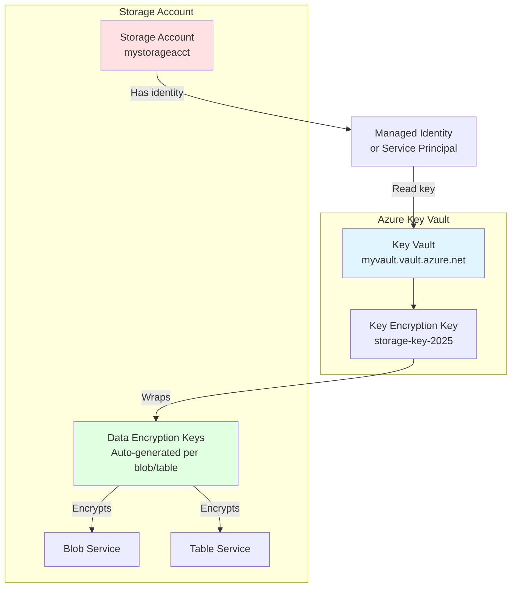

# Encryption and Data Protection

> **File Purpose**: Comprehensive guide to customer-managed keys (CMK), double encryption, immutability policies, key rotation, and infrastructure encryption
> **Prerequisites**: Understanding of Azure Key Vault and encryption concepts
> **Agent Use Case**: Reference when implementing HIPAA/PCI compliance, data immutability requirements, or advanced encryption configurations

## Quick Context

**All Azure Storage data is encrypted at rest by default** using Microsoft-managed keys (256-bit AES encryption). For compliance requirements (HIPAA, PCI DSS, GDPR), use **customer-managed keys (CMK)** stored in Azure Key Vault. For write-once-read-many (WORM) scenarios, implement **immutability policies** with time-based retention or legal holds.

**Key principle**: Encryption at rest protects data on disk. Encryption in transit (TLS 1.2+) protects data over the network. Layer both with immutability policies for comprehensive data protection.

## Encryption at Rest Overview

### Encryption Types Comparison

| Feature | Microsoft-Managed Keys (MMK) | Customer-Managed Keys (CMK) | Double Encryption |
|---------|----------------------------|---------------------------|------------------|
| **Key management** | Microsoft | Customer (Key Vault) | Customer + Microsoft |
| **Key rotation** | Automatic | Customer-controlled | Customer-controlled |
| **Compliance** | Basic | HIPAA, PCI DSS, GDPR | Highest compliance |
| **Cost** | Free | Key Vault operations | Key Vault operations |
| **Setup complexity** | None (default) | Medium | Medium-High |
| **Performance impact** | None | Minimal (<1%) | Minimal (<2%) |
| **Revocability** | No | Yes (revoke key) | Yes |

### When to Use Each Type

| Scenario | Recommended Encryption | Rationale |
|----------|----------------------|-----------|
| Dev/test environments | Microsoft-Managed Keys | Simplicity, no compliance requirements |
| Production (general) | Microsoft-Managed Keys | Adequate for most workloads |
| HIPAA compliance | Customer-Managed Keys | Control over key lifecycle required |
| PCI DSS compliance | Customer-Managed Keys | Customer key control required |
| Defense/government | Customer-Managed Keys + Double Encryption | Maximum security posture |
| Multi-tenant SaaS | Customer-Managed Keys (per tenant) | Customer isolation requirements |
| Data sovereignty | Customer-Managed Keys in local Key Vault | Keys stay in specific region |

## Customer-Managed Keys (CMK)

### Architecture Overview



**How CMK works**:
1. Storage account generates data encryption keys (DEKs) for each blob/table
2. DEKs encrypted using Key Encryption Key (KEK) from Key Vault
3. Storage account uses managed identity to access Key Vault
4. Encrypted DEKs stored with data; KEK never leaves Key Vault

### Prerequisites: Key Vault Setup

**Step 1: Create Key Vault**:

```bash
# Variables
KV_NAME="myvault"
RG_KV="rg-keyvault"
LOCATION="westus3"

# Create Key Vault (Premium SKU for HSM-backed keys)
az keyvault create \
  --name $KV_NAME \
  --resource-group $RG_KV \
  --location $LOCATION \
  --sku Premium \
  --enable-purge-protection true \
  --enable-soft-delete true \
  --retention-days 90

# Note: Purge protection cannot be disabled after enabling (permanent)
```

**Step 2: Create encryption key**:

```bash
# Create RSA key (2048-bit or 3072-bit)
az keyvault key create \
  --vault-name $KV_NAME \
  --name storage-key-2025 \
  --kty RSA \
  --size 3072 \
  --ops encrypt decrypt wrapKey unwrapKey

# For HSM-backed key (Premium Key Vault only)
az keyvault key create \
  --vault-name $KV_NAME \
  --name storage-key-2025-hsm \
  --kty RSA-HSM \
  --size 3072 \
  --ops encrypt decrypt wrapKey unwrapKey \
  --protection hsm
```

**Key operations** required for storage encryption:
- `encrypt`, `decrypt` - Encrypt/decrypt DEKs
- `wrapKey`, `unwrapKey` - Wrap/unwrap DEKs

### Enable CMK: Existing Storage Account

**Azure CLI**:

```bash
# Variables
STORAGE_ACCOUNT="mystorageacct"
RG_STORAGE="rg-storage"
KV_NAME="myvault"
KEY_NAME="storage-key-2025"

# 1. Enable system-assigned managed identity on storage account
az storage account update \
  --name $STORAGE_ACCOUNT \
  --resource-group $RG_STORAGE \
  --assign-identity

# 2. Get storage account's principal ID
PRINCIPAL_ID=$(az storage account show \
  --name $STORAGE_ACCOUNT \
  --resource-group $RG_STORAGE \
  --query identity.principalId -o tsv)

echo "Storage Account Principal ID: $PRINCIPAL_ID"

# 3. Grant storage account access to Key Vault
az keyvault set-policy \
  --name $KV_NAME \
  --object-id $PRINCIPAL_ID \
  --key-permissions get unwrapKey wrapKey

# 4. Get Key Vault key URL
KEY_URL=$(az keyvault key show \
  --vault-name $KV_NAME \
  --name $KEY_NAME \
  --query key.kid -o tsv)

echo "Key URL: $KEY_URL"

# 5. Configure storage account to use CMK
az storage account update \
  --name $STORAGE_ACCOUNT \
  --resource-group $RG_STORAGE \
  --encryption-key-source Microsoft.Keyvault \
  --encryption-key-vault $KEY_URL
```

**Verify CMK configuration**:

```bash
az storage account show \
  --name $STORAGE_ACCOUNT \
  --resource-group $RG_STORAGE \
  --query "encryption.{keySource:keySource, keyvaultproperties:keyvaultproperties}"
```

### Enable CMK: New Storage Account (Bicep)

**Complete Bicep template**:

```bicep
param location string = resourceGroup().location
param storageAccountName string
param keyVaultName string
param keyName string = 'storage-key-2025'

// Key Vault
resource keyVault 'Microsoft.KeyVault/vaults@2023-07-01' = {
  name: keyVaultName
  location: location
  properties: {
    sku: {
      family: 'A'
      name: 'premium' // Premium for HSM-backed keys
    }
    tenantId: subscription().tenantId
    enableSoftDelete: true
    softDeleteRetentionInDays: 90
    enablePurgeProtection: true // Required for CMK
    enableRbacAuthorization: false
    accessPolicies: [] // Set via separate resource
  }
}

// Encryption key
resource encryptionKey 'Microsoft.KeyVault/vaults/keys@2023-07-01' = {
  parent: keyVault
  name: keyName
  properties: {
    kty: 'RSA-HSM' // HSM-backed
    keySize: 3072
    keyOps: [
      'encrypt'
      'decrypt'
      'wrapKey'
      'unwrapKey'
    ]
    attributes: {
      enabled: true
    }
  }
}

// Storage account with system-assigned managed identity
resource storageAccount 'Microsoft.Storage/storageAccounts@2023-05-01' = {
  name: storageAccountName
  location: location
  kind: 'StorageV2'
  sku: {
    name: 'Standard_GZRS'
  }
  identity: {
    type: 'SystemAssigned'
  }
  properties: {
    encryption: {
      keySource: 'Microsoft.Keyvault'
      keyvaultproperties: {
        keyname: keyName
        keyvaulturi: keyVault.properties.vaultUri
      }
      services: {
        blob: {
          enabled: true
          keyType: 'Account' // Account-level key
        }
        table: {
          enabled: true
          keyType: 'Account'
        }
        queue: {
          enabled: true
          keyType: 'Account'
        }
        file: {
          enabled: true
          keyType: 'Account'
        }
      }
      requireInfrastructureEncryption: false // Set true for double encryption
    }
    supportsHttpsTrafficOnly: true
    minimumTlsVersion: 'TLS1_2'
    allowBlobPublicAccess: false
    allowSharedKeyAccess: false
    networkAcls: {
      defaultAction: 'Deny'
      bypass: 'AzureServices'
    }
  }
}

// Grant storage account access to Key Vault
resource keyVaultAccessPolicy 'Microsoft.KeyVault/vaults/accessPolicies@2023-07-01' = {
  parent: keyVault
  name: 'add'
  properties: {
    accessPolicies: [
      {
        tenantId: subscription().tenantId
        objectId: storageAccount.identity.principalId
        permissions: {
          keys: [
            'get'
            'unwrapKey'
            'wrapKey'
          ]
        }
      }
    ]
  }
}

// Outputs
output storageAccountId string = storageAccount.id
output keyVaultUri string = keyVault.properties.vaultUri
output keyUri string = encryptionKey.properties.keyUri
```

**Deploy**:

```bash
az deployment group create \
  --resource-group rg-storage \
  --template-file storage-cmk.bicep \
  --parameters storageAccountName=mystorageacct keyVaultName=myvault
```

### User-Assigned Managed Identity (Alternative)

**Use case**: Share identity across multiple storage accounts.

```bicep
// User-assigned identity
resource identity 'Microsoft.ManagedIdentity/userAssignedIdentities@2023-01-31' = {
  name: 'storage-cmk-identity'
  location: location
}

// Storage account with user-assigned identity
resource storageAccount 'Microsoft.Storage/storageAccounts@2023-05-01' = {
  name: storageAccountName
  location: location
  kind: 'StorageV2'
  sku: { name: 'Standard_GZRS' }
  identity: {
    type: 'UserAssigned'
    userAssignedIdentities: {
      '${identity.id}': {}
    }
  }
  properties: {
    encryption: {
      keySource: 'Microsoft.Keyvault'
      keyvaultproperties: {
        keyname: keyName
        keyvaulturi: keyVault.properties.vaultUri
      }
      identity: {
        userAssignedIdentity: identity.id
      }
    }
  }
}

// Grant user-assigned identity access to Key Vault
resource keyVaultAccessPolicy 'Microsoft.KeyVault/vaults/accessPolicies@2023-07-01' = {
  parent: keyVault
  name: 'add'
  properties: {
    accessPolicies: [
      {
        tenantId: subscription().tenantId
        objectId: identity.properties.principalId
        permissions: {
          keys: ['get', 'unwrapKey', 'wrapKey']
        }
      }
    ]
  }
}
```

## Double Encryption (Infrastructure Encryption)

### What Is Double Encryption?

**Double encryption** adds a second layer of encryption using Microsoft-managed keys at the infrastructure level. Data encrypted twice:
1. **Service-level encryption** - Customer-managed key (or Microsoft-managed key)
2. **Infrastructure-level encryption** - Microsoft-managed key (hardware-level)

**Use case**: Defense-in-depth for highly sensitive data (defense/government, financial services).

### Enable Double Encryption: Bicep

```bicep
resource storageAccount 'Microsoft.Storage/storageAccounts@2023-05-01' = {
  name: storageAccountName
  location: location
  kind: 'StorageV2'
  sku: { name: 'Standard_GZRS' }
  identity: {
    type: 'SystemAssigned'
  }
  properties: {
    encryption: {
      keySource: 'Microsoft.Keyvault'
      keyvaultproperties: {
        keyname: keyName
        keyvaulturi: keyVaultUri
      }
      requireInfrastructureEncryption: true // Enable double encryption
      services: {
        blob: {
          enabled: true
          keyType: 'Account'
        }
        table: {
          enabled: true
          keyType: 'Account'
        }
      }
    }
    supportsHttpsTrafficOnly: true
  }
}
```

**Important**: Infrastructure encryption **must be enabled at account creation**. Cannot be enabled later.

**Azure CLI** (new account):

```bash
az storage account create \
  --name mystorageacct \
  --resource-group rg-storage \
  --location westus3 \
  --sku Standard_GZRS \
  --kind StorageV2 \
  --encryption-services blob table \
  --require-infrastructure-encryption true \
  --assign-identity \
  --encryption-key-source Microsoft.Keyvault \
  --encryption-key-vault $KEY_URL
```

## Key Rotation

### Automatic Key Rotation (Recommended)

**Azure Key Vault supports automatic key rotation**. Storage account automatically uses new key version.

**Enable auto-rotation** (Key Vault):

```bash
# Create rotation policy (rotate every 90 days)
az keyvault key rotation-policy update \
  --vault-name $KV_NAME \
  --name storage-key-2025 \
  --value '{
    "lifetimeActions": [
      {
        "trigger": {
          "timeAfterCreate": "P90D"
        },
        "action": {
          "type": "Rotate"
        }
      }
    ],
    "attributes": {
      "expiryTime": "P2Y"
    }
  }'
```

**Bicep** (with auto-rotation):

```bicep
resource encryptionKey 'Microsoft.KeyVault/vaults/keys@2023-07-01' = {
  parent: keyVault
  name: keyName
  properties: {
    kty: 'RSA-HSM'
    keySize: 3072
    keyOps: ['encrypt', 'decrypt', 'wrapKey', 'unwrapKey']
    rotationPolicy: {
      lifetimeActions: [
        {
          trigger: {
            timeAfterCreate: 'P90D' // Rotate every 90 days
          }
          action: {
            type: 'Rotate'
          }
        }
        {
          trigger: {
            timeBeforeExpiry: 'P30D' // Notify 30 days before expiry
          }
          action: {
            type: 'Notify'
          }
        }
      ]
      attributes: {
        expiryTime: 'P2Y' // Key expires after 2 years
      }
    }
  }
}
```

**Storage account auto-update**:

```bicep
resource storageAccount 'Microsoft.Storage/storageAccounts@2023-05-01' = {
  name: storageAccountName
  properties: {
    encryption: {
      keySource: 'Microsoft.Keyvault'
      keyvaultproperties: {
        keyname: keyName
        keyvaulturi: keyVaultUri
        // No key version specified - uses latest version automatically
      }
    }
  }
}
```

**How auto-rotation works**:
1. Key Vault rotates key based on policy (every 90 days)
2. Storage account detects new key version (within 24 hours)
3. Storage re-encrypts DEKs with new key version
4. Old key version still accessible for 90 days (grace period)

### Manual Key Rotation

**If auto-rotation not enabled**:

```bash
# 1. Create new key version
az keyvault key create \
  --vault-name $KV_NAME \
  --name storage-key-2025

# 2. Update storage account to use new key version
NEW_KEY_URL=$(az keyvault key show \
  --vault-name $KV_NAME \
  --name storage-key-2025 \
  --query key.kid -o tsv)

az storage account update \
  --name $STORAGE_ACCOUNT \
  --resource-group $RG_STORAGE \
  --encryption-key-vault $NEW_KEY_URL
```

**Rotation schedule**:
- **Compliance requirement**: Rotate every 90 days (HIPAA, PCI DSS)
- **Best practice**: Automate via Key Vault rotation policy
- **Monitor**: Alert when key approaches expiry

### Revoke Customer-Managed Key

**To deny access to storage account** (emergency revocation):

```bash
# Option 1: Disable key in Key Vault
az keyvault key set-attributes \
  --vault-name $KV_NAME \
  --name storage-key-2025 \
  --enabled false

# Option 2: Remove Key Vault access policy
az keyvault delete-policy \
  --name $KV_NAME \
  --object-id $PRINCIPAL_ID

# Option 3: Delete key (recoverable if soft delete enabled)
az keyvault key delete \
  --vault-name $KV_NAME \
  --name storage-key-2025
```

**Impact**:
- Storage account becomes **inaccessible** (cannot read/write data)
- Existing connections fail with 403 Forbidden
- Revocation takes effect within **5 minutes**

**Re-enable access**:

```bash
# Re-enable key
az keyvault key set-attributes \
  --vault-name $KV_NAME \
  --name storage-key-2025 \
  --enabled true

# Or restore deleted key
az keyvault key recover \
  --vault-name $KV_NAME \
  --name storage-key-2025
```

## Immutability Policies (WORM)

### What Is Immutability?

**Immutability** provides Write-Once-Read-Many (WORM) storage for compliance (SEC 17a-4, FINRA, HIPAA). Once committed, blobs **cannot be modified or deleted** until retention period expires.

### Immutability Types

| Type | Duration | Deletable? | Modifiable? | Use Case |
|------|----------|-----------|-------------|----------|
| **Time-based retention** | Fixed period (days/years) | No | No | Regulatory compliance (SEC, FINRA) |
| **Legal hold** | Until explicitly removed | No | No | Litigation, investigations |
| **Version-level immutability** | Per blob version | No | No | Granular WORM (preferred) |

### Enable Immutability: Container-Level

**Azure CLI**:

```bash
# 1. Create container with version-level immutability support
az storage container immutability-policy create \
  --account-name $STORAGE_ACCOUNT \
  --container-name compliance-docs \
  --period 365 \
  --allow-protected-append-writes false

# 2. Lock policy (cannot be shortened or deleted)
az storage container immutability-policy lock \
  --account-name $STORAGE_ACCOUNT \
  --container-name compliance-docs \
  --if-match "*"

# 3. Enable versioning (required for version-level immutability)
az storage account blob-service-properties update \
  --account-name $STORAGE_ACCOUNT \
  --enable-versioning true
```

**Bicep**:

```bicep
resource storageAccount 'Microsoft.Storage/storageAccounts@2023-05-01' = {
  name: storageAccountName
  location: location
  kind: 'StorageV2'
  sku: { name: 'Standard_GZRS' }
  properties: {
    supportsHttpsTrafficOnly: true
  }

  // Enable blob versioning
  resource blobService 'blobServices' = {
    name: 'default'
    properties: {
      isVersioningEnabled: true
      deleteRetentionPolicy: {
        enabled: true
        days: 7
      }
    }

    // Container with immutability policy
    resource container 'containers' = {
      name: 'compliance-docs'
      properties: {
        publicAccess: 'None'
        immutableStorageWithVersioning: {
          enabled: true
        }
      }
    }
  }
}
```

### Version-Level Immutability (Recommended)

**More flexible** than container-level immutability. Each blob version has independent retention policy.

```bash
# 1. Enable version-level immutability on container
az storage container create \
  --account-name $STORAGE_ACCOUNT \
  --name documents \
  --enable-version-level-immutability true \
  --auth-mode login

# 2. Upload blob with immutability policy
az storage blob upload \
  --account-name $STORAGE_ACCOUNT \
  --container-name documents \
  --name contract.pdf \
  --file ./contract.pdf \
  --immutability-policy-mode Locked \
  --immutability-policy-expiry "2026-10-06T00:00:00Z" \
  --auth-mode login
```

**C# example**:

```csharp
using Azure.Storage.Blobs;
using Azure.Storage.Blobs.Models;

public async Task UploadImmutableBlobAsync(
    string containerName,
    string blobName,
    Stream content,
    DateTimeOffset retentionExpiry)
{
    var blobClient = _blobServiceClient
        .GetBlobContainerClient(containerName)
        .GetBlobClient(blobName);

    // Upload with immutability policy
    var uploadOptions = new BlobUploadOptions
    {
        ImmutabilityPolicy = new BlobImmutabilityPolicy
        {
            ExpiresOn = retentionExpiry,
            PolicyMode = BlobImmutabilityPolicyMode.Locked
        }
    };

    await blobClient.UploadAsync(content, uploadOptions);

    _logger.LogInformation(
        "Uploaded immutable blob {BlobName}, retention until {Expiry}",
        blobName,
        retentionExpiry);
}

// Query immutability properties
public async Task<BlobImmutabilityPolicy?> GetImmutabilityPolicyAsync(
    string containerName,
    string blobName)
{
    var blobClient = _blobServiceClient
        .GetBlobContainerClient(containerName)
        .GetBlobClient(blobName);

    var properties = await blobClient.GetPropertiesAsync();

    return properties.Value.ImmutabilityPolicy;
}
```

### Legal Hold

**Legal hold** prevents deletion until explicitly removed. Used for litigation, investigations.

```bash
# Set legal hold on blob
az storage blob set-legal-hold \
  --account-name $STORAGE_ACCOUNT \
  --container-name documents \
  --name contract.pdf \
  --legal-hold true \
  --auth-mode login

# Remove legal hold
az storage blob set-legal-hold \
  --account-name $STORAGE_ACCOUNT \
  --container-name documents \
  --name contract.pdf \
  --legal-hold false \
  --auth-mode login
```

**C# example**:

```csharp
public async Task SetLegalHoldAsync(
    string containerName,
    string blobName,
    bool hasLegalHold)
{
    var blobClient = _blobServiceClient
        .GetBlobContainerClient(containerName)
        .GetBlobClient(blobName);

    var response = await blobClient.SetLegalHoldAsync(hasLegalHold);

    _logger.LogWarning(
        "Legal hold {Action} on blob {BlobName}",
        hasLegalHold ? "SET" : "REMOVED",
        blobName);
}
```

**Legal hold + time-based retention**:
- If both set, blob protected until **both** are cleared
- Legal hold can be set even after retention period expires

### Audit Immutability Changes

**Query diagnostic logs** (KQL):

```kql
StorageBlobLogs
| where TimeGenerated > ago(30d)
| where OperationName in (
    "SetBlobImmutabilityPolicy",
    "DeleteBlobImmutabilityPolicy",
    "SetBlobLegalHold"
  )
| project TimeGenerated, OperationName, CallerIpAddress, UserAgentHeader, Uri
| order by TimeGenerated desc
```

## Soft Delete and Versioning

### Soft Delete (Recoverability)

**Soft delete** retains deleted blobs for specified period (complements immutability).

```bash
# Enable soft delete for blobs (7-day retention)
az storage account blob-service-properties update \
  --account-name $STORAGE_ACCOUNT \
  --enable-delete-retention true \
  --delete-retention-days 7

# Enable soft delete for containers
az storage account blob-service-properties update \
  --account-name $STORAGE_ACCOUNT \
  --enable-container-delete-retention true \
  --container-delete-retention-days 7
```

**Bicep**:

```bicep
resource blobService 'Microsoft.Storage/storageAccounts/blobServices@2023-05-01' = {
  parent: storageAccount
  name: 'default'
  properties: {
    deleteRetentionPolicy: {
      enabled: true
      days: 7
    }
    containerDeleteRetentionPolicy: {
      enabled: true
      days: 7
    }
    isVersioningEnabled: true
  }
}
```

**Restore deleted blob** (C#):

```csharp
public async Task<bool> RestoreDeletedBlobAsync(
    string containerName,
    string blobName)
{
    var containerClient = _blobServiceClient.GetBlobContainerClient(containerName);

    // List deleted blobs
    await foreach (var item in containerClient.GetBlobsAsync(
        BlobTraits.None,
        BlobStates.Deleted))
    {
        if (item.Name == blobName && item.Deleted)
        {
            var blobClient = containerClient.GetBlobClient(blobName);
            await blobClient.UndeleteAsync();

            _logger.LogInformation("Restored deleted blob {BlobName}", blobName);
            return true;
        }
    }

    return false;
}
```

### Blob Versioning

**Versioning** automatically creates new version on every overwrite.

```bash
# Enable versioning
az storage account blob-service-properties update \
  --account-name $STORAGE_ACCOUNT \
  --enable-versioning true
```

**List versions** (C#):

```csharp
public async Task<List<BlobVersion>> ListBlobVersionsAsync(
    string containerName,
    string blobName)
{
    var containerClient = _blobServiceClient.GetBlobContainerClient(containerName);
    var versions = new List<BlobVersion>();

    await foreach (var item in containerClient.GetBlobsAsync(
        BlobTraits.None,
        BlobStates.Version,
        prefix: blobName))
    {
        versions.Add(new BlobVersion
        {
            Name = item.Name,
            VersionId = item.VersionId,
            IsLatestVersion = item.IsLatestVersion.GetValueOrDefault(),
            LastModified = item.Properties.LastModified.GetValueOrDefault()
        });
    }

    return versions;
}

public record BlobVersion(
    string Name,
    string VersionId,
    bool IsLatestVersion,
    DateTimeOffset LastModified);
```

**Restore previous version**:

```csharp
public async Task RestoreBlobVersionAsync(
    string containerName,
    string blobName,
    string versionId)
{
    var containerClient = _blobServiceClient.GetBlobContainerClient(containerName);

    // Get versioned blob
    var versionedBlob = containerClient.GetBlobClient(blobName).WithVersion(versionId);

    // Copy version to current blob (creates new version)
    var currentBlob = containerClient.GetBlobClient(blobName);
    await currentBlob.StartCopyFromUriAsync(versionedBlob.Uri);

    _logger.LogInformation(
        "Restored blob {BlobName} to version {VersionId}",
        blobName,
        versionId);
}
```

## Encryption in Transit

### TLS 1.2+ Enforcement

**Always enforce HTTPS and TLS 1.2+**:

```bash
# Require HTTPS
az storage account update \
  --name $STORAGE_ACCOUNT \
  --resource-group $RG_STORAGE \
  --https-only true

# Require TLS 1.2+
az storage account update \
  --name $STORAGE_ACCOUNT \
  --resource-group $RG_STORAGE \
  --min-tls-version TLS1_2
```

**Bicep**:

```bicep
resource storageAccount 'Microsoft.Storage/storageAccounts@2023-05-01' = {
  name: storageAccountName
  properties: {
    supportsHttpsTrafficOnly: true
    minimumTlsVersion: 'TLS1_2'
  }
}
```

**Application code** (enforce TLS 1.2):

```csharp
// .NET automatically uses TLS 1.2+ for Azure SDK
// No additional configuration needed

// To verify TLS version:
ServicePointManager.SecurityProtocol = SecurityProtocolType.Tls12 | SecurityProtocolType.Tls13;
```

## Compliance Scenarios

### HIPAA Compliance Checklist

- [ ] Enable customer-managed keys (CMK) with Key Vault
- [ ] Enable infrastructure encryption (double encryption)
- [ ] Enable soft delete (30-day retention minimum)
- [ ] Enable blob versioning
- [ ] Enforce TLS 1.2+
- [ ] Disable public network access
- [ ] Enable diagnostic logs
- [ ] Implement key rotation (90 days)
- [ ] Enable immutability policies for audit logs

**Bicep template** (HIPAA-compliant storage):

```bicep
resource storageAccount 'Microsoft.Storage/storageAccounts@2023-05-01' = {
  name: storageAccountName
  location: location
  kind: 'StorageV2'
  sku: { name: 'Standard_GZRS' }
  identity: { type: 'SystemAssigned' }
  properties: {
    encryption: {
      keySource: 'Microsoft.Keyvault'
      keyvaultproperties: {
        keyname: keyName
        keyvaulturi: keyVaultUri
      }
      requireInfrastructureEncryption: true // Double encryption
    }
    supportsHttpsTrafficOnly: true
    minimumTlsVersion: 'TLS1_2'
    allowBlobPublicAccess: false
    allowSharedKeyAccess: false
    publicNetworkAccess: 'Disabled'
    networkAcls: {
      defaultAction: 'Deny'
      bypass: 'AzureServices'
    }
  }

  resource blobService 'blobServices' = {
    name: 'default'
    properties: {
      isVersioningEnabled: true
      deleteRetentionPolicy: {
        enabled: true
        days: 30
      }
    }
  }
}
```

### PCI DSS Compliance Checklist

- [ ] Enable customer-managed keys (CMK)
- [ ] Rotate keys every 90 days (automated)
- [ ] Disable account key access
- [ ] Enable diagnostic logs to immutable storage
- [ ] Network isolation (private endpoints)
- [ ] Enforce TLS 1.2+
- [ ] Implement quarterly key access audits

### SEC 17a-4 / FINRA Compliance

**Requires WORM storage** (Write-Once-Read-Many):

```bicep
resource storageAccount 'Microsoft.Storage/storageAccounts@2023-05-01' = {
  name: storageAccountName
  properties: {
    encryption: {
      keySource: 'Microsoft.Keyvault'
      keyvaultproperties: {
        keyname: keyName
        keyvaulturi: keyVaultUri
      }
    }
  }

  resource blobService 'blobServices' = {
    name: 'default'
    properties: {
      isVersioningEnabled: true
    }

    resource container 'containers' = {
      name: 'financial-records'
      properties: {
        immutableStorageWithVersioning: {
          enabled: true
        }
      }
    }
  }
}
```

**Upload blobs with 7-year retention**:

```csharp
var retentionExpiry = DateTimeOffset.UtcNow.AddYears(7);

await blobClient.UploadAsync(content, new BlobUploadOptions
{
    ImmutabilityPolicy = new BlobImmutabilityPolicy
    {
        ExpiresOn = retentionExpiry,
        PolicyMode = BlobImmutabilityPolicyMode.Locked
    }
});
```

## Security Best Practices Checklist

### Encryption Configuration

- [ ] Use customer-managed keys (CMK) for compliance workloads
- [ ] Enable infrastructure encryption for highest security
- [ ] Store encryption keys in Premium Key Vault (HSM-backed)
- [ ] Enable Key Vault purge protection (cannot be disabled)
- [ ] Enable Key Vault soft delete (90-day retention)
- [ ] Use 3072-bit RSA keys (or 2048-bit minimum)

### Key Management

- [ ] Enable automatic key rotation (90 days)
- [ ] Use system-assigned or user-assigned managed identity (no secrets)
- [ ] Grant minimal Key Vault permissions (get, wrapKey, unwrapKey)
- [ ] Monitor key access logs (Azure Monitor)
- [ ] Alert on key access failures
- [ ] Document key revocation procedures

### Immutability

- [ ] Enable version-level immutability for WORM requirements
- [ ] Use time-based retention for compliance (SEC, FINRA)
- [ ] Implement legal hold for litigation scenarios
- [ ] Audit immutability policy changes (diagnostic logs)
- [ ] Test restore procedures quarterly

### Data Protection

- [ ] Enable soft delete (7-30 day retention)
- [ ] Enable blob versioning (recoverability)
- [ ] Enable container soft delete
- [ ] Implement lifecycle policies (move to cool/archive)
- [ ] Test recovery procedures quarterly

### Encryption in Transit

- [ ] Enforce HTTPS-only access
- [ ] Require TLS 1.2+ (disable TLS 1.0/1.1)
- [ ] Validate client TLS configuration

## Navigation

- **Previous**: `sas-patterns.md`
- **Next**: `network-security.md`
- **Up**: `00-overview.md`

## See Also

- `identity-authentication.md` - Managed identity for Key Vault access
- `network-security.md` - Network isolation for Key Vault
- `02-core-concepts/security-model.md` - Encryption overview
- `03-blob-storage/blob-lifecycle-management.md` - Lifecycle policies

## References

[1] "Customer-managed keys for Azure Storage encryption" - Microsoft Learn - 2024-09 - https://learn.microsoft.com/azure/storage/common/customer-managed-keys-overview
[2] "Azure Storage encryption for data at rest" - Microsoft Learn - 2024-08 - https://learn.microsoft.com/azure/storage/common/storage-service-encryption
[3] "Configure customer-managed keys" - Microsoft Learn - 2024-09 - https://learn.microsoft.com/azure/storage/common/customer-managed-keys-configure-key-vault
[4] "Immutable storage for blobs" - Microsoft Learn - 2024-09 - https://learn.microsoft.com/azure/storage/blobs/immutable-storage-overview
[5] "Enable and manage blob versioning" - Microsoft Learn - 2024-08 - https://learn.microsoft.com/azure/storage/blobs/versioning-enable
[6] "Soft delete for blobs" - Microsoft Learn - 2024-07 - https://learn.microsoft.com/azure/storage/blobs/soft-delete-blob-overview
[7] "Azure Key Vault key rotation" - Microsoft Learn - 2024-09 - https://learn.microsoft.com/azure/key-vault/keys/how-to-configure-key-rotation
