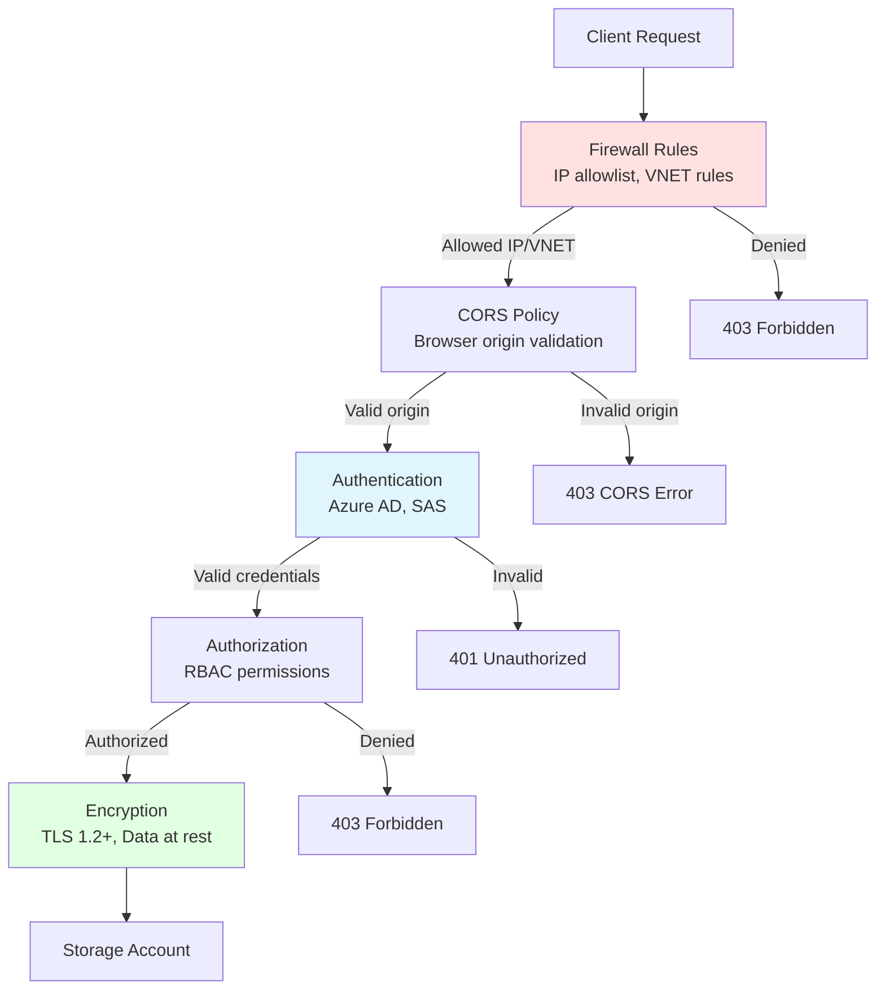

# Network Security and Access Controls

> **File Purpose**: Comprehensive guide to firewall rules, IP allowlists, CORS configuration, and network security best practices
> **Prerequisites**: Understanding of networking concepts from `02-core-concepts/networking-architecture.md`
> **Agent Use Case**: Reference when configuring firewall rules, implementing CORS for browser access, or troubleshooting connectivity issues

## Quick Context

**Deny all public network access by default**. Use private endpoints for Azure services, IP allowlists for known external IPs, and CORS policies for browser-based access. This file focuses on firewall configuration, CORS, and security auditing. For private endpoint implementation, see `02-core-concepts/networking-architecture.md`.

**Key principle**: Network security is defense-in-depth. Layer firewall rules (network layer) with RBAC (identity layer) and encryption (data layer) for comprehensive protection.

## Network Access Control Overview

### Security Layers



### Network Access Patterns

| Access Pattern | Firewall Rule | CORS Policy | Use Case |
|---------------|--------------|-------------|----------|
| **Private endpoint** | Not required | Not required | Azure services in VNET |
| **VNET service endpoint** | VNET rule | Not required | Azure services in VNET |
| **IP allowlist** | IP rule | Optional | Known public IPs (CI/CD, third-party) |
| **Browser upload** | IP rule or public | Required | Web applications |
| **CDN origin** | IP rule (CDN IPs) | Optional | CDN caching |
| **Mobile app** | Public + SAS | Optional | Mobile clients |
| **Deny all (production)** | Default deny + private endpoint | Not required | Maximum security |

## Firewall Rules Configuration

### Default Action: Deny

**Production best practice**: Deny all public access by default.

```bash
# Variables
STORAGE_ACCOUNT="mystorageacct"
RG_STORAGE="rg-storage"

# Set default action to Deny (blocks all public access)
az storage account update \
  --name $STORAGE_ACCOUNT \
  --resource-group $RG_STORAGE \
  --default-action Deny \
  --bypass AzureServices

# Verify configuration
az storage account show \
  --name $STORAGE_ACCOUNT \
  --resource-group $RG_STORAGE \
  --query "networkRuleSet.{defaultAction:defaultAction, bypass:bypass}"
```

**Bicep**:

```bicep
resource storageAccount 'Microsoft.Storage/storageAccounts@2023-05-01' = {
  name: storageAccountName
  location: location
  kind: 'StorageV2'
  sku: { name: 'Standard_GZRS' }
  properties: {
    networkAcls: {
      defaultAction: 'Deny' // Block all by default
      bypass: 'AzureServices' // Allow trusted Azure services
      ipRules: [] // No IP allowlist
      virtualNetworkRules: [] // No VNET rules
    }
    publicNetworkAccess: 'Enabled' // For IP allowlist; set to 'Disabled' for private endpoints only
    supportsHttpsTrafficOnly: true
    minimumTlsVersion: 'TLS1_2'
  }
}
```

### IP Allowlist (IP Rules)

**Use case**: Grant access from specific public IPs (CI/CD agents, third-party services, office IPs).

**Add IP rule**:

```bash
# Single IP address
az storage account network-rule add \
  --account-name $STORAGE_ACCOUNT \
  --resource-group $RG_STORAGE \
  --ip-address 203.0.113.42

# IP range (CIDR notation)
az storage account network-rule add \
  --account-name $STORAGE_ACCOUNT \
  --resource-group $RG_STORAGE \
  --ip-address 203.0.113.0/24

# Multiple IPs
for ip in 203.0.113.10 203.0.113.20 203.0.113.30; do
  az storage account network-rule add \
    --account-name $STORAGE_ACCOUNT \
    --resource-group $RG_STORAGE \
    --ip-address $ip
done
```

**Bicep**:

```bicep
resource storageAccount 'Microsoft.Storage/storageAccounts@2023-05-01' = {
  name: storageAccountName
  properties: {
    networkAcls: {
      defaultAction: 'Deny'
      bypass: 'AzureServices'
      ipRules: [
        {
          value: '203.0.113.42' // Single IP
          action: 'Allow'
        }
        {
          value: '203.0.113.0/24' // IP range
          action: 'Allow'
        }
        {
          value: '198.51.100.0/24' // Another IP range
          action: 'Allow'
        }
      ]
    }
  }
}
```

**Important notes**:
- Use **public IP** of client (not private IP)
- Check your IP: `curl ifconfig.me`
- Azure Portal IP: Check error message for required IP
- IPv6 supported (CIDR notation)

**Remove IP rule**:

```bash
az storage account network-rule remove \
  --account-name $STORAGE_ACCOUNT \
  --resource-group $RG_STORAGE \
  --ip-address 203.0.113.42
```

### VNET Rules (Service Endpoints)

**Use case**: Grant access from Azure VNET subnets (alternative to private endpoints).

**See `02-core-concepts/networking-architecture.md` for detailed service endpoint setup.**

**Quick reference**:

```bash
# 1. Enable service endpoint on subnet
az network vnet subnet update \
  --vnet-name vnet-prod \
  --name snet-apps \
  --resource-group rg-network \
  --service-endpoints Microsoft.Storage

# 2. Add VNET rule to storage account
az storage account network-rule add \
  --account-name $STORAGE_ACCOUNT \
  --resource-group $RG_STORAGE \
  --vnet-name vnet-prod \
  --subnet snet-apps
```

**Bicep**:

```bicep
resource storageAccount 'Microsoft.Storage/storageAccounts@2023-05-01' = {
  name: storageAccountName
  properties: {
    networkAcls: {
      defaultAction: 'Deny'
      bypass: 'AzureServices'
      virtualNetworkRules: [
        {
          id: subnet.id // Subnet resource ID
          action: 'Allow'
        }
      ]
    }
  }
}
```

### Bypass Azure Services

**Allow trusted Azure services** to access storage even when default action is Deny.

```bash
az storage account update \
  --name $STORAGE_ACCOUNT \
  --resource-group $RG_STORAGE \
  --bypass AzureServices
```

**Trusted services include**:
- Azure Monitor (diagnostics logs)
- Azure Backup
- Azure Site Recovery
- Azure Log Analytics
- Azure Event Grid
- Azure Data Factory (with managed identity)
- Azure Synapse Analytics (with managed identity)
- Azure Machine Learning

**Security note**: Bypass only grants network access. Services still need RBAC permissions or SAS tokens.

**Bypass options**:
- `AzureServices` - All trusted services
- `Logging` - Azure Storage logging only
- `Metrics` - Azure Storage metrics only
- `None` - No bypass (strictest)

```bicep
resource storageAccount 'Microsoft.Storage/storageAccounts@2023-05-01' = {
  properties: {
    networkAcls: {
      defaultAction: 'Deny'
      bypass: 'AzureServices, Logging, Metrics'
    }
  }
}
```

### Resource Instance Rules

**Grant access to specific Azure resource instances** (App Service, VM, etc.).

```bash
# Get resource ID of App Service
APP_ID=$(az webapp show \
  --name myapp \
  --resource-group rg-apps \
  --query id -o tsv)

# Add resource instance rule
az storage account network-rule add \
  --account-name $STORAGE_ACCOUNT \
  --resource-group $RG_STORAGE \
  --resource-id $APP_ID
```

**Bicep**:

```bicep
resource storageAccount 'Microsoft.Storage/storageAccounts@2023-05-01' = {
  properties: {
    networkAcls: {
      defaultAction: 'Deny'
      bypass: 'AzureServices'
      resourceAccessRules: [
        {
          tenantId: subscription().tenantId
          resourceId: appService.id
        }
      ]
    }
  }
}
```

**Use case**: Allow specific App Service to access storage without VNET integration.

### Public Network Access (Disable)

**Maximum security**: Disable all public network access (only private endpoints work).

```bash
az storage account update \
  --name $STORAGE_ACCOUNT \
  --resource-group $RG_STORAGE \
  --public-network-access Disabled

# Re-enable (if needed)
az storage account update \
  --name $STORAGE_ACCOUNT \
  --resource-group $RG_STORAGE \
  --public-network-access Enabled
```

**Bicep**:

```bicep
resource storageAccount 'Microsoft.Storage/storageAccounts@2023-05-01' = {
  properties: {
    publicNetworkAccess: 'Disabled' // Zero internet exposure
    networkAcls: {
      defaultAction: 'Deny' // Redundant, but explicit
    }
  }
}
```

**Impact**:
- ✅ Maximum security (zero internet exposure)
- ✅ Compliant with zero-trust
- ❌ Requires private endpoint for all access
- ❌ Azure Portal storage browser unavailable (use Azure Storage Explorer)
- ❌ Cannot use Azure CLI from local machine (use Cloud Shell or VNET-connected machine)

## CORS Configuration

### What Is CORS?

**Cross-Origin Resource Sharing (CORS)** allows JavaScript in web browsers to access Azure Storage from different origins (domains).

**Use case**: Browser-based uploads (e.g., React/Angular app uploads files directly to storage).

### CORS Policy Structure

**CORS policy** (per service: blob, table, queue, file):
- **AllowedOrigins**: Domains allowed to make requests (e.g., `https://myapp.com`)
- **AllowedMethods**: HTTP methods (GET, PUT, POST, DELETE, OPTIONS)
- **AllowedHeaders**: Request headers (e.g., `x-ms-blob-type`, `Content-Type`)
- **ExposedHeaders**: Response headers exposed to browser (e.g., `x-ms-request-id`)
- **MaxAgeInSeconds**: Preflight cache duration (browser caches OPTIONS response)

### Configure CORS: Azure CLI

**Blob service CORS**:

```bash
# Set CORS rule
az storage cors add \
  --services b \
  --methods GET PUT POST \
  --origins "https://myapp.com" "https://app.example.com" \
  --allowed-headers "*" \
  --exposed-headers "x-ms-request-id" "x-ms-version" \
  --max-age 3600 \
  --account-name $STORAGE_ACCOUNT \
  --account-key $ACCOUNT_KEY

# View CORS rules
az storage cors list \
  --services b \
  --account-name $STORAGE_ACCOUNT \
  --account-key $ACCOUNT_KEY
```

**Table service CORS**:

```bash
az storage cors add \
  --services t \
  --methods GET POST PUT DELETE \
  --origins "https://myapp.com" \
  --allowed-headers "*" \
  --exposed-headers "*" \
  --max-age 3600 \
  --account-name $STORAGE_ACCOUNT \
  --account-key $ACCOUNT_KEY
```

**Clear CORS rules**:

```bash
az storage cors clear \
  --services b \
  --account-name $STORAGE_ACCOUNT \
  --account-key $ACCOUNT_KEY
```

### Configure CORS: Bicep

**Complete CORS configuration**:

```bicep
resource storageAccount 'Microsoft.Storage/storageAccounts@2023-05-01' = {
  name: storageAccountName
  location: location
  kind: 'StorageV2'
  sku: { name: 'Standard_GZRS' }

  // Blob service CORS
  resource blobService 'blobServices' = {
    name: 'default'
    properties: {
      cors: {
        corsRules: [
          {
            allowedOrigins: [
              'https://myapp.com'
              'https://app.example.com'
            ]
            allowedMethods: [
              'GET'
              'PUT'
              'POST'
              'DELETE'
              'OPTIONS'
            ]
            allowedHeaders: [
              '*' // All headers (or specific: 'x-ms-blob-type', 'Content-Type')
            ]
            exposedHeaders: [
              'x-ms-request-id'
              'x-ms-version'
              'Content-Length'
            ]
            maxAgeInSeconds: 3600 // 1 hour
          }
        ]
      }
    }
  }

  // Table service CORS
  resource tableService 'tableServices' = {
    name: 'default'
    properties: {
      cors: {
        corsRules: [
          {
            allowedOrigins: ['https://myapp.com']
            allowedMethods: ['GET', 'POST', 'PUT', 'DELETE', 'OPTIONS']
            allowedHeaders: ['*']
            exposedHeaders: ['*']
            maxAgeInSeconds: 3600
          }
        ]
      }
    }
  }
}
```

### Configure CORS: C# Management SDK

```csharp
using Azure.ResourceManager;
using Azure.ResourceManager.Storage;
using Azure.ResourceManager.Storage.Models;

public async Task ConfigureCorsAsync(
    string resourceGroupName,
    string storageAccountName)
{
    var armClient = new ArmClient(new DefaultAzureCredential());
    var subscription = await armClient.GetDefaultSubscriptionAsync();
    var resourceGroup = await subscription.GetResourceGroupAsync(resourceGroupName);
    var storageAccount = await resourceGroup.Value.GetStorageAccountAsync(storageAccountName);

    // Configure Blob service CORS
    var blobServiceData = new BlobServiceData
    {
        Cors = new StorageCorsRules
        {
            CorsRulesValue =
            {
                new StorageCorsRule(
                    allowedOrigins: new[] { "https://myapp.com", "https://app.example.com" },
                    allowedMethods: new[] { "GET", "PUT", "POST", "DELETE", "OPTIONS" },
                    maxAgeInSeconds: 3600,
                    exposedHeaders: new[] { "x-ms-request-id", "x-ms-version" },
                    allowedHeaders: new[] { "*" }
                )
            }
        }
    };

    var blobService = await storageAccount.Value.GetBlobService().GetAsync();
    await blobService.Value.UpdateAsync(blobServiceData);

    Console.WriteLine("CORS configured for blob service");
}
```

### CORS Best Practices

**1. Specific origins** (not wildcard):

```bicep
// ❌ BAD: Allows all origins
allowedOrigins: ['*']

// ✅ GOOD: Specific origins
allowedOrigins: [
  'https://myapp.com'
  'https://staging.myapp.com'
]
```

**2. Minimal methods**:

```bicep
// ❌ BAD: All methods
allowedMethods: ['GET', 'PUT', 'POST', 'DELETE', 'HEAD', 'OPTIONS']

// ✅ GOOD: Only needed methods
allowedMethods: ['GET', 'PUT', 'OPTIONS'] // Upload only
```

**3. Specific headers** (if possible):

```bicep
// ⚠️ ACCEPTABLE: Wildcard headers
allowedHeaders: ['*']

// ✅ BETTER: Specific headers
allowedHeaders: [
  'x-ms-blob-type'
  'x-ms-blob-content-type'
  'Content-Type'
]
```

**4. Reasonable max age**:

```bicep
maxAgeInSeconds: 3600 // 1 hour (browser caches preflight)
```

**5. HTTPS-only origins**:

```bicep
// ❌ BAD: HTTP allowed
allowedOrigins: ['http://myapp.com']

// ✅ GOOD: HTTPS only
allowedOrigins: ['https://myapp.com']
```

### Browser Upload Example (JavaScript)

**React example** (fetch SAS from backend, upload to storage):

```javascript
// 1. Get SAS token from backend
const response = await fetch('/api/sas/upload-url', {
  method: 'POST',
  headers: {
    'Content-Type': 'application/json',
    'Authorization': `Bearer ${accessToken}`
  },
  body: JSON.stringify({ fileName: file.name })
});

const { uploadUrl } = await response.json();

// 2. Upload directly to Azure Storage
const uploadResponse = await fetch(uploadUrl, {
  method: 'PUT',
  headers: {
    'x-ms-blob-type': 'BlockBlob',
    'Content-Type': file.type
  },
  body: file
});

if (uploadResponse.ok) {
  console.log('Upload successful');
} else {
  const error = await uploadResponse.text();
  console.error('Upload failed:', error);
}
```

**CORS preflight** (browser sends OPTIONS request first):

```
OPTIONS /mycontainer/file.pdf?<SAS> HTTP/1.1
Host: mystorageacct.blob.core.windows.net
Origin: https://myapp.com
Access-Control-Request-Method: PUT
Access-Control-Request-Headers: x-ms-blob-type, Content-Type

Response:
HTTP/1.1 200 OK
Access-Control-Allow-Origin: https://myapp.com
Access-Control-Allow-Methods: GET, PUT, POST, DELETE, OPTIONS
Access-Control-Allow-Headers: x-ms-blob-type, Content-Type
Access-Control-Max-Age: 3600
```

## Private Endpoints

**For comprehensive private endpoint setup, see `02-core-concepts/networking-architecture.md`.**

**Quick reference**:

```bash
# 1. Disable public network access
az storage account update \
  --name $STORAGE_ACCOUNT \
  --resource-group $RG_STORAGE \
  --public-network-access Disabled

# 2. Create private endpoint
az network private-endpoint create \
  --name pe-${STORAGE_ACCOUNT}-blob \
  --resource-group rg-network \
  --vnet-name vnet-prod \
  --subnet snet-endpoints \
  --private-connection-resource-id /subscriptions/{sub}/resourceGroups/$RG_STORAGE/providers/Microsoft.Storage/storageAccounts/$STORAGE_ACCOUNT \
  --group-id blob \
  --connection-name ${STORAGE_ACCOUNT}-blob-connection

# 3. Configure Private DNS Zone (see networking-architecture.md)
```

**Benefits**:
- Private IP in VNET (10.x.x.x)
- Zero internet exposure
- Hybrid connectivity (ExpressRoute/VPN)
- Compliant with zero-trust

**Cost**: ~$7.30/month per endpoint per service (blob + table = $14.60/month)

## Security Audit and Monitoring

### View Current Firewall Rules

```bash
# Show all network ACL settings
az storage account show \
  --name $STORAGE_ACCOUNT \
  --resource-group $RG_STORAGE \
  --query "networkRuleSet" -o json

# List IP rules only
az storage account network-rule list \
  --account-name $STORAGE_ACCOUNT \
  --resource-group $RG_STORAGE \
  --query "ipRules[].{IP:value, Action:action}" -o table

# List VNET rules only
az storage account network-rule list \
  --account-name $STORAGE_ACCOUNT \
  --resource-group $RG_STORAGE \
  --query "virtualNetworkRules[].{SubnetId:id, Action:action}" -o table
```

### Diagnostic Logs (Network Monitoring)

**Enable diagnostic logs**:

```bash
az monitor diagnostic-settings create \
  --name storage-network-logs \
  --resource /subscriptions/{sub}/resourceGroups/$RG_STORAGE/providers/Microsoft.Storage/storageAccounts/$STORAGE_ACCOUNT \
  --logs '[
    {
      "category": "StorageRead",
      "enabled": true,
      "retentionPolicy": {"enabled": true, "days": 30}
    },
    {
      "category": "StorageWrite",
      "enabled": true,
      "retentionPolicy": {"enabled": true, "days": 30}
    },
    {
      "category": "StorageDelete",
      "enabled": true,
      "retentionPolicy": {"enabled": true, "days": 30}
    }
  ]' \
  --workspace /subscriptions/{sub}/resourceGroups/rg-monitoring/providers/Microsoft.OperationalInsights/workspaces/myworkspace
```

**Query network errors** (KQL):

```kql
// 403 Forbidden errors (network access denied)
StorageBlobLogs
| where TimeGenerated > ago(24h)
| where StatusCode == 403
| summarize Count=count() by CallerIpAddress, OperationName, StatusText
| order by Count desc

// Access from unexpected IPs
StorageBlobLogs
| where TimeGenerated > ago(7d)
| where CallerIpAddress !in ("203.0.113.42", "203.0.113.10") // Known IPs
| where StatusCode == 200
| summarize count() by CallerIpAddress, OperationName
| order by count_ desc

// CORS errors
StorageBlobLogs
| where TimeGenerated > ago(24h)
| where StatusText contains "CORS"
| project TimeGenerated, CallerIpAddress, Uri, UserAgentHeader, StatusText
```

### Azure Monitor Alerts

**Alert on excessive 403 errors**:

```bash
az monitor metrics alert create \
  --name network-access-denied \
  --resource-group $RG_STORAGE \
  --scopes /subscriptions/{sub}/resourceGroups/$RG_STORAGE/providers/Microsoft.Storage/storageAccounts/$STORAGE_ACCOUNT \
  --condition "total Transactions where ResponseType == 'ClientOtherError' > 100" \
  --window-size 5m \
  --evaluation-frequency 1m \
  --description "Alert on excessive network access denials" \
  --action email admin@example.com
```

**Alert on unexpected IP access**:

```kql
// Log Analytics alert rule
StorageBlobLogs
| where TimeGenerated > ago(5m)
| where CallerIpAddress !startswith "203.0.113." // Expected IP range
| where StatusCode == 200
| summarize count() by CallerIpAddress
| where count_ > 10
```

### Quarterly Audit Checklist

**Run every 90 days**:

```bash
# 1. Review IP allowlist
az storage account network-rule list \
  --account-name $STORAGE_ACCOUNT \
  --resource-group $RG_STORAGE \
  --query "ipRules[].value" -o tsv > current_ips.txt

# 2. Remove obsolete IPs
# (Manual review: Check if IPs still needed)

# 3. Review VNET rules
az storage account network-rule list \
  --account-name $STORAGE_ACCOUNT \
  --resource-group $RG_STORAGE \
  --query "virtualNetworkRules[].id" -o tsv

# 4. Review CORS policies
az storage cors list \
  --services b \
  --account-name $STORAGE_ACCOUNT \
  --account-key $ACCOUNT_KEY

# 5. Review access logs (last 90 days)
# (Run KQL query in Log Analytics)
```

## Troubleshooting Network Connectivity

### Issue: Connection Timeout

**Symptoms**: Application cannot connect to storage account.

**Diagnosis**:

```bash
# 1. Check default action
az storage account show \
  --name $STORAGE_ACCOUNT \
  --resource-group $RG_STORAGE \
  --query "networkRuleSet.defaultAction"

# If "Deny", check IP/VNET rules

# 2. Test DNS resolution (from client machine)
nslookup mystorageacct.blob.core.windows.net

# 3. Test connectivity
curl -I https://mystorageacct.blob.core.windows.net

# 4. Check NSG rules (if using VNET)
az network nsg rule list \
  --nsg-name nsg-snet-apps \
  --resource-group rg-network \
  --query "[].{Name:name, Priority:priority, DestPort:destinationPortRange, Access:access}" -o table
```

**Solutions**:
- Add client IP to allowlist
- Configure VNET service endpoint or private endpoint
- Verify NSG allows outbound HTTPS (port 443)
- Check public network access setting

### Issue: 403 Forbidden (Network Access Denied)

**Error**:
```
Status: 403 (Forbidden)
ErrorCode: AuthorizationPermissionMismatch
This request is not authorized to perform this operation using this permission.
```

**Diagnosis**:

```bash
# 1. Get your public IP
curl ifconfig.me

# 2. Check if IP in allowlist
az storage account network-rule list \
  --account-name $STORAGE_ACCOUNT \
  --resource-group $RG_STORAGE \
  --query "ipRules[].value" -o tsv

# 3. Check diagnostic logs
# (Run KQL query for recent 403 errors)
```

**Solutions**:
- Add your IP to allowlist
- Verify client IP (NAT gateway, proxy may change IP)
- Check if public network access disabled (requires private endpoint)

### Issue: CORS Error (Browser)

**Error**:
```
Access to fetch at 'https://mystorageacct.blob.core.windows.net/...'
from origin 'https://myapp.com' has been blocked by CORS policy:
No 'Access-Control-Allow-Origin' header is present on the requested resource.
```

**Diagnosis**:

```bash
# 1. Check CORS configuration
az storage cors list \
  --services b \
  --account-name $STORAGE_ACCOUNT \
  --account-key $ACCOUNT_KEY

# 2. Test preflight request (from browser console)
fetch('https://mystorageacct.blob.core.windows.net/...', {
  method: 'OPTIONS',
  headers: {
    'Origin': 'https://myapp.com',
    'Access-Control-Request-Method': 'PUT'
  }
})
```

**Solutions**:
- Add origin to CORS `allowedOrigins`
- Include required HTTP method in `allowedMethods`
- Add required headers to `allowedHeaders`
- Verify HTTPS-only (not HTTP)
- Check browser console for preflight response

### Issue: Private Endpoint Not Working

**Symptoms**: Cannot access storage from VNET.

**Diagnosis**:

```bash
# 1. Verify DNS resolution (from VM in VNET)
nslookup mystorageacct.blob.core.windows.net

# Should return private IP (10.x.x.x), not public IP

# 2. Check Private DNS Zone linked to VNET
az network private-dns link vnet list \
  --zone-name privatelink.blob.core.windows.net \
  --resource-group rg-network

# 3. Check DNS zone group
az network private-endpoint dns-zone-group list \
  --endpoint-name pe-mystorageacct-blob \
  --resource-group rg-network
```

**Solutions**:
- Link Private DNS Zone to VNET
- Create DNS zone group for auto-registration
- Manually create A record if zone group missing
- See `02-core-concepts/networking-architecture.md` for details

## Security Best Practices Checklist

### Firewall Configuration

- [ ] Default action set to Deny (`--default-action Deny`)
- [ ] Public network access disabled (`--public-network-access Disabled`) or minimal IP allowlist
- [ ] Bypass set to AzureServices only (not Logging/Metrics unless needed)
- [ ] IP allowlist minimized (only known IPs, no broad ranges)
- [ ] IP rules reviewed quarterly (remove obsolete)
- [ ] VNET service endpoints or private endpoints for Azure services
- [ ] Resource instance rules for specific App Services (if needed)

### CORS Configuration

- [ ] Specific origins (not wildcard `*`)
- [ ] HTTPS-only origins
- [ ] Minimal HTTP methods (only needed)
- [ ] Specific headers (if possible, not wildcard)
- [ ] Reasonable max age (1-24 hours)
- [ ] CORS policies reviewed quarterly

### Private Endpoints

- [ ] Private endpoints created for each service (blob, table, etc.)
- [ ] Private DNS Zones created and linked to VNETs
- [ ] DNS zone groups configured (auto-registration)
- [ ] Public network access disabled (maximum security)
- [ ] Hybrid DNS forwarder configured (if on-premises access)

### Monitoring and Auditing

- [ ] Diagnostic logs enabled (StorageRead, StorageWrite, StorageDelete)
- [ ] Logs sent to Log Analytics workspace
- [ ] Azure Monitor alerts configured (403 errors, unexpected IPs)
- [ ] Network rules audited quarterly
- [ ] Access logs reviewed monthly (KQL queries)
- [ ] Incident response plan documented

### TLS/HTTPS

- [ ] HTTPS-only enabled (`--https-only true`)
- [ ] TLS 1.2+ enforced (`--min-tls-version TLS1_2`)
- [ ] HTTP redirected to HTTPS (automatic)
- [ ] Client TLS configuration validated

## Production Deployment Checklist

**Before production launch**:

- [ ] Default action: Deny
- [ ] Public network access: Disabled (or IP allowlist documented)
- [ ] Private endpoints: Configured for all services
- [ ] HTTPS-only: Enabled
- [ ] TLS 1.2+: Enforced
- [ ] CORS policies: Configured (if browser access needed)
- [ ] Firewall rules: Documented (IP allowlist, VNET rules)
- [ ] Diagnostic logs: Enabled and sent to Log Analytics
- [ ] Azure Monitor alerts: Configured
- [ ] Network security reviewed by security team
- [ ] Disaster recovery plan: Includes network configuration

## Navigation

- **Previous**: `encryption.md`
- **Up**: `00-overview.md`

## See Also

- `02-core-concepts/networking-architecture.md` - Private endpoints, DNS configuration
- `identity-authentication.md` - RBAC and authentication
- `02-core-concepts/security-model.md` - Defense-in-depth principles
- `06-operations/observability.md` - Diagnostic logging and monitoring

## References

[1] "Configure Azure Storage firewalls and virtual networks" - Microsoft Learn - 2024-09 - https://learn.microsoft.com/azure/storage/common/storage-network-security
[2] "Azure Storage private endpoints" - Microsoft Learn - 2024-09 - https://learn.microsoft.com/azure/storage/common/storage-private-endpoints
[3] "CORS support for Azure Storage" - Microsoft Learn - 2024-08 - https://learn.microsoft.com/rest/api/storageservices/cross-origin-resource-sharing--cors--support-for-the-azure-storage-services
[4] "Use private endpoints for Azure Storage" - Microsoft Learn - 2024-08 - https://learn.microsoft.com/azure/storage/common/storage-network-security
[5] "Azure Storage security recommendations" - Microsoft Learn - 2024-09 - https://learn.microsoft.com/azure/storage/blobs/security-recommendations
