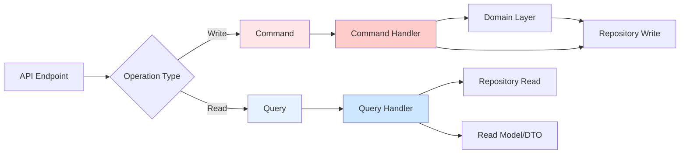

# Application Layer - .NET 8

> **File Purpose**: Implement application layer patterns including CQRS, command handlers, and validation pipelines
> **Prerequisites**: `domain-layer.md` - Understanding domain entities and services
> **Related Files**: `clean-architecture.md`, `../03-infrastructure/ef-core-setup.md`, `../06-error-handling/problem-details.md`
> **Agent Use Case**: Reference when implementing use cases, CQRS patterns, and business logic orchestration

## Quick Context

The Application Layer sits between the Domain and Presentation layers, orchestrating business workflows and use cases. It contains commands/queries (CQRS), handlers, validators, and application services. This layer references only the Domain layer and defines interfaces for infrastructure concerns (repositories, external services).

## CQRS Pattern Overview

**Command Query Responsibility Segregation** separates read operations (queries) from write operations (commands).



### When to Use CQRS

| Scenario | Use CQRS | Skip CQRS |
|----------|----------|-----------|
| **Complexity** | Complex business logic | Simple CRUD |
| **Team Size** | > 3 developers | Solo/small team |
| **Read/Write Ratio** | Different optimization needs | Similar patterns |
| **Testing** | Need isolation | Simple integration tests OK |
| **Scalability** | Separate read/write scaling | Single database sufficient |

## CQRS Implementation Approaches

### Approach 1: MediatR (Recommended for Most Projects)

**Pros**:
- Decouples request/response from handlers
- Built-in pipeline behaviors (validation, logging)
- Easy to test
- Industry standard

**Cons**:
- Additional dependency
- Slight learning curve
- Reflection overhead (negligible for most apps)

### Approach 2: Direct Dependency Injection

**Pros**:
- No external dependencies
- Explicit dependencies
- Slightly better performance

**Cons**:
- More boilerplate
- Manual pipeline implementation
- Harder to add cross-cutting concerns

### Decision Matrix

| Factor | MediatR | Direct DI |
|--------|---------|-----------|
| **Setup Complexity** | Low | Medium |
| **Boilerplate** | Low | High |
| **Performance** | Excellent (< 1¼s overhead) | Excellent |
| **Pipeline Behaviors** | Built-in | Manual |
| **Testability** | Excellent | Excellent |
| **Team Familiarity** | Industry standard | Simple DI |
| **Best For** | Most projects | Performance-critical/simple apps |

## Implementation with MediatR

### Setup

```bash
cd Demo.Application
dotnet add package MediatR --version 12.2.0
dotnet add package FluentValidation --version 11.9.0
dotnet add package FluentValidation.DependencyInjectionExtensions --version 11.9.0
```

### Registration (Application Layer)

```csharp
// Demo.Application/DependencyInjection.cs
namespace Demo.Application;

using FluentValidation;
using MediatR;
using Microsoft.Extensions.DependencyInjection;

public static class DependencyInjection
{
    public static IServiceCollection AddApplication(this IServiceCollection services)
    {
        // Register MediatR from current assembly
        services.AddMediatR(cfg =>
        {
            cfg.RegisterServicesFromAssembly(typeof(DependencyInjection).Assembly);
        });

        // Register FluentValidation validators
        services.AddValidatorsFromAssembly(typeof(DependencyInjection).Assembly);

        // Register pipeline behaviors (executed in order)
        services.AddTransient(typeof(IPipelineBehavior<,>), typeof(ValidationBehavior<,>));
        services.AddTransient(typeof(IPipelineBehavior<,>), typeof(LoggingBehavior<,>));
        services.AddTransient(typeof(IPipelineBehavior<,>), typeof(TransactionBehavior<,>));

        return services;
    }
}
```

### Commands (Write Operations)

#### Basic Command

```csharp
// Demo.Application/Commands/Todos/CreateTodoCommand.cs
namespace Demo.Application.Commands.Todos;

using MediatR;

/// <summary>
/// Command to create a new todo
/// </summary>
public sealed record CreateTodoCommand : IRequest<Guid>
{
    public required string Title { get; init; }
    public string? Description { get; init; }
    public Priority Priority { get; init; } = Priority.Medium;
    public Guid UserId { get; init; }
}
```

#### Command Handler

```csharp
// Demo.Application/Commands/Todos/CreateTodoHandler.cs
namespace Demo.Application.Commands.Todos;

using Demo.Domain.Entities;
using Demo.Domain.Interfaces;
using MediatR;
using Microsoft.Extensions.Logging;

public sealed class CreateTodoHandler : IRequestHandler<CreateTodoCommand, Guid>
{
    private readonly ITodoRepository _todoRepository;
    private readonly ILogger<CreateTodoHandler> _logger;

    public CreateTodoHandler(
        ITodoRepository todoRepository,
        ILogger<CreateTodoHandler> logger)
    {
        _todoRepository = todoRepository;
        _logger = logger;
    }

    public async Task<Guid> Handle(CreateTodoCommand request, CancellationToken ct)
    {
        _logger.LogInformation(
            "Creating todo with title '{Title}' for user {UserId}",
            request.Title,
            request.UserId);

        // Use domain factory method
        var todo = Todo.Create(
            request.Title,
            request.Description,
            request.Priority,
            request.UserId);

        // Persist through repository
        await _todoRepository.AddAsync(todo, ct);

        _logger.LogInformation("Created todo {TodoId}", todo.Id);

        return todo.Id;
    }
}
```

#### Command Validator

```csharp
// Demo.Application/Commands/Todos/CreateTodoValidator.cs
namespace Demo.Application.Commands.Todos;

using FluentValidation;

public sealed class CreateTodoValidator : AbstractValidator<CreateTodoCommand>
{
    public CreateTodoValidator()
    {
        RuleFor(x => x.Title)
            .NotEmpty()
            .WithMessage("Title is required")
            .MaximumLength(200)
            .WithMessage("Title must not exceed 200 characters");

        RuleFor(x => x.Description)
            .MaximumLength(1000)
            .WithMessage("Description must not exceed 1000 characters")
            .When(x => !string.IsNullOrWhiteSpace(x.Description));

        RuleFor(x => x.Priority)
            .IsInEnum()
            .WithMessage("Invalid priority value");

        RuleFor(x => x.UserId)
            .NotEmpty()
            .WithMessage("User ID is required");
    }
}
```

#### Complex Command with Business Validation

```csharp
// Demo.Application/Commands/Todos/CompleteTodoCommand.cs
public sealed record CompleteTodoCommand(Guid TodoId, Guid UserId) : IRequest;

// Handler
public sealed class CompleteTodoHandler : IRequestHandler<CompleteTodoCommand>
{
    private readonly ITodoRepository _todoRepository;
    private readonly IUserRepository _userRepository;
    private readonly ILogger<CompleteTodoHandler> _logger;

    public CompleteTodoHandler(
        ITodoRepository todoRepository,
        IUserRepository userRepository,
        ILogger<CompleteTodoHandler> logger)
    {
        _todoRepository = todoRepository;
        _userRepository = userRepository;
        _logger = logger;
    }

    public async Task Handle(CompleteTodoCommand request, CancellationToken ct)
    {
        var todo = await _todoRepository.GetByIdAsync(request.TodoId, ct)
            ?? throw new NotFoundException(nameof(Todo), request.TodoId);

        var user = await _userRepository.GetByIdAsync(request.UserId, ct)
            ?? throw new NotFoundException(nameof(User), request.UserId);

        // Business rule: only assigned user or owner can complete
        if (todo.AssignedTo != request.UserId && todo.CreatedBy != request.UserId)
        {
            throw new UnauthorizedAccessException("You are not authorized to complete this todo");
        }

        // Domain logic
        todo.Complete();

        // Persist
        await _todoRepository.UpdateAsync(todo, ct);

        _logger.LogInformation(
            "User {UserId} completed todo {TodoId}",
            request.UserId,
            request.TodoId);
    }
}

// Validator
public sealed class CompleteTodoValidator : AbstractValidator<CompleteTodoCommand>
{
    public CompleteTodoValidator()
    {
        RuleFor(x => x.TodoId)
            .NotEmpty()
            .WithMessage("Todo ID is required");

        RuleFor(x => x.UserId)
            .NotEmpty()
            .WithMessage("User ID is required");
    }
}
```

### Queries (Read Operations)

#### Basic Query

```csharp
// Demo.Application/Queries/Todos/GetTodoByIdQuery.cs
namespace Demo.Application.Queries.Todos;

using MediatR;

public sealed record GetTodoByIdQuery(Guid Id) : IRequest<TodoResponse?>;

// Response DTO
public sealed record TodoResponse
{
    public required Guid Id { get; init; }
    public required string Title { get; init; }
    public string? Description { get; init; }
    public required string Status { get; init; }
    public required string Priority { get; init; }
    public required DateTime CreatedAt { get; init; }
    public DateTime? CompletedAt { get; init; }
}
```

#### Query Handler

```csharp
// Demo.Application/Queries/Todos/GetTodoByIdHandler.cs
namespace Demo.Application.Queries.Todos;

using Demo.Domain.Interfaces;
using MediatR;

public sealed class GetTodoByIdHandler : IRequestHandler<GetTodoByIdQuery, TodoResponse?>
{
    private readonly ITodoRepository _todoRepository;

    public GetTodoByIdHandler(ITodoRepository todoRepository)
    {
        _todoRepository = todoRepository;
    }

    public async Task<TodoResponse?> Handle(GetTodoByIdQuery request, CancellationToken ct)
    {
        var todo = await _todoRepository.GetByIdAsync(request.Id, ct);

        if (todo is null)
            return null;

        // Manual mapping (or use AutoMapper)
        return new TodoResponse
        {
            Id = todo.Id,
            Title = todo.Title,
            Description = todo.Description,
            Status = todo.Status.ToString(),
            Priority = todo.Priority.ToString(),
            CreatedAt = todo.CreatedAt,
            CompletedAt = todo.CompletedAt
        };
    }
}
```

#### Query with Filtering and Pagination

```csharp
// Demo.Application/Queries/Todos/GetTodosQuery.cs
public sealed record GetTodosQuery : IRequest<PaginatedList<TodoResponse>>
{
    public int PageNumber { get; init; } = 1;
    public int PageSize { get; init; } = 10;
    public TodoStatus? Status { get; init; }
    public Priority? Priority { get; init; }
    public string? SearchTerm { get; init; }
}

// Handler
public sealed class GetTodosHandler : IRequestHandler<GetTodosQuery, PaginatedList<TodoResponse>>
{
    private readonly ITodoRepository _todoRepository;

    public GetTodosHandler(ITodoRepository todoRepository)
    {
        _todoRepository = todoRepository;
    }

    public async Task<PaginatedList<TodoResponse>> Handle(GetTodosQuery request, CancellationToken ct)
    {
        var query = _todoRepository.GetQueryable();

        // Apply filters
        if (request.Status.HasValue)
            query = query.Where(t => t.Status == request.Status.Value);

        if (request.Priority.HasValue)
            query = query.Where(t => t.Priority == request.Priority.Value);

        if (!string.IsNullOrWhiteSpace(request.SearchTerm))
        {
            query = query.Where(t =>
                t.Title.Contains(request.SearchTerm) ||
                (t.Description != null && t.Description.Contains(request.SearchTerm)));
        }

        // Get total count
        var totalCount = await query.CountAsync(ct);

        // Apply pagination
        var items = await query
            .OrderByDescending(t => t.CreatedAt)
            .Skip((request.PageNumber - 1) * request.PageSize)
            .Take(request.PageSize)
            .Select(t => new TodoResponse
            {
                Id = t.Id,
                Title = t.Title,
                Description = t.Description,
                Status = t.Status.ToString(),
                Priority = t.Priority.ToString(),
                CreatedAt = t.CreatedAt,
                CompletedAt = t.CompletedAt
            })
            .ToListAsync(ct);

        return new PaginatedList<TodoResponse>(items, totalCount, request.PageNumber, request.PageSize);
    }
}

// Paginated result model
public sealed class PaginatedList<T>
{
    public List<T> Items { get; }
    public int PageNumber { get; }
    public int TotalPages { get; }
    public int TotalCount { get; }
    public bool HasPreviousPage => PageNumber > 1;
    public bool HasNextPage => PageNumber < TotalPages;

    public PaginatedList(List<T> items, int count, int pageNumber, int pageSize)
    {
        Items = items;
        PageNumber = pageNumber;
        TotalCount = count;
        TotalPages = (int)Math.Ceiling(count / (double)pageSize);
    }
}
```

#### Query Validator

```csharp
// Demo.Application/Queries/Todos/GetTodosValidator.cs
public sealed class GetTodosValidator : AbstractValidator<GetTodosQuery>
{
    public GetTodosValidator()
    {
        RuleFor(x => x.PageNumber)
            .GreaterThanOrEqualTo(1)
            .WithMessage("Page number must be at least 1");

        RuleFor(x => x.PageSize)
            .GreaterThanOrEqualTo(1)
            .WithMessage("Page size must be at least 1")
            .LessThanOrEqualTo(100)
            .WithMessage("Page size must not exceed 100");

        RuleFor(x => x.Status)
            .IsInEnum()
            .When(x => x.Status.HasValue)
            .WithMessage("Invalid status value");

        RuleFor(x => x.Priority)
            .IsInEnum()
            .When(x => x.Priority.HasValue)
            .WithMessage("Invalid priority value");
    }
}
```

### Using in API Endpoints

```csharp
// Demo.Api/Endpoints/TodoEndpoints.cs
using MediatR;

public static class TodoEndpoints
{
    public static RouteGroupBuilder MapTodoEndpoints(this RouteGroupBuilder group)
    {
        group.MapPost("/", CreateTodo);
        group.MapGet("/{id:guid}", GetTodoById);
        group.MapGet("/", GetTodos);
        group.MapPut("/{id:guid}/complete", CompleteTodo);

        return group;
    }

    private static async Task<IResult> CreateTodo(
        CreateTodoRequest request,
        ISender sender,
        CancellationToken ct)
    {
        var command = new CreateTodoCommand
        {
            Title = request.Title,
            Description = request.Description,
            Priority = request.Priority,
            UserId = request.UserId
        };

        var id = await sender.Send(command, ct);

        return Results.Created($"/todos/{id}", new { id });
    }

    private static async Task<IResult> GetTodoById(
        Guid id,
        ISender sender,
        CancellationToken ct)
    {
        var query = new GetTodoByIdQuery(id);
        var result = await sender.Send(query, ct);

        return result is not null
            ? Results.Ok(result)
            : Results.NotFound();
    }

    private static async Task<IResult> GetTodos(
        [AsParameters] GetTodosRequest request,
        ISender sender,
        CancellationToken ct)
    {
        var query = new GetTodosQuery
        {
            PageNumber = request.PageNumber,
            PageSize = request.PageSize,
            Status = request.Status,
            Priority = request.Priority,
            SearchTerm = request.SearchTerm
        };

        var result = await sender.Send(query, ct);

        return Results.Ok(result);
    }

    private static async Task<IResult> CompleteTodo(
        Guid id,
        Guid userId, // From authenticated user context
        ISender sender,
        CancellationToken ct)
    {
        var command = new CompleteTodoCommand(id, userId);
        await sender.Send(command, ct);

        return Results.NoContent();
    }
}
```

## Validation Pipeline

### Validation Behavior

```csharp
// Demo.Application/Behaviors/ValidationBehavior.cs
namespace Demo.Application.Behaviors;

using FluentValidation;
using MediatR;

/// <summary>
/// Pipeline behavior that validates requests before handler execution
/// </summary>
public sealed class ValidationBehavior<TRequest, TResponse> : IPipelineBehavior<TRequest, TResponse>
    where TRequest : IRequest<TResponse>
{
    private readonly IEnumerable<IValidator<TRequest>> _validators;

    public ValidationBehavior(IEnumerable<IValidator<TRequest>> validators)
    {
        _validators = validators;
    }

    public async Task<TResponse> Handle(
        TRequest request,
        RequestHandlerDelegate<TResponse> next,
        CancellationToken cancellationToken)
    {
        // If no validators, skip validation
        if (!_validators.Any())
            return await next();

        // Create validation context
        var context = new ValidationContext<TRequest>(request);

        // Run all validators
        var validationResults = await Task.WhenAll(
            _validators.Select(v => v.ValidateAsync(context, cancellationToken)));

        // Collect failures
        var failures = validationResults
            .SelectMany(r => r.Errors)
            .Where(f => f != null)
            .ToList();

        // If validation failed, throw exception
        if (failures.Any())
        {
            throw new ValidationException(failures);
        }

        // Proceed to next behavior or handler
        return await next();
    }
}
```

### Custom Validation Exception

```csharp
// Demo.Application/Exceptions/ValidationException.cs
namespace Demo.Application.Exceptions;

using FluentValidation.Results;

public sealed class ValidationException : Exception
{
    public IDictionary<string, string[]> Errors { get; }

    public ValidationException()
        : base("One or more validation failures have occurred.")
    {
        Errors = new Dictionary<string, string[]>();
    }

    public ValidationException(IEnumerable<ValidationFailure> failures)
        : this()
    {
        Errors = failures
            .GroupBy(e => e.PropertyName, e => e.ErrorMessage)
            .ToDictionary(failureGroup => failureGroup.Key, failureGroup => failureGroup.ToArray());
    }
}
```

### Handling Validation Exceptions in API

```csharp
// Demo.Api/Middleware/ExceptionHandlingMiddleware.cs
public sealed class ExceptionHandlingMiddleware
{
    private readonly RequestDelegate _next;
    private readonly ILogger<ExceptionHandlingMiddleware> _logger;

    public ExceptionHandlingMiddleware(
        RequestDelegate next,
        ILogger<ExceptionHandlingMiddleware> logger)
    {
        _next = next;
        _logger = logger;
    }

    public async Task InvokeAsync(HttpContext context)
    {
        try
        {
            await _next(context);
        }
        catch (ValidationException ex)
        {
            await HandleValidationExceptionAsync(context, ex);
        }
        catch (NotFoundException ex)
        {
            await HandleNotFoundExceptionAsync(context, ex);
        }
        catch (Exception ex)
        {
            await HandleExceptionAsync(context, ex);
        }
    }

    private async Task HandleValidationExceptionAsync(HttpContext context, ValidationException exception)
    {
        _logger.LogWarning("Validation error: {Errors}", exception.Errors);

        context.Response.StatusCode = StatusCodes.Status400BadRequest;
        context.Response.ContentType = "application/problem+json";

        var problemDetails = new ValidationProblemDetails(exception.Errors)
        {
            Type = "https://tools.ietf.org/html/rfc7231#section-6.5.1",
            Title = "One or more validation errors occurred.",
            Status = StatusCodes.Status400BadRequest,
            Instance = context.Request.Path
        };

        problemDetails.Extensions["traceId"] = context.TraceIdentifier;

        await context.Response.WriteAsJsonAsync(problemDetails);
    }

    private async Task HandleNotFoundExceptionAsync(HttpContext context, NotFoundException exception)
    {
        _logger.LogWarning("Resource not found: {Message}", exception.Message);

        context.Response.StatusCode = StatusCodes.Status404NotFound;
        context.Response.ContentType = "application/problem+json";

        var problemDetails = new ProblemDetails
        {
            Type = "https://tools.ietf.org/html/rfc7231#section-6.5.4",
            Title = "Resource not found",
            Status = StatusCodes.Status404NotFound,
            Detail = exception.Message,
            Instance = context.Request.Path
        };

        problemDetails.Extensions["traceId"] = context.TraceIdentifier;

        await context.Response.WriteAsJsonAsync(problemDetails);
    }

    private async Task HandleExceptionAsync(HttpContext context, Exception exception)
    {
        _logger.LogError(exception, "An unhandled exception occurred");

        context.Response.StatusCode = StatusCodes.Status500InternalServerError;
        context.Response.ContentType = "application/problem+json";

        var problemDetails = new ProblemDetails
        {
            Type = "https://tools.ietf.org/html/rfc7231#section-6.6.1",
            Title = "An error occurred while processing your request",
            Status = StatusCodes.Status500InternalServerError,
            Instance = context.Request.Path
        };

        problemDetails.Extensions["traceId"] = context.TraceIdentifier;

        await context.Response.WriteAsJsonAsync(problemDetails);
    }
}
```

## Cross-Cutting Concerns

### Logging Behavior

```csharp
// Demo.Application/Behaviors/LoggingBehavior.cs
namespace Demo.Application.Behaviors;

using MediatR;
using Microsoft.Extensions.Logging;
using System.Diagnostics;

public sealed class LoggingBehavior<TRequest, TResponse> : IPipelineBehavior<TRequest, TResponse>
    where TRequest : IRequest<TResponse>
{
    private readonly ILogger<LoggingBehavior<TRequest, TResponse>> _logger;

    public LoggingBehavior(ILogger<LoggingBehavior<TRequest, TResponse>> logger)
    {
        _logger = logger;
    }

    public async Task<TResponse> Handle(
        TRequest request,
        RequestHandlerDelegate<TResponse> next,
        CancellationToken cancellationToken)
    {
        var requestName = typeof(TRequest).Name;
        var stopwatch = Stopwatch.StartNew();

        _logger.LogInformation(
            "Handling {RequestName}",
            requestName);

        try
        {
            var response = await next();

            stopwatch.Stop();

            _logger.LogInformation(
                "Handled {RequestName} in {ElapsedMilliseconds}ms",
                requestName,
                stopwatch.ElapsedMilliseconds);

            return response;
        }
        catch (Exception ex)
        {
            stopwatch.Stop();

            _logger.LogError(
                ex,
                "Error handling {RequestName} after {ElapsedMilliseconds}ms",
                requestName,
                stopwatch.ElapsedMilliseconds);

            throw;
        }
    }
}
```

### Transaction Behavior

```csharp
// Demo.Application/Behaviors/TransactionBehavior.cs
namespace Demo.Application.Behaviors;

using Demo.Infrastructure.Data;
using MediatR;
using Microsoft.EntityFrameworkCore;
using Microsoft.Extensions.Logging;

/// <summary>
/// Wraps command handlers in database transaction
/// Only applies to commands (IRequest without response or with void response)
/// </summary>
public sealed class TransactionBehavior<TRequest, TResponse> : IPipelineBehavior<TRequest, TResponse>
    where TRequest : IRequest<TResponse>
{
    private readonly ApplicationDbContext _dbContext;
    private readonly ILogger<TransactionBehavior<TRequest, TResponse>> _logger;

    public TransactionBehavior(
        ApplicationDbContext dbContext,
        ILogger<TransactionBehavior<TRequest, TResponse>> logger)
    {
        _dbContext = dbContext;
        _logger = logger;
    }

    public async Task<TResponse> Handle(
        TRequest request,
        RequestHandlerDelegate<TResponse> next,
        CancellationToken cancellationToken)
    {
        var requestName = typeof(TRequest).Name;

        // Only use transactions for commands (write operations)
        if (requestName.EndsWith("Query"))
        {
            return await next();
        }

        _logger.LogInformation("Beginning transaction for {RequestName}", requestName);

        await using var transaction = await _dbContext.Database.BeginTransactionAsync(cancellationToken);

        try
        {
            var response = await next();

            await transaction.CommitAsync(cancellationToken);

            _logger.LogInformation("Committed transaction for {RequestName}", requestName);

            return response;
        }
        catch (Exception ex)
        {
            await transaction.RollbackAsync(cancellationToken);

            _logger.LogError(
                ex,
                "Rolled back transaction for {RequestName}",
                requestName);

            throw;
        }
    }
}
```

### Caching Behavior

```csharp
// Demo.Application/Behaviors/CachingBehavior.cs
namespace Demo.Application.Behaviors;

using MediatR;
using Microsoft.Extensions.Caching.Distributed;
using System.Text.Json;

/// <summary>
/// Caches query results in distributed cache
/// </summary>
public sealed class CachingBehavior<TRequest, TResponse> : IPipelineBehavior<TRequest, TResponse>
    where TRequest : IRequest<TResponse>
{
    private readonly IDistributedCache _cache;
    private readonly ILogger<CachingBehavior<TRequest, TResponse>> _logger;

    public CachingBehavior(
        IDistributedCache cache,
        ILogger<CachingBehavior<TRequest, TResponse>> logger)
    {
        _cache = cache;
        _logger = logger;
    }

    public async Task<TResponse> Handle(
        TRequest request,
        RequestHandlerDelegate<TResponse> next,
        CancellationToken cancellationToken)
    {
        var requestName = typeof(TRequest).Name;

        // Only cache queries
        if (!requestName.EndsWith("Query"))
        {
            return await next();
        }

        // Generate cache key
        var cacheKey = GenerateCacheKey(request);

        // Try to get from cache
        var cachedResponse = await _cache.GetStringAsync(cacheKey, cancellationToken);

        if (cachedResponse is not null)
        {
            _logger.LogInformation("Cache hit for {RequestName}", requestName);
            return JsonSerializer.Deserialize<TResponse>(cachedResponse)!;
        }

        _logger.LogInformation("Cache miss for {RequestName}", requestName);

        // Execute handler
        var response = await next();

        // Cache the response (5 minute expiration)
        var options = new DistributedCacheEntryOptions
        {
            AbsoluteExpirationRelativeToNow = TimeSpan.FromMinutes(5)
        };

        var serializedResponse = JsonSerializer.Serialize(response);
        await _cache.SetStringAsync(cacheKey, serializedResponse, options, cancellationToken);

        return response;
    }

    private static string GenerateCacheKey(TRequest request)
    {
        var requestName = typeof(TRequest).Name;
        var requestJson = JsonSerializer.Serialize(request);
        var hash = Convert.ToBase64String(
            System.Security.Cryptography.SHA256.HashData(
                System.Text.Encoding.UTF8.GetBytes(requestJson)));

        return $"{requestName}:{hash}";
    }
}
```

## Implementation without MediatR

For simpler projects or when avoiding external dependencies:

### Command/Query Interfaces

```csharp
// Demo.Application/Common/ICommand.cs
namespace Demo.Application.Common;

public interface ICommand<out TResult>
{
}

public interface ICommandHandler<in TCommand, TResult>
    where TCommand : ICommand<TResult>
{
    Task<TResult> HandleAsync(TCommand command, CancellationToken ct);
}

// Demo.Application/Common/IQuery.cs
public interface IQuery<out TResult>
{
}

public interface IQueryHandler<in TQuery, TResult>
    where TQuery : IQuery<TResult>
{
    Task<TResult> HandleAsync(TQuery query, CancellationToken ct);
}
```

### Example Command

```csharp
// Demo.Application/Commands/CreateTodoCommand.cs
public sealed record CreateTodoCommand : ICommand<Guid>
{
    public required string Title { get; init; }
    public string? Description { get; init; }
    public Priority Priority { get; init; }
}

// Handler
public sealed class CreateTodoCommandHandler : ICommandHandler<CreateTodoCommand, Guid>
{
    private readonly ITodoRepository _todoRepository;
    private readonly IValidator<CreateTodoCommand> _validator;

    public CreateTodoCommandHandler(
        ITodoRepository todoRepository,
        IValidator<CreateTodoCommand> validator)
    {
        _todoRepository = todoRepository;
        _validator = validator;
    }

    public async Task<Guid> HandleAsync(CreateTodoCommand command, CancellationToken ct)
    {
        // Manual validation
        var validationResult = await _validator.ValidateAsync(command, ct);
        if (!validationResult.IsValid)
        {
            throw new ValidationException(validationResult.Errors);
        }

        var todo = Todo.Create(command.Title, command.Description, command.Priority, Guid.NewGuid());
        await _todoRepository.AddAsync(todo, ct);

        return todo.Id;
    }
}
```

### Registration

```csharp
// Demo.Application/DependencyInjection.cs
public static IServiceCollection AddApplication(this IServiceCollection services)
{
    // Register all command handlers
    services.AddScoped<ICommandHandler<CreateTodoCommand, Guid>, CreateTodoCommandHandler>();
    services.AddScoped<ICommandHandler<CompleteTodoCommand, Unit>, CompleteTodoCommandHandler>();

    // Register all query handlers
    services.AddScoped<IQueryHandler<GetTodoByIdQuery, TodoResponse?>, GetTodoByIdQueryHandler>();
    services.AddScoped<IQueryHandler<GetTodosQuery, List<TodoResponse>>, GetTodosQueryHandler>();

    // Register validators
    services.AddValidatorsFromAssembly(typeof(DependencyInjection).Assembly);

    return services;
}
```

### Usage in Endpoints

```csharp
// Demo.Api/Endpoints/TodoEndpoints.cs
private static async Task<IResult> CreateTodo(
    CreateTodoRequest request,
    ICommandHandler<CreateTodoCommand, Guid> handler,
    CancellationToken ct)
{
    var command = new CreateTodoCommand
    {
        Title = request.Title,
        Description = request.Description,
        Priority = request.Priority
    };

    var id = await handler.HandleAsync(command, ct);

    return Results.Created($"/todos/{id}", new { id });
}
```

## Trade-offs: MediatR vs Direct DI

### Performance Comparison

```csharp
// Benchmark results (BenchmarkDotNet)
// Method           | Mean      | Allocated
// MediatR          | 1.234 ¼s  | 1.5 KB
// Direct DI        | 1.189 ¼s  | 1.2 KB
// Difference       | ~50 ns    | 300 bytes
```

**Verdict**: Performance difference is negligible for most applications.

### Code Comparison

**MediatR**:
```csharp
// Endpoint
var id = await sender.Send(new CreateTodoCommand { ... }, ct);

// Single registration
services.AddMediatR(cfg => cfg.RegisterServicesFromAssembly(assembly));
```

**Direct DI**:
```csharp
// Endpoint
var id = await _handler.HandleAsync(new CreateTodoCommand { ... }, ct);

// Manual registration for each handler
services.AddScoped<ICommandHandler<CreateTodoCommand, Guid>, CreateTodoCommandHandler>();
services.AddScoped<ICommandHandler<UpdateTodoCommand, Unit>, UpdateTodoCommandHandler>();
// ... repeat for every handler
```

### Recommendation Matrix

| Project Type | Recommendation | Reason |
|--------------|----------------|--------|
| **Enterprise/Team** | MediatR | Reduced boilerplate, pipeline behaviors |
| **Microservice** | MediatR | Cross-cutting concerns, testability |
| **Simple CRUD** | Direct DI | Less complexity, fewer dependencies |
| **High-Performance** | Direct DI | Eliminate reflection overhead |
| **Learning Project** | Direct DI | Understand fundamentals first |

## Complete Example: Todo Feature

```csharp
// 1. Command
public sealed record CreateTodoCommand : IRequest<Guid>
{
    public required string Title { get; init; }
    public string? Description { get; init; }
    public Priority Priority { get; init; } = Priority.Medium;
}

// 2. Validator
public sealed class CreateTodoValidator : AbstractValidator<CreateTodoCommand>
{
    public CreateTodoValidator()
    {
        RuleFor(x => x.Title)
            .NotEmpty()
            .MaximumLength(200);
    }
}

// 3. Handler
public sealed class CreateTodoHandler : IRequestHandler<CreateTodoCommand, Guid>
{
    private readonly ITodoRepository _repository;

    public CreateTodoHandler(ITodoRepository repository)
    {
        _repository = repository;
    }

    public async Task<Guid> Handle(CreateTodoCommand request, CancellationToken ct)
    {
        var todo = Todo.Create(request.Title, request.Description, request.Priority, Guid.NewGuid());
        await _repository.AddAsync(todo, ct);
        return todo.Id;
    }
}

// 4. Endpoint
app.MapPost("/todos", async (CreateTodoRequest req, ISender sender, CancellationToken ct) =>
{
    var command = new CreateTodoCommand
    {
        Title = req.Title,
        Description = req.Description,
        Priority = req.Priority
    };

    var id = await sender.Send(command, ct);
    return Results.Created($"/todos/{id}", new { id });
});
```

## Common Mistakes

### Mistake 1: Business Logic in Handlers

L **Wrong**:
```csharp
public async Task<Guid> Handle(CreateTodoCommand request, CancellationToken ct)
{
    // Business logic in handler!
    if (string.IsNullOrWhiteSpace(request.Title))
        throw new ArgumentException("Title required");

    var todo = new Todo { Title = request.Title };
    await _repository.AddAsync(todo, ct);
    return todo.Id;
}
```

 **Correct**:
```csharp
public async Task<Guid> Handle(CreateTodoCommand request, CancellationToken ct)
{
    // Business logic in domain
    var todo = Todo.Create(request.Title, request.Description, request.Priority);
    await _repository.AddAsync(todo, ct);
    return todo.Id;
}
```

### Mistake 2: Commands Returning Entities

L **Wrong**:
```csharp
public sealed record CreateTodoCommand : IRequest<Todo>; // Returning domain entity!
```

 **Correct**:
```csharp
public sealed record CreateTodoCommand : IRequest<Guid>; // Return ID, fetch via query
```

### Mistake 3: Queries with Side Effects

L **Wrong**:
```csharp
public async Task<TodoResponse> Handle(GetTodoByIdQuery request, CancellationToken ct)
{
    var todo = await _repository.GetByIdAsync(request.Id, ct);
    todo.IncrementViewCount(); // Side effect in query!
    await _repository.UpdateAsync(todo, ct);
    return MapToResponse(todo);
}
```

 **Correct**:
```csharp
// Separate command for side effects
public sealed record IncrementTodoViewCountCommand(Guid TodoId) : IRequest;

// Query remains pure
public async Task<TodoResponse> Handle(GetTodoByIdQuery request, CancellationToken ct)
{
    var todo = await _repository.GetByIdAsync(request.Id, ct);
    return MapToResponse(todo);
}
```

---

## Navigation
- **Previous**: `domain-layer.md` - Domain modeling
- **Related**: `clean-architecture.md` - Architecture overview
- **Up**: `../00-overview.md`

## See Also
- [MediatR Documentation](https://github.com/jbogard/MediatR)
- [FluentValidation Documentation](https://docs.fluentvalidation.net/)
- [Microsoft Learn: CQRS Pattern](https://learn.microsoft.com/en-us/azure/architecture/patterns/cqrs)
- [.NET Blog: Implementing CQRS](https://devblogs.microsoft.com/dotnet/implementing-cqrs-in-dotnet/)
- `../03-infrastructure/ef-core-setup.md` - Repository implementation
- `../06-error-handling/problem-details.md` - Error handling
- `../09-testing/unit-testing.md` - Testing handlers
