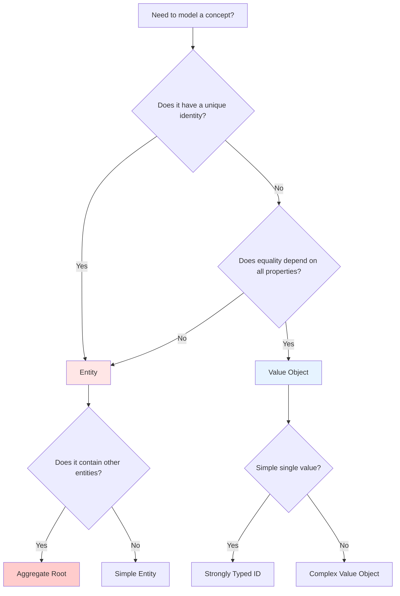

# Domain Layer - .NET 8

> **File Purpose**: Design rich domain models using entities, value objects, and domain services
> **Prerequisites**: `clean-architecture.md` - Understanding of layer boundaries
> **Related Files**: `application-layer.md`, `../03-infrastructure/ef-core-setup.md`
> **Agent Use Case**: Reference when implementing domain-driven design patterns in .NET 8

## Quick Context

The Domain Layer is the heart of your application, containing business logic, entities, value objects, and domain services. It has zero dependencies on infrastructure or frameworks, making it completely testable and portable. This guide covers implementing rich domain models using C# 12 features like required members, primary constructors, and collection expressions.

## Entities vs Value Objects

### Comparison Matrix

| Aspect | Entity | Value Object |
|--------|--------|--------------|
| **Identity** | Has unique ID | No identity (equality by value) |
| **Mutability** | Can change over time | Immutable |
| **Lifecycle** | Tracked by ORM | Not tracked separately |
| **Equality** | By ID | By all properties |
| **Examples** | User, Order, Todo | Email, Money, DateRange |
| **C# Type** | Class with Id property | Record or readonly struct |

### Decision Tree



## Entities

### Entity Pattern (C# 12)

**Basic Entity**:
```csharp
// Demo.Domain/Entities/Todo.cs
namespace Demo.Domain.Entities;

public sealed class Todo
{
    // Primary key
    public Guid Id { get; private set; }

    // Properties with controlled mutation
    public string Title { get; private set; } = string.Empty;
    public string? Description { get; private set; }
    public TodoStatus Status { get; private set; }
    public Priority Priority { get; private set; }

    // Audit fields
    public DateTime CreatedAt { get; private set; }
    public DateTime? CompletedAt { get; private set; }
    public Guid CreatedBy { get; private set; }

    // Navigation properties
    public User CreatedByUser { get; private set; } = null!;
    public List<TodoTag> Tags { get; private set; } = [];

    // Parameterless constructor for EF Core
    private Todo() { }

    // Factory method (preferred over public constructor)
    public static Todo Create(string title, string? description, Priority priority, Guid userId)
    {
        ArgumentException.ThrowIfNullOrWhiteSpace(title, nameof(title));

        if (title.Length > 200)
            throw new ArgumentException("Title cannot exceed 200 characters", nameof(title));

        return new Todo
        {
            Id = Guid.NewGuid(),
            Title = title,
            Description = description,
            Status = TodoStatus.NotStarted,
            Priority = priority,
            CreatedAt = DateTime.UtcNow,
            CreatedBy = userId
        };
    }

    // Business logic methods
    public void UpdateTitle(string newTitle)
    {
        ArgumentException.ThrowIfNullOrWhiteSpace(newTitle, nameof(newTitle));

        if (newTitle.Length > 200)
            throw new ArgumentException("Title cannot exceed 200 characters", nameof(newTitle));

        Title = newTitle;
    }

    public void UpdateDescription(string? newDescription)
    {
        Description = newDescription;
    }

    public void Start()
    {
        if (Status != TodoStatus.NotStarted)
            throw new InvalidOperationException($"Cannot start todo with status {Status}");

        Status = TodoStatus.InProgress;
    }

    public void Complete()
    {
        if (Status == TodoStatus.Completed)
            throw new InvalidOperationException("Todo is already completed");

        Status = TodoStatus.Completed;
        CompletedAt = DateTime.UtcNow;
    }

    public void Reopen()
    {
        if (Status != TodoStatus.Completed)
            throw new InvalidOperationException("Can only reopen completed todos");

        Status = TodoStatus.InProgress;
        CompletedAt = null;
    }

    public void UpdatePriority(Priority newPriority)
    {
        Priority = newPriority;
    }

    public void AddTag(string tagName)
    {
        ArgumentException.ThrowIfNullOrWhiteSpace(tagName, nameof(tagName));

        if (Tags.Any(t => t.Name.Equals(tagName, StringComparison.OrdinalIgnoreCase)))
            throw new InvalidOperationException($"Tag '{tagName}' already exists");

        Tags.Add(TodoTag.Create(tagName));
    }

    public void RemoveTag(string tagName)
    {
        var tag = Tags.FirstOrDefault(t => t.Name.Equals(tagName, StringComparison.OrdinalIgnoreCase));
        if (tag is null)
            throw new InvalidOperationException($"Tag '{tagName}' not found");

        Tags.Remove(tag);
    }
}
```

### Entity with Primary Constructor (C# 12)

For simpler entities with less behavior:

```csharp
// Demo.Domain/Entities/Category.cs
namespace Demo.Domain.Entities;

public sealed class Category(Guid id, string name, string? description)
{
    public Guid Id { get; private set; } = id;
    public string Name { get; private set; } = name;
    public string? Description { get; private set; } = description;

    // Parameterless constructor for EF Core
    private Category() : this(Guid.Empty, string.Empty, null) { }

    public static Category Create(string name, string? description = null)
    {
        ArgumentException.ThrowIfNullOrWhiteSpace(name, nameof(name));

        return new Category(Guid.NewGuid(), name, description);
    }

    public void UpdateName(string newName)
    {
        ArgumentException.ThrowIfNullOrWhiteSpace(newName, nameof(newName));
        Name = newName;
    }
}
```

### Aggregate Root Pattern

An aggregate is a cluster of entities and value objects with a root entity:

```csharp
// Demo.Domain/Entities/Order.cs
namespace Demo.Domain.Entities;

/// <summary>
/// Aggregate root for Order and OrderItems
/// </summary>
public sealed class Order
{
    public Guid Id { get; private set; }
    public string OrderNumber { get; private set; } = string.Empty;
    public OrderStatus Status { get; private set; }
    public DateTime CreatedAt { get; private set; }

    // Private collection - external code cannot modify directly
    private readonly List<OrderItem> _items = [];

    // Expose as read-only
    public IReadOnlyCollection<OrderItem> Items => _items.AsReadOnly();

    // Computed property
    public decimal TotalAmount => _items.Sum(i => i.TotalPrice);

    private Order() { }

    public static Order Create(string orderNumber)
    {
        ArgumentException.ThrowIfNullOrWhiteSpace(orderNumber, nameof(orderNumber));

        return new Order
        {
            Id = Guid.NewGuid(),
            OrderNumber = orderNumber,
            Status = OrderStatus.Draft,
            CreatedAt = DateTime.UtcNow
        };
    }

    // Aggregate controls adding items (enforces invariants)
    public void AddItem(Guid productId, string productName, decimal unitPrice, int quantity)
    {
        if (Status != OrderStatus.Draft)
            throw new InvalidOperationException("Cannot modify order after submission");

        if (quantity <= 0)
            throw new ArgumentException("Quantity must be positive", nameof(quantity));

        if (unitPrice <= 0)
            throw new ArgumentException("Unit price must be positive", nameof(unitPrice));

        // Business rule: max 10 items per order
        if (_items.Count >= 10)
            throw new InvalidOperationException("Order cannot exceed 10 items");

        var existingItem = _items.FirstOrDefault(i => i.ProductId == productId);

        if (existingItem is not null)
        {
            existingItem.UpdateQuantity(existingItem.Quantity + quantity);
        }
        else
        {
            var item = OrderItem.Create(Id, productId, productName, unitPrice, quantity);
            _items.Add(item);
        }
    }

    public void RemoveItem(Guid productId)
    {
        if (Status != OrderStatus.Draft)
            throw new InvalidOperationException("Cannot modify order after submission");

        var item = _items.FirstOrDefault(i => i.ProductId == productId);
        if (item is null)
            throw new InvalidOperationException("Item not found in order");

        _items.Remove(item);
    }

    public void Submit()
    {
        if (Status != OrderStatus.Draft)
            throw new InvalidOperationException($"Cannot submit order with status {Status}");

        if (!_items.Any())
            throw new InvalidOperationException("Cannot submit empty order");

        Status = OrderStatus.Submitted;
    }

    public void Cancel()
    {
        if (Status == OrderStatus.Shipped || Status == OrderStatus.Delivered)
            throw new InvalidOperationException($"Cannot cancel order with status {Status}");

        Status = OrderStatus.Cancelled;
    }
}

// OrderItem is an entity but only accessible through Order aggregate
public sealed class OrderItem
{
    public Guid Id { get; private set; }
    public Guid OrderId { get; private set; }
    public Guid ProductId { get; private set; }
    public string ProductName { get; private set; } = string.Empty;
    public decimal UnitPrice { get; private set; }
    public int Quantity { get; private set; }
    public decimal TotalPrice => UnitPrice * Quantity;

    private OrderItem() { }

    internal static OrderItem Create(Guid orderId, Guid productId, string productName, decimal unitPrice, int quantity)
    {
        return new OrderItem
        {
            Id = Guid.NewGuid(),
            OrderId = orderId,
            ProductId = productId,
            ProductName = productName,
            UnitPrice = unitPrice,
            Quantity = quantity
        };
    }

    internal void UpdateQuantity(int newQuantity)
    {
        if (newQuantity <= 0)
            throw new ArgumentException("Quantity must be positive", nameof(newQuantity));

        Quantity = newQuantity;
    }
}
```

**Key Aggregate Rules**:
1. External code only references the root (Order)
2. Invariants enforced by aggregate root
3. Single transaction boundary
4. Repository only for aggregate roots

## Value Objects

### Simple Value Object (Record)

```csharp
// Demo.Domain/ValueObjects/Email.cs
namespace Demo.Domain.ValueObjects;

/// <summary>
/// Represents a validated email address
/// </summary>
public sealed record Email
{
    public string Value { get; init; }

    private Email(string value)
    {
        Value = value;
    }

    public static Email Create(string value)
    {
        ArgumentException.ThrowIfNullOrWhiteSpace(value, nameof(value));

        if (!IsValidEmail(value))
            throw new ArgumentException($"Invalid email format: {value}", nameof(value));

        return new Email(value.ToLowerInvariant().Trim());
    }

    private static bool IsValidEmail(string email)
    {
        // Simple validation (use regex or MailAddress for production)
        return email.Contains('@') && email.Contains('.');
    }

    // Implicit conversion to string
    public static implicit operator string(Email email) => email.Value;

    public override string ToString() => Value;
}
```

### Complex Value Object

```csharp
// Demo.Domain/ValueObjects/Money.cs
namespace Demo.Domain.ValueObjects;

/// <summary>
/// Represents a monetary amount with currency
/// </summary>
public sealed record Money
{
    public decimal Amount { get; init; }
    public string Currency { get; init; }

    private Money(decimal amount, string currency)
    {
        Amount = amount;
        Currency = currency;
    }

    public static Money Create(decimal amount, string currency)
    {
        if (amount < 0)
            throw new ArgumentException("Amount cannot be negative", nameof(amount));

        ArgumentException.ThrowIfNullOrWhiteSpace(currency, nameof(currency));

        if (currency.Length != 3)
            throw new ArgumentException("Currency must be 3-letter ISO code", nameof(currency));

        return new Money(amount, currency.ToUpperInvariant());
    }

    public static Money Zero(string currency) => Create(0, currency);

    // Factory methods for common currencies
    public static Money Usd(decimal amount) => Create(amount, "USD");
    public static Money Eur(decimal amount) => Create(amount, "EUR");
    public static Money Gbp(decimal amount) => Create(amount, "GBP");

    // Operators
    public static Money operator +(Money left, Money right)
    {
        if (left.Currency != right.Currency)
            throw new InvalidOperationException($"Cannot add {left.Currency} and {right.Currency}");

        return Create(left.Amount + right.Amount, left.Currency);
    }

    public static Money operator -(Money left, Money right)
    {
        if (left.Currency != right.Currency)
            throw new InvalidOperationException($"Cannot subtract {left.Currency} and {right.Currency}");

        return Create(left.Amount - right.Amount, left.Currency);
    }

    public static Money operator *(Money money, decimal multiplier)
    {
        return Create(money.Amount * multiplier, money.Currency);
    }

    public Money Negate() => Create(-Amount, Currency);

    public bool IsZero => Amount == 0;

    public override string ToString() => $"{Amount:N2} {Currency}";
}
```

### Value Object with Validation

```csharp
// Demo.Domain/ValueObjects/DateRange.cs
namespace Demo.Domain.ValueObjects;

/// <summary>
/// Represents a date range with validation
/// </summary>
public sealed record DateRange
{
    public DateTime Start { get; init; }
    public DateTime End { get; init; }

    private DateRange(DateTime start, DateTime end)
    {
        Start = start;
        End = end;
    }

    public static DateRange Create(DateTime start, DateTime end)
    {
        if (start > end)
            throw new ArgumentException("Start date must be before or equal to end date");

        return new DateRange(start, end);
    }

    public int DurationInDays => (End - Start).Days + 1;

    public bool Contains(DateTime date) => date >= Start && date <= End;

    public bool Overlaps(DateRange other)
    {
        return Start <= other.End && End >= other.Start;
    }

    public override string ToString() => $"{Start:yyyy-MM-dd} to {End:yyyy-MM-dd}";
}
```

### Strongly Typed IDs (Value Objects)

Prevents primitive obsession and type confusion:

```csharp
// Demo.Domain/ValueObjects/TodoId.cs
namespace Demo.Domain.ValueObjects;

/// <summary>
/// Strongly typed ID for Todo entity
/// </summary>
public readonly record struct TodoId(Guid Value)
{
    public static TodoId New() => new(Guid.NewGuid());
    public static TodoId Empty => new(Guid.Empty);

    public static implicit operator Guid(TodoId id) => id.Value;
    public static explicit operator TodoId(Guid value) => new(value);

    public override string ToString() => Value.ToString();
}

// Usage
public sealed class Todo
{
    public TodoId Id { get; private set; }

    public static Todo Create(string title)
    {
        return new Todo
        {
            Id = TodoId.New(), // Type-safe ID
            Title = title
        };
    }
}

// Prevents bugs like this:
void ProcessTodo(Guid todoId, Guid userId) { } // Easy to swap parameters

// vs

void ProcessTodo(TodoId todoId, UserId userId) { } // Compiler error if swapped!
```

## Immutability and Equality

### Immutable Value Object

```csharp
// Demo.Domain/ValueObjects/Address.cs
namespace Demo.Domain.ValueObjects;

public sealed record Address
{
    public required string Street { get; init; }
    public required string City { get; init; }
    public required string PostalCode { get; init; }
    public required string Country { get; init; }

    // With expression for creating modified copies
    public Address WithCity(string newCity)
    {
        return this with { City = newCity };
    }
}

// Usage:
var address1 = new Address
{
    Street = "123 Main St",
    City = "New York",
    PostalCode = "10001",
    Country = "USA"
};

var address2 = address1 with { City = "Boston" }; // New instance

// Equality by value
var address3 = new Address
{
    Street = "123 Main St",
    City = "New York",
    PostalCode = "10001",
    Country = "USA"
};

Console.WriteLine(address1 == address3); // True (same values)
Console.WriteLine(ReferenceEquals(address1, address3)); // False (different instances)
```

### Collection Expressions (C# 12)

```csharp
public sealed class TodoList
{
    private readonly List<Todo> _todos = [];

    public IReadOnlyList<Todo> Todos => _todos;

    public void AddTodos(IEnumerable<Todo> todos)
    {
        _todos.AddRange(todos);
    }

    // Collection expression
    public List<Todo> GetActiveTodos() =>
    [
        ..._todos.Where(t => t.Status != TodoStatus.Completed)
    ];

    // Spread operator
    public List<Todo> CombineWith(TodoList other) =>
    [
        .._todos,
        ..other._todos
    ];
}
```

## Domain Services vs Application Services

### When to Use Domain Services

**Domain Service Criteria**:
- Operation involves multiple entities/aggregates
- Business logic doesn't naturally fit in any single entity
- Operation is a domain concept (not infrastructure)

### Comparison Matrix

| Aspect | Domain Service | Application Service |
|--------|----------------|---------------------|
| **Location** | Demo.Domain/Services | Demo.Application/Services |
| **Purpose** | Complex domain logic | Orchestrate use cases |
| **Dependencies** | Other domain objects | Repositories, domain services |
| **Testability** | Pure logic (easy) | Requires mocking |
| **Persistence** | No database access | Calls repositories |
| **Example** | Calculate tax, validate eligibility | Create order flow |

### Domain Service Example

```csharp
// Demo.Domain/Services/ITodoAssignmentService.cs
namespace Demo.Domain.Services;

/// <summary>
/// Domain service for complex assignment logic
/// </summary>
public interface ITodoAssignmentService
{
    bool CanAssign(Todo todo, User user);
    void AssignTodo(Todo todo, User user);
}

// Demo.Domain/Services/TodoAssignmentService.cs
public sealed class TodoAssignmentService : ITodoAssignmentService
{
    public bool CanAssign(Todo todo, User user)
    {
        // Complex business rules spanning multiple entities
        if (todo.Status == TodoStatus.Completed)
            return false;

        if (user.ActiveTodoCount >= user.MaxActiveTodos)
            return false;

        if (todo.Priority == Priority.Critical && !user.CanHandleCritical)
            return false;

        return true;
    }

    public void AssignTodo(Todo todo, User user)
    {
        if (!CanAssign(todo, user))
            throw new InvalidOperationException("Cannot assign todo to user");

        todo.AssignTo(user.Id);
        user.IncrementActiveTodoCount();
    }
}
```

### Application Service Example

```csharp
// Demo.Application/Services/ITodoService.cs
namespace Demo.Application.Services;

/// <summary>
/// Application service orchestrating use cases
/// </summary>
public interface ITodoService
{
    Task<Guid> CreateTodoAsync(CreateTodoRequest request, CancellationToken ct);
    Task AssignTodoAsync(Guid todoId, Guid userId, CancellationToken ct);
}

// Implementation
public sealed class TodoService : ITodoService
{
    private readonly ITodoRepository _todoRepository;
    private readonly IUserRepository _userRepository;
    private readonly ITodoAssignmentService _assignmentService;
    private readonly ILogger<TodoService> _logger;

    public TodoService(
        ITodoRepository todoRepository,
        IUserRepository userRepository,
        ITodoAssignmentService assignmentService,
        ILogger<TodoService> logger)
    {
        _todoRepository = todoRepository;
        _userRepository = userRepository;
        _assignmentService = assignmentService;
        _logger = logger;
    }

    public async Task<Guid> CreateTodoAsync(CreateTodoRequest request, CancellationToken ct)
    {
        var todo = Todo.Create(request.Title, request.Description, request.Priority, request.UserId);

        await _todoRepository.AddAsync(todo, ct);

        _logger.LogInformation("Created todo {TodoId}", todo.Id);

        return todo.Id;
    }

    public async Task AssignTodoAsync(Guid todoId, Guid userId, CancellationToken ct)
    {
        var todo = await _todoRepository.GetByIdAsync(todoId, ct)
            ?? throw new NotFoundException(nameof(Todo), todoId);

        var user = await _userRepository.GetByIdAsync(userId, ct)
            ?? throw new NotFoundException(nameof(User), userId);

        // Use domain service for complex logic
        _assignmentService.AssignTodo(todo, user);

        await _todoRepository.UpdateAsync(todo, ct);
        await _userRepository.UpdateAsync(user, ct);

        _logger.LogInformation("Assigned todo {TodoId} to user {UserId}", todoId, userId);
    }
}
```

## Rich vs Anemic Domain Models

### Anemic Domain Model (Anti-pattern)

L **Avoid This**:
```csharp
// Anemic - just data, no behavior
public class Todo
{
    public Guid Id { get; set; }
    public string Title { get; set; }
    public TodoStatus Status { get; set; }
    public DateTime? CompletedAt { get; set; }
}

// Business logic scattered in services
public class TodoService
{
    public void CompleteTodo(Todo todo)
    {
        // Validation and logic in service
        if (todo.Status == TodoStatus.Completed)
            throw new InvalidOperationException("Already completed");

        todo.Status = TodoStatus.Completed;
        todo.CompletedAt = DateTime.UtcNow;
    }
}
```

**Problems**:
- Logic duplicated across services
- No encapsulation
- Easy to put todo in invalid state
- Hard to find business rules

### Rich Domain Model (Recommended)

 **Prefer This**:
```csharp
// Rich - encapsulates behavior and invariants
public sealed class Todo
{
    public Guid Id { get; private set; }
    public string Title { get; private set; } = string.Empty;
    public TodoStatus Status { get; private set; }
    public DateTime? CompletedAt { get; private set; }

    // Business logic in entity
    public void Complete()
    {
        // Validation encapsulated
        if (Status == TodoStatus.Completed)
            throw new InvalidOperationException("Todo is already completed");

        // State transition logic
        Status = TodoStatus.Completed;
        CompletedAt = DateTime.UtcNow;
    }

    // Cannot be put in invalid state
    public void UpdateTitle(string newTitle)
    {
        ArgumentException.ThrowIfNullOrWhiteSpace(newTitle, nameof(newTitle));

        if (newTitle.Length > 200)
            throw new ArgumentException("Title too long", nameof(newTitle));

        Title = newTitle;
    }
}

// Service just orchestrates
public class TodoService
{
    public async Task CompleteTodoAsync(Guid id, CancellationToken ct)
    {
        var todo = await _repository.GetByIdAsync(id, ct);
        todo.Complete(); // Domain logic encapsulated
        await _repository.UpdateAsync(todo, ct);
    }
}
```

**Benefits**:
- Single place for business rules
- Self-documenting
- Impossible to create invalid state
- Easy to test

## Domain Events

Domain events represent something that happened in the domain:

```csharp
// Demo.Domain/Events/DomainEvent.cs
namespace Demo.Domain.Events;

/// <summary>
/// Base class for domain events
/// </summary>
public abstract record DomainEvent
{
    public Guid Id { get; init; } = Guid.NewGuid();
    public DateTime OccurredAt { get; init; } = DateTime.UtcNow;
}

// Demo.Domain/Events/TodoCompletedEvent.cs
public sealed record TodoCompletedEvent : DomainEvent
{
    public required Guid TodoId { get; init; }
    public required string Title { get; init; }
    public required Guid CompletedBy { get; init; }
    public required DateTime CompletedAt { get; init; }
}

// Demo.Domain/Events/TodoCreatedEvent.cs
public sealed record TodoCreatedEvent : DomainEvent
{
    public required Guid TodoId { get; init; }
    public required string Title { get; init; }
    public required Priority Priority { get; init; }
    public required Guid CreatedBy { get; init; }
}
```

### Entity with Domain Events

```csharp
// Demo.Domain/Common/IHasDomainEvents.cs
namespace Demo.Domain.Common;

public interface IHasDomainEvents
{
    IReadOnlyCollection<DomainEvent> DomainEvents { get; }
    void ClearDomainEvents();
}

// Demo.Domain/Entities/Todo.cs (with events)
public sealed class Todo : IHasDomainEvents
{
    private readonly List<DomainEvent> _domainEvents = [];
    public IReadOnlyCollection<DomainEvent> DomainEvents => _domainEvents.AsReadOnly();

    public Guid Id { get; private set; }
    public string Title { get; private set; } = string.Empty;
    public TodoStatus Status { get; private set; }

    public static Todo Create(string title, Priority priority, Guid userId)
    {
        var todo = new Todo
        {
            Id = Guid.NewGuid(),
            Title = title,
            Priority = priority,
            Status = TodoStatus.NotStarted
        };

        // Raise domain event
        todo.AddDomainEvent(new TodoCreatedEvent
        {
            TodoId = todo.Id,
            Title = todo.Title,
            Priority = todo.Priority,
            CreatedBy = userId
        });

        return todo;
    }

    public void Complete()
    {
        if (Status == TodoStatus.Completed)
            throw new InvalidOperationException("Already completed");

        Status = TodoStatus.Completed;
        CompletedAt = DateTime.UtcNow;

        // Raise domain event
        AddDomainEvent(new TodoCompletedEvent
        {
            TodoId = Id,
            Title = Title,
            CompletedBy = CreatedBy,
            CompletedAt = CompletedAt.Value
        });
    }

    private void AddDomainEvent(DomainEvent eventItem)
    {
        _domainEvents.Add(eventItem);
    }

    public void ClearDomainEvents()
    {
        _domainEvents.Clear();
    }
}
```

### Publishing Domain Events (Infrastructure)

```csharp
// Demo.Infrastructure/Data/ApplicationDbContext.cs
public sealed class ApplicationDbContext : DbContext
{
    private readonly IMediator _mediator;

    public ApplicationDbContext(DbContextOptions<ApplicationDbContext> options, IMediator mediator)
        : base(options)
    {
        _mediator = mediator;
    }

    public override async Task<int> SaveChangesAsync(CancellationToken ct = default)
    {
        // Collect domain events before saving
        var domainEvents = ChangeTracker.Entries<IHasDomainEvents>()
            .Select(x => x.Entity)
            .SelectMany(x => x.DomainEvents)
            .ToList();

        // Save changes
        var result = await base.SaveChangesAsync(ct);

        // Publish events after successful save
        foreach (var domainEvent in domainEvents)
        {
            await _mediator.Publish(domainEvent, ct);
        }

        // Clear events
        ChangeTracker.Entries<IHasDomainEvents>()
            .Select(x => x.Entity)
            .ToList()
            .ForEach(entity => entity.ClearDomainEvents());

        return result;
    }
}
```

## C# 12 Features for Domain Modeling

### Required Members

```csharp
// Demo.Domain/ValueObjects/PersonName.cs
public sealed record PersonName
{
    public required string FirstName { get; init; }
    public required string LastName { get; init; }
    public string? MiddleName { get; init; }

    public string FullName => MiddleName is null
        ? $"{FirstName} {LastName}"
        : $"{FirstName} {MiddleName} {LastName}";
}

// Usage:
var name = new PersonName
{
    FirstName = "John",
    LastName = "Doe"
}; // Compiles

var invalid = new PersonName
{
    FirstName = "John"
    // Error: Required member 'LastName' must be set
};
```

### Primary Constructors

```csharp
// Demo.Domain/ValueObjects/Coordinates.cs
namespace Demo.Domain.ValueObjects;

public sealed record Coordinates(double Latitude, double Longitude)
{
    public static Coordinates Create(double latitude, double longitude)
    {
        if (latitude < -90 || latitude > 90)
            throw new ArgumentOutOfRangeException(nameof(latitude), "Must be between -90 and 90");

        if (longitude < -180 || longitude > 180)
            throw new ArgumentOutOfRangeException(nameof(longitude), "Must be between -180 and 180");

        return new Coordinates(latitude, longitude);
    }

    public double DistanceTo(Coordinates other)
    {
        // Haversine formula implementation
        const double earthRadiusKm = 6371;

        var dLat = DegreesToRadians(other.Latitude - Latitude);
        var dLon = DegreesToRadians(other.Longitude - Longitude);

        var a = Math.Sin(dLat / 2) * Math.Sin(dLat / 2) +
                Math.Cos(DegreesToRadians(Latitude)) * Math.Cos(DegreesToRadians(other.Latitude)) *
                Math.Sin(dLon / 2) * Math.Sin(dLon / 2);

        var c = 2 * Math.Atan2(Math.Sqrt(a), Math.Sqrt(1 - a));

        return earthRadiusKm * c;
    }

    private static double DegreesToRadians(double degrees) => degrees * Math.PI / 180;
}
```

### Init-Only Collections

```csharp
public sealed class TodoList
{
    public required Guid Id { get; init; }
    public required string Name { get; init; }

    // Collection can be set during initialization only
    public IReadOnlyList<Todo> Todos { get; init; } = [];

    // Alternative: allow modification through methods
    private readonly List<Todo> _todos = [];
    public IReadOnlyList<Todo> Items => _todos;

    public void AddTodo(Todo todo) => _todos.Add(todo);
}
```

## Common Mistakes

### Mistake 1: Public Setters on Entities

L **Wrong**:
```csharp
public class Todo
{
    public Guid Id { get; set; }
    public string Title { get; set; } // Anyone can set!
    public TodoStatus Status { get; set; }
}

// Can bypass validation
todo.Status = TodoStatus.Completed; // No business logic executed
```

 **Correct**:
```csharp
public sealed class Todo
{
    public Guid Id { get; private set; }
    public string Title { get; private set; } = string.Empty;
    public TodoStatus Status { get; private set; }

    public void Complete() // Controlled mutation
    {
        if (Status == TodoStatus.Completed)
            throw new InvalidOperationException("Already completed");

        Status = TodoStatus.Completed;
    }
}
```

### Mistake 2: Value Objects with Identity

L **Wrong**:
```csharp
public class Money // Should be record
{
    public Guid Id { get; set; } // Value objects don't have identity!
    public decimal Amount { get; set; }
    public string Currency { get; set; }
}
```

 **Correct**:
```csharp
public sealed record Money(decimal Amount, string Currency); // No ID
```

### Mistake 3: Mutable Value Objects

L **Wrong**:
```csharp
public class Address
{
    public string City { get; set; } // Mutable
}

var address = new Address { City = "New York" };
address.City = "Boston"; // Mutated - violates value object semantics
```

 **Correct**:
```csharp
public sealed record Address(string Street, string City);

var address1 = new Address("123 Main", "New York");
var address2 = address1 with { City = "Boston" }; // New instance
```

### Mistake 4: Logic in Constructor

L **Wrong**:
```csharp
public class Todo
{
    public Todo(string title)
    {
        if (string.IsNullOrWhiteSpace(title))
            throw new ArgumentException("Title required");

        Title = title;
        // Constructor logic hard to extend
    }
}
```

 **Correct**:
```csharp
public sealed class Todo
{
    private Todo() { } // EF Core

    public static Todo Create(string title)
    {
        ArgumentException.ThrowIfNullOrWhiteSpace(title);
        // Factory method - flexible, can add overloads
        return new Todo { Title = title };
    }
}
```

## Testing Domain Logic

```csharp
// Demo.Domain.Tests/Entities/TodoTests.cs
public sealed class TodoTests
{
    [Fact]
    public void Create_WithValidData_ShouldCreateTodo()
    {
        // Arrange
        var title = "Test Todo";
        var priority = Priority.High;
        var userId = Guid.NewGuid();

        // Act
        var todo = Todo.Create(title, null, priority, userId);

        // Assert
        todo.Should().NotBeNull();
        todo.Title.Should().Be(title);
        todo.Priority.Should().Be(priority);
        todo.Status.Should().Be(TodoStatus.NotStarted);
    }

    [Fact]
    public void Complete_WhenNotStarted_ShouldSetCompletedStatus()
    {
        // Arrange
        var todo = Todo.Create("Test", null, Priority.Medium, Guid.NewGuid());

        // Act
        todo.Complete();

        // Assert
        todo.Status.Should().Be(TodoStatus.Completed);
        todo.CompletedAt.Should().NotBeNull();
        todo.CompletedAt.Should().BeCloseTo(DateTime.UtcNow, TimeSpan.FromSeconds(1));
    }

    [Fact]
    public void Complete_WhenAlreadyCompleted_ShouldThrowException()
    {
        // Arrange
        var todo = Todo.Create("Test", null, Priority.Medium, Guid.NewGuid());
        todo.Complete();

        // Act
        var act = () => todo.Complete();

        // Assert
        act.Should().Throw<InvalidOperationException>()
            .WithMessage("*already completed*");
    }

    [Theory]
    [InlineData("")]
    [InlineData(" ")]
    [InlineData(null)]
    public void Create_WithInvalidTitle_ShouldThrowException(string invalidTitle)
    {
        // Act
        var act = () => Todo.Create(invalidTitle, null, Priority.Low, Guid.NewGuid());

        // Assert
        act.Should().Throw<ArgumentException>();
    }
}
```

---

## Navigation
- **Previous**: `clean-architecture.md` - Architecture overview
- **Next**: `application-layer.md` - Application patterns
- **Up**: `../00-overview.md`

## See Also
- [Domain-Driven Design: Tackling Complexity - Eric Evans](https://www.domainlanguage.com/ddd/)
- [Microsoft Learn: Domain model layer](https://learn.microsoft.com/en-us/dotnet/architecture/microservices/microservice-ddd-cqrs-patterns/net-core-microservice-domain-model)
- [.NET Blog: C# 12 Features](https://devblogs.microsoft.com/dotnet/welcome-to-csharp-12/)
- `../03-infrastructure/ef-core-setup.md` - Persisting domain models
- `../09-testing/unit-testing.md` - Testing domain logic
